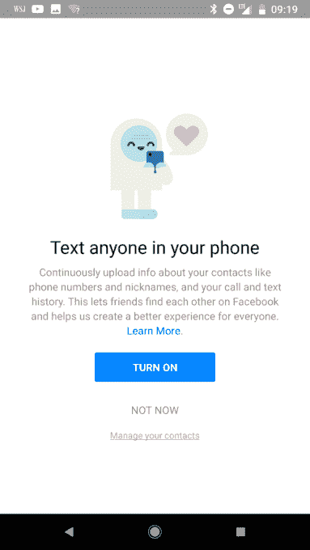

# 脸书否认未经许可收集电话和短信数据

> 原文：<https://web.archive.org/web/https://techcrunch.com/2018/03/25/facebook-denies-it-collects-call-and-sms-data-from-phones-without-permission/>

在 Ars Technica 报道称脸书秘密地从安卓手机上收集电话和短信数据并且已经这样做了很多年之后，这家丑闻缠身的公司回应说它只从已经许可的用户那里收集这些信息。

脸书[在其新闻网站上发布的公开声明](https://web.archive.org/web/20221224150914/https://newsroom.fb.com/news/2018/03/fact-check-your-call-and-sms-history/)几天前，[在报纸上刊登了整版广告](https://web.archive.org/web/20221224150914/https://techcrunch.com/2018/03/25/zuck-apologizes-for-cambridge-analytica-scandal-with-full-page-print-ad/)，为第三方应用程序滥用数据道歉，以应对剑桥分析公司丑闻的余波(此处跟随故事发展[)。在广告中，创始人兼首席执行官马克·扎克伯格写道“我们有责任保护您的信息。如果不能，我们就不配。”](https://web.archive.org/web/20221224150914/https://techcrunch.com/story/facebook-responds-to-data-misuse/)

然而，该公司对 Ars Technica 事件的回应却有所不同，脸书将这篇文章的标题定为“事实核查:你的通话和短信记录”它说“你可能已经看到了最近的一些报道，脸书在未经许可的情况下记录了人们的通话和短信记录。事实并非如此，”然后继续解释说，通话和短信历史记录是 Messenger 或 Android 版脸书 Lite 的一项可选功能，“人们必须明确同意使用”，他们可以随时关闭，这也将删除与该应用程序共享的任何通话和短信数据。

Ars Technica 已经修改了最初的帖子，对脸书的声明做出了回应，称这与它的几项调查结果相矛盾，包括与该出版物分享数据的用户的体验。

“在我的情况下，对我的 Google Play 数据的审查证实了 Messenger 从未安装在我使用的 Android 设备上，”Ars Technica IT 和国家安全编辑肖恩·加拉格尔在他的帖子的修正案中写道。“脸书安装在我使用的 Nexus 平板电脑和 2015 年的 Blackphone 2 上，从来没有明确的消息要求访问电话和短信数据。然而，有从 2015 年底到 2016 年底的通话数据，当时我在 Blackphone 2 上重新安装了操作系统，并清除了所有应用程序。”

在声明中，脸书表示，“联系进口商在社交应用和服务中相当普遍，是一种更容易找到你想联系的人的方式。这是 2015 年在 Messenger 中首次推出的，后来在脸书 Lite 中作为一个选项提供，这是一个用于 Android 的脸书的轻量级版本。”

当人们第一次在 Android 上注册 Messenger 或脸书 Lite，或者在 Android 设备上登录 Messenger 时，他们会看到一个屏幕，让他们选择持续上传联系人以及通话和短信历史记录。脸书补充说，在 Messenger 上，用户有三种选择:打开该功能，“了解更多”以获取更多信息，或者“现在不”跳过它。在脸书建兴，他们有两个选择:打开它或跳过。如果选择加入的用户后来改变了主意，脸书说他们可以在应用程序的设置中关闭它，可以选择关闭连续通话和文本历史记录，同时保持联系人上传功能，或者删除他们从该应用程序上传的所有联系人信息。"

脸书声明中的一张图片。

脸书用粗体字强调，它“从不出售这些数据，这项功能不会收集你的短信或电话内容。”

尽管选择性加入屏幕确实声明，授予许可将“持续上传”联系人、通话和短信历史记录的信息，但有争议的是，许多用户并不真正理解这是什么意思，与其说“这让朋友们可以在脸书上找到彼此，并帮助我们为每个人创造更好的体验”(一条用一幅甜蜜的卡通人物发短信给小心脏的信息)，脸书真的应该提供更多关于具体记录内容和原因的细节。

剑桥分析公司(Cambridge Analytica)丑闻仍然历历在目，脸书显然愿意将保护个人数据的责任推给已经感到受害的用户，这不太可能帮助他们重获任何善意。但是，即使是真正理解该功能的含义并选择加入的人，也是在假设他们的数据会像脸书承诺的那样得到保护的情况下这样做的。正如剑桥分析公司的惨败所突显的那样，情况并非总是如此。