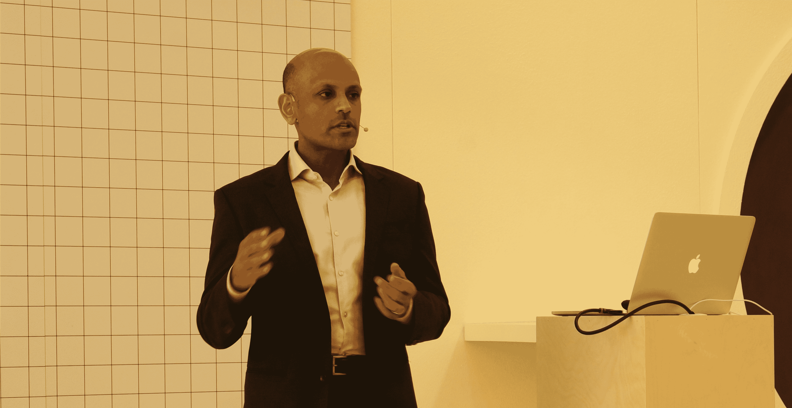

# 脸书在乌干达挖掘移动基础设施，TIP 向初创公司 TechCrunch 投资 1.7 亿美元

> 原文：<https://web.archive.org/web/https://techcrunch.com/2017/02/27/facebook-digs-into-mobile-infrastructure-in-uganda-as-tip-commits-170m-to-startups/>

虽然谷歌正在利用 MWC 展示其在移动设备上的本地应用方面的一些进步——具体来说是在[聊天应用](https://web.archive.org/web/20221025223005/https://beta.techcrunch.com/2017/02/26/google-assistant-its-ai-based-personal-helper-rolls-out-to-nougat-and-marshmallow-handsets/)中的[——但世界上最大的聊天应用公司正在做一些完全不同的事情。今天，脸书](https://web.archive.org/web/20221025223005/https://beta.techcrunch.com/2017/02/23/google-rcs/)[宣布](https://web.archive.org/web/20221025223005/https://code.facebook.com/posts/1642803246023947/airtel-and-bcs-with-support-from-facebook-to-build-shared-fiber-backhaul-connectivity-in-uganda/)将与印度 [Airtel](https://web.archive.org/web/20221025223005/http://www.airtel.com/) 和批发供应商 [BCS](https://web.archive.org/web/20221025223005/http://www.bcsgroup.co.za/) 合作，在乌干达建设一个 770 公里(500 英里)的光纤回程网络，这两家运营商在乌干达都有网络业务；它的电信基础设施项目正在呼吁向电信基础设施初创公司投资 1.7 亿美元。

除此之外，该公司还在其他努力上取得进展，通过其[电信基础设施项目](https://web.archive.org/web/20221025223005/https://code.facebook.com/posts/973406756030104/adopting-an-open-approach-to-global-networks-with-the-telecom-infra-project/)，在人们如何连接互联网(特别是脸书)的基础设施中发挥更大的作用。脸书自己的[旅行者光网络转发器](https://web.archive.org/web/20221025223005/https://code.facebook.com/posts/1977308282496021/an-open-approach-for-switching-routing-and-transport/)现在正由欧洲的 Telia 和 Orange 运营商[部署和测试。](https://web.archive.org/web/20221025223005/https://telecominfraproject.com/a-tip-update-from-mwc-2017/)

脸书表示，它预计乌干达项目(将获得脸书的“数千万投资”)将覆盖 300 多万人(这不是有多少人将使用它，而是有多少人可能被覆盖)。作为回程网络，目的是为无线运营商的基站提供更多容量，以便它们能够提供 3G 和 4G 移动数据服务(在发展中国家的许多地方，运营商仍然只能提供 2G 或 2.5G)。

与此同时,“航海家”项目是 TIP 的众多更新项目之一，TIP 由脸书于去年创建，但(像脸书的另一个连接项目——Internet.org)包括许多其他成员——在这种情况下，超过 450 个成员，包括大大小小的区域运营商；像英特尔和微软这样的设备和软件供应商；还有更多。

TIP 今天发布的其他消息包括，TIP 预计将向正在建设或致力于电信基础设施解决方案的初创公司投资 1.7 亿美元。在我看来，这是一个有趣的发展，考虑到最近创业公司的发展及其资金是如何集中在软件解决方案上的。

脸书和 TIP 尚未透露哪些公司将获得这笔资金的太多细节——我们已经问过了，并将在了解更多信息后更新——但它指出，向这 1.7 亿美元总额捐款的投资者包括 Atlantic Bridge、Capital Enterprise、Downing Ventures、Entrepreneur First、epset 1 Ventures、IP Group plc、Oxford Sciences Innovation 和 Touchstone Innovations，以及其他投资者、孵化器和机构。

脸书在今天的公告中表示:“我们相信，这些创新投资者专注的投资方向将为该行业带来新的基础设施解决方案。”。

明确一点，这不是基金；这更多的是一个概念性的想法，即这些投资者愿意对通信基础设施领域的初创公司投资多少:他们将拥有自己的资金和承诺，理论上，这将使他们达到那个总数。

在 MWC 的一次会议上，脸书副总裁杰伊·帕里克提供了一份关于脸书如何参与的更多细节。“脸书实际上并没有投入实际资金。那是风投。我们在指导方面提供我们的专业知识，我们帮助他们了解如何进行黑客马拉松，如何建立他们的空间，如果他们决定使用我们的开源硬件和软件，我们将提供我们可以提供的任何专业知识。”

他补充说，该公司本质上是在帮助将它从规模化生产环境中获得的知识及其文化带到这些中心。“这种方式更加可持续，”他指出。

与此同时，TIP 中的学术团体将把重点放在投资大学衍生产品或那些将大学知识产权用于通信基础设施解决方案的产品上。一些技术将包括智能天线和无线能量传输。

为此，由英国电信牵头的两个新“加速中心”正在英国启动，旨在帮助运营商和脸书考虑和部署该领域初创公司的基础设施解决方案。这是脸书去年与 SK 电讯在南韩建立的第一个中心的基础。你可以阅读更多关于 TIP 的其他项目，这些项目大多处于非常技术性的网络技术试点阶段。

【T2

网络连接和脸书的“连接世界的使命”一直是这家社交网络公司的长期次要主题，该公司的面包和黄油继续在其社交网络上做广告，包括脸书，还有 Messenger，WhatsApp 和 Instagram。

虽然脸书的使用在北美和西欧等地区几乎无处不在，但在发展中市场，特别是在缺乏良好互联网接入基础设施的地方，它的使用较少，因此脸书的连接努力在一定程度上是创造合适环境以吸引更多业务的一种方式。

但是，尽管这些努力有着明显的慈善和弥合数字鸿沟的良好目标，但迄今为止，结果却是喜忧参半。[Internet.org](https://web.archive.org/web/20221025223005/http://internet.org/)——脸书与其他几家公司合作，在选定的国家提供基本上“免费”的移动互联网的项目——事与愿违，因为它在印度因网络中立问题(特别是脸书的倡议对脸书的帮助比其他任何人都大)而被[屏蔽](https://web.archive.org/web/20221025223005/https://beta.techcrunch.com/2016/02/08/india-blocks-facebook-freebasics-net-neutrality/)。它仍然设法让[4000 万人](https://web.archive.org/web/20221025223005/https://beta.techcrunch.com/2016/11/02/omnipresent/)与该倡议联系在一起，该倡议还在继续扩大。

Parikh 在今天的新闻发布会上指出，该公司目前正专注于印度的 [Express Wifi](https://web.archive.org/web/20221025223005/https://info.internet.org/en/story/expresswifi/) 项目，我们应该“继续关注”任何进一步的公告。

其 Aquila 无人机的一次测试，一架传送互联网接入的“[飞机](https://web.archive.org/web/20221025223005/https://beta.techcrunch.com/2015/03/26/facebooks-aquila-drone-will-beam-down-internet-access-with-lasers/)，因[结构故障](https://web.archive.org/web/20221025223005/https://beta.techcrunch.com/2016/11/21/the-ntsb-is-investigating-the-structural-failure-of-facebooks-aquila-internet-drone/)而坠毁。

虽然今天的新闻是关于脸书如何似乎更加关注建设确切的物理基础设施，它过去曾说部署成本太高，但它也在继续探索进一步的无线选项，如[这项计划通过卫星提供非洲的接入](https://web.archive.org/web/20221025223005/https://www.bloomberg.com/news/articles/2016-08-31/facebook-to-start-africa-satellite-this-week-to-find-rural-users)。去年，脸书的第一颗卫星因 SpaceX 的火箭爆炸而被毁，这一计划面临挫折。然而，Parikh 认为，卫星是该公司仍然感兴趣的东西，它是偏远地区的最佳解决方案(可能是其 Aquila 无人机努力的补充技术)。

印度 Internet.org 的情况表明，印度政府、企业和公众确实在质疑，像脸书这样的公司更多地涉足互联互通等领域，到底有什么好处还是坏处。随着脸书越来越高调地展示其愿景，这些问题将继续被提出。与此同时，在更基本的层面上，在没有更好地了解共享内容的情况下，更多的连接究竟有多大好处，这是一个持续存在的问题。举例来说，假新闻的兴起，加上新兴的冲浪者，是一个[可怕的前景](https://web.archive.org/web/20221025223005/https://www.buzzfeed.com/sheerafrenkel/fake-news-spreads-trump-around-the-world)。

*更新以澄清 1.7 亿美元是一个目标金额，而不是一个特定的基金，并且还添加了关于哪些类型的领域可能获得启动投资的更多细节。*