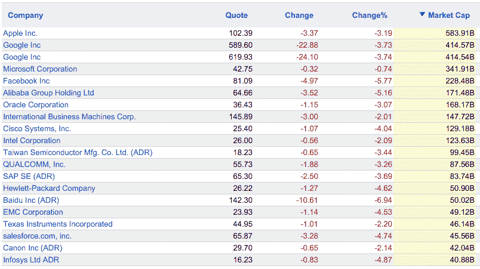

# 随着股市暴跌，脸书下跌 12.1%，苹果下跌 10%，谷歌下跌 6.5%，微软下跌 5.8%

> 原文：<https://web.archive.org/web/https://techcrunch.com/2015/08/24/facebook-down-12-1-apple-down-10-google-down-6-5-microsoft-down-5-8-as-stock-markets-plummet/>

# 随着股市暴跌，脸书下跌 12.1%，苹果下跌 10%，谷歌下跌 6.5%，微软下跌 5.8%

**更新:** [上市科技公司已经从股市暴跌中复苏](https://web.archive.org/web/20230405041553/https://techcrunch.com/2015/08/24/public-tech-companies-are-already-recovering-from-brutal-stock-market-decline/)

由于对中国的担忧，全球股市[暴跌](https://web.archive.org/web/20230405041553/http://www.bloomberg.com/news/articles/2015-08-23/u-s-stock-index-futures-decline-after-steepest-slump-since-2011)，科技公司正遭受当前不利的股市环境。所有的科技公司现在都在下跌，一些公司遭受了明显的调整。股市开盘时，与周五的收盘价相比，[脸书](www.google.com/finance?q=NASDAQ%3AFB)下跌 12.1%，至 75.62 美元，[苹果](www.google.com/finance?q=NASDAQ%3AAAPL)下跌 10%，至 95.17 美元，[亚马逊](www.google.com/finance?q=NASDAQ%3AAMZN)下跌 6.4%，至 463.03 美元，[微软](www.google.com/finance?q=NASDAQ%3AMSFT)下跌 5.8%，至 40.59 美元。

这样的例子不胜枚举。较小的公司也遭受了损失。网飞股市开盘下跌 14.7%，至 88.67 美元，此前几个月表现出色。最近[独立](https://web.archive.org/web/20230405041553/https://techcrunch.com/2015/07/20/paypal-shares-pop-8-3-percent-following-ebay-split-valuing-paypal-at-more-than-50b/)的 PayPal 也开盘下跌 9%，至 31.17 美元。Twitter 下跌 8.9%，至 23.56 美元。

总的来说，几千亿市值一夜之间化为乌有。他们中的许多人已经从这个艰难的交易日中恢复过来——例如，苹果公司现在“只”下跌了 3.2%。不过，看到所有这些上市公司同时出现亏损，还是令人印象深刻。以下是今早交易开始 30 分钟后的情况回顾:

你可能已经注意到，中国股市经历了自 2007 年以来[最糟糕的交易日](https://web.archive.org/web/20230405041553/http://www.bloomberg.com/news/articles/2015-08-24/chinese-stock-index-futures-tumble-after-last-week-s-retreat)，欧洲[紧随其后](https://web.archive.org/web/20230405041553/http://www.bloomberg.com/news/articles/2015-08-24/european-stock-index-futures-signal-equity-tumble-will-deepen)。不出所料，美国股市也出现暴跌。今天早上，道琼斯指数一度下跌了 1000 多点。

科技公司也遭受损失并不奇怪。但似乎其中一些公司比非科技公司遭受的损失更大。例如，许多人表达了对苹果的担忧。中国现在是该公司最重要的市场之一。如果中国经济不景气，苹果最终可能会卖出比预期更少的 iPhones。蒂姆·库克今天早上给吉姆·克莱默发了一封电子邮件，以缓解这种担忧(见下文)。

看看这是一次永久性的调整，还是股市将在未来几周反弹，这将是一件有趣的事情。对于打算在未来几个月进行 IPO 的大型民营科技公司来说，可能会有不同的影响。

https://Twitter . com/carlquintanilla/status/635799629947404288