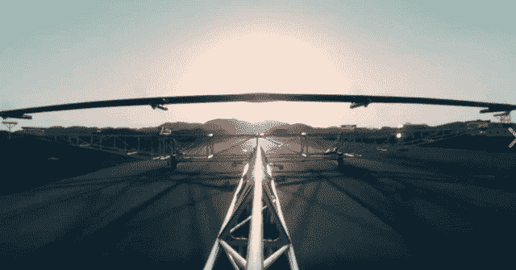

# 为了防止另一次坠机，脸书的太阳能无人机将安装空气制动器

> 原文：<https://web.archive.org/web/https://techcrunch.com/2016/12/16/facebook-drone-crash/>

脸书太阳能无人机 Aquila 的右翼发生故障，导致其首次试飞的[迫降](https://web.archive.org/web/20230322163744/https://techcrunch.com/2016/11/21/the-ntsb-is-investigating-the-structural-failure-of-facebooks-aquila-internet-drone/)，根据[国家运输安全委员会关于该事件的新报告](https://web.archive.org/web/20230322163744/http://www.ntsb.gov/_layouts/ntsb.aviation/brief.aspx?ev_id=20160701X62525&key=1)。作为回应，[脸书表示](https://web.archive.org/web/20230322163744/https://code.facebook.com/posts/1186557928107489/reviewing-aquila-s-first-full-scale-test-flight/?__mref=message_bubble)其互联网接入传播无人机的下一个版本将有一个扰流器或空气制动，并将安全空速优先于高度跟踪。

坠机事件发生在 6 月 28 日亚利桑那州尤马郊外，虽然实验飞机很难被期望在第一次飞行中完美工作，但这对脸书来说仍是一件尴尬的事情。这也是其通过 Internet.org 接入倡议向世界偏远地区提供网络连接的计划的一个挫折。

由于 NTSB 的监管规定，在监管机构发布报告之前，脸书不能讨论此次事故。报道试飞的记者甚至不知道它发生了，直到上个月彭博的一篇报道揭露了坠毁着陆。

飞行期间风速增加，持续了约 90 分钟，比原计划长 3 倍。因此,“天鹰号”在日出开始加热空气时着陆。脸书连通性实验室的负责人 Yael Maguire 解释说，无人机在距离地面 20 英尺的地方缓慢滑行，“在最后 4 秒钟，我们收到了一些非常有趣的热气流”。

“我们已经在模拟中着陆了一千次，”他告诉 TechCrunch。“虽然从未有过这样的风。”

脸书预计 Aquila 的设计会造成一些小的损坏，它有滑橇和低挂螺旋桨:“没有起落架——甚至没有跑道，只是沙漠中的一个降落点，”马奎尔说。

但当它下降时，意想不到的大风将无人机推离了滑行路径。自动驾驶仪的反应是倾斜机头，使其加速。

“这超出了飞机的设计规格，”马奎尔说。"机翼的右边好像断了。"

NTSB 报告称，飞机“在大约与机翼水平的高度以低于每小时 30 英里的速度撞击地面，并且“由于撞击和机翼故障，飞机遭受了严重损坏”。空气制动或扰流器可以让无人机降低机头，而不会不安全地增加空气速度。

马奎尔很乐观:“它发现了系统中的一个漏洞，这是我们在数千次模拟中没有发现的。修复相对简单。”

[在脸书代码博客](https://web.archive.org/web/20230322163744/https://code.facebook.com/posts/1186557928107489/reviewing-aquila-s-first-full-scale-test-flight/)上的一篇文章中，马奎尔总结道“我们已经在设计和建造第二代飞机，根据我们的学习，增加了新的功能，并渴望再次飞行。每一次连续的试飞都将带来预期和意外的技术挑战，并将教会我们更多如何驾驶这种实验飞机。”

作为一家硬件公司，脸书仍是新手。尽管它拥有巨大的资源，但在期望一切都完美运行之前，它将不得不经受试验和错误。