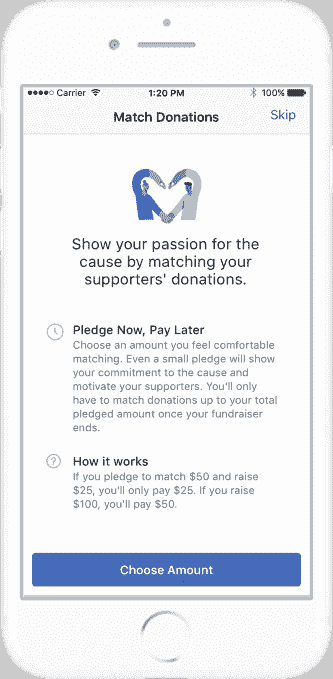

# 脸书降低个人事业的筹款费用

> 原文：<https://web.archive.org/web/https://techcrunch.com/2018/04/27/facebook-drops-fundraising-fees-for-personal-causes/>

尽管脸书因与剑桥分析公司有关的一切事情受到抨击，该公司仍然希望能够做一些好事。如今，脸书正在取消与个人事业筹款者相关的平台费。

这意味着脸书将取消美国 4.3%的平台费和加拿大 6.2%的平台费。收取这些费用是为了涵盖每个筹款人的审查过程和审查。现在，脸书表示将承担与这些安全和保护措施相关的费用。

“我们在不断学习，这是我们想做的事情，以帮助人们最大限度地受益，”脸书社会公益产品负责人阿莎·夏尔马在电话中告诉我。

不过，需要明确的是，支付处理费用和税收仍将存在。在美国和加拿大，支付处理费为 2.6%加 0.30 美元。脸书还推出了其融资工具的两个新功能。

首先是人们为非营利筹款人匹配捐款的能力；二是个人原因的范畴扩展。现在，除了为兽医账单、个人紧急事件等筹集资金，人们还可以为旅行(社区旅行或医疗需求)、家庭相关事业(收养等)、宗教活动和志愿者用品筹集资金。

脸书还没有分享与筹款人相关的具体金额，但表示其工具已经帮助超过 750，000 个非营利组织收集捐款。关于个人原因，夏尔马只会说，“我们看到所有这些类别的活动，这就是为什么我们有它们。”