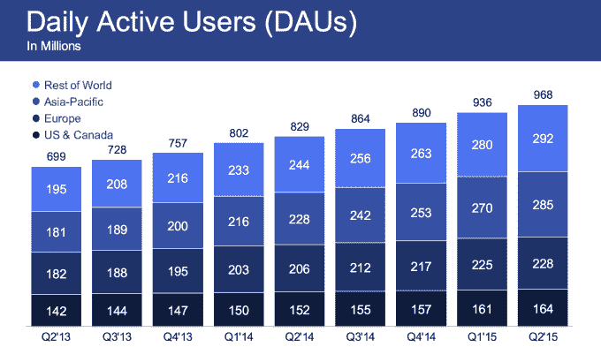
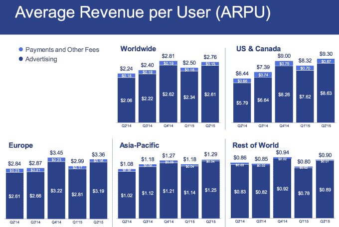

# 脸书以 40.4 亿美元的收入击败 Q2，用户增长放缓至 3.47%，季度增长达到 14.9 亿美元

> 原文：<https://web.archive.org/web/https://techcrunch.com/2015/07/29/facebook-earnings-q2-2015/>

根据其新的收益报告，人们并没有减少使用脸书。脸书从上个季度的[失误](https://web.archive.org/web/20230317182841/https://techcrunch.com/2015/04/22/facebook-q1-2015-earnings/#.c09dfs:YWm7)中恢复过来，在 [Q2 2015](https://web.archive.org/web/20230317182841/http://investor.fb.com/releasedetail.cfm?ReleaseID=924562) 中以 40.4 亿美元的收入和 0.50 美元的每股收益击败了华尔街的预期。脸书现在每月有 14.9 亿用户，环比增长 3.47%，略低于 Q1 3.6%的增长率。

分析师曾预测收入为 39.9 亿美元，每股收益为 47 美分。然而，衡量脸书实际利润的 GAAP 净利润同比从 7.91 亿美元下降到 7.19 亿美元。这似乎是导致脸书股价在盘后交易中下跌 1.39%至 95.53 美元的原因。

但就社交网络的长期健康而言，最重要的统计数据是脸书保持了 65%的粘性，即 DAU 除以毛。这是用户参与度的表现，在该服务与 Snapchat 和 Twitter 争夺注意力的过程中，用户参与度没有下降是一个好迹象。

[find the best id = " jfhjsd 9 kveh " title = "脸书公司(FB)季度收入" width = " 650 " height = " 500 " URL = " https://w . graphiq . com/w/jfhjsd 9 kveh " link = " http://listings . findcompany . com/l/14143267/脸书-Inc-in-Menlo-Park-CA " link _ text = "脸书公司(FB)季度收入| findcompany "]

[find the best id = " hbwjlvcdnv " title = "脸书公司(FB)季度净收入" width = " 650 " height = " 500 " URL = " https://w . graphiq . com/w/hbwjlllvcdnv " link = " http://listings . findcompany . com/l/14143267/脸书-Inc-in-Menlo-Park-CA " link _ text = "脸书公司(FB)季度净收入| FindTheCompany "

[find the best id = " du 1 yittkmpx " title = "脸书公司–季度每股收益" width = " 600 " height = " 488 " URL = " https://w . graphiq . com/w/du 1 yittkmpx " link = " http://listings . findcompany . com/l/14143267/脸书公司-in-Menlo-Park-CA" link_text= "脸书公司–季度每股收益| findcompany "]

移动广告现在占广告收入的 76 %,高于上个季度的 73%。移动月度用户从 12.5 亿增长 4.8%至 13.1 亿，移动日用户从 7.98 亿增长 5.76%至 8.44 亿，均比上一季度略有放缓。日活跃用户达到 9.68 亿，比 9.36 亿增长 3.41%。

相比之下，Twitter 的用户数量本季度仅增长了 2.6%，如果不算不看广告的“短信快速关注”用户，则仅增长了 0.66%。

脸书财报电话会议中最有趣的数据是，[首席执行官马克·扎克伯格](https://web.archive.org/web/20230317182841/https://www.facebook.com/photo.php?fbid=10155824814360177&set=a.404308695176.365039.717545176&type=1&theater)指出，[脸书事件已经达到“全球规模”，拥有 4.5 亿用户](https://web.archive.org/web/20230317182841/http://t.co/MFQ55yDx5O)。这意味着它可以准备好推出自己的独立应用，专注于帮助人们回答“今晚我该做什么？”

讨论的另一个重点是[脸书利用 Messenger 和 WhatsApp 赚钱的策略](https://web.archive.org/web/20230317182841/https://techcrunch.com/2015/07/29/ease-them-into-it/)。就像脸书推迟了新闻提要中的广告，以支持首先允许与商业页面的自愿互动一样，脸书希望人们在让公司付费接触客户之前，通过聊天与企业建立有机联系。

扎克伯格还浏览了脸书应用程序家族的统计数据，包括 8 亿 WhatsApp 用户、7 亿 Messenger 用户、3 亿 Instagram 用户、8.5 亿 Groups 用户和 4000 万使用 Pages 的小企业。

脸书在本季度大力改善其广告和电子商务选项，同时试图将内容引入其围墙花园，包括视频和即时文章。

它在新闻订阅中增加了购买按钮和自动填写的电子邮件注册表单。随着每天超过 40 亿的视频浏览量，它开始销售保证 10 秒钟观看的视频广告，而不是选择只购买三秒钟的视频印象。

与此同时，Messenger 已经发展成为一个庞大的聊天应用，现在拥有 7 亿用户。最近推出的朋友间支付和应用平台可能有助于脸书加深用户忠诚度，同时依靠其核心应用的新闻订阅广告赚钱。

Instagram 广告定位和格式的改进意味着它可以开始从其照片分享应用程序中产生大量收入。脸书在财报中仍然没有对 Instagram 或 WhatsApp 说太多。据非官方消息，eMarketer 估计，Instagram 今年的收入将达到 5.95 亿美元。

脸书似乎已经解决了“世界其他地区”的广告收入问题，该地区包括许多南美和非洲的发展中国家。从网速较慢的用户和旧手机中赚钱的能力对脸书的长期收入增长至关重要，因为在其主要的西方市场，用户渗透率已经饱和。

最近推出的精简版脸书 Lite Android 应用程序可能会让世界各地的人们更容易在社交网络上冲浪和查看其广告。

脸书刚刚开始看到其吸收互联网的成果。在 18 个月的时间里，它从几乎不播放任何视频变成了一个庞大的观众群。来自用户和企业的有机剪辑提供了掩护，掩盖了自动播放视频广告的入侵。

通过即时文章，它找到了一种方法，将花园墙上的一个大洞变成了一种新的赚钱方式。用户不再溜出去阅读新闻网站上的文章，或者在加载时沮丧地关闭应用程序，而是通过即时文章让用户在脸书的应用程序中来回跳转，在那里他们可以看到广告。

如果不是因为上个季度的失误(该公司将其归咎于汇率波动)，这将是脸书连续第 12 个季度亏损。尽管许多人确信 Snapchat 的快速增长会蚕食脸书的一大块业务，但该公司仍在稳步增长。十一年过去了，人们仍然对脸书爱不释手。