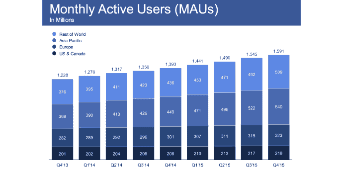
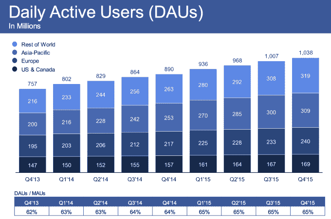
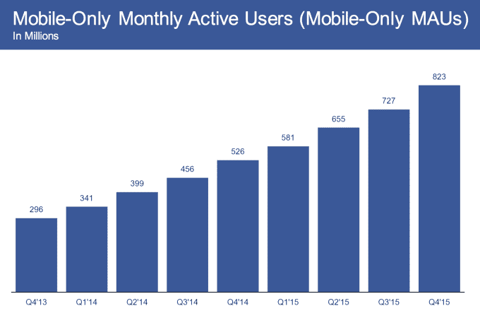
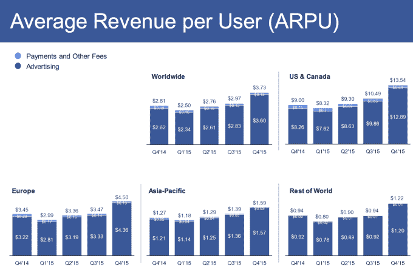

# 脸书攀升至 15.9 亿用户，第四季度收入超过 58 亿美元

> 原文：<https://web.archive.org/web/https://techcrunch.com/2016/01/27/facebook-earnings-q4-2015/>

通过吸引发展中国家的用户和广告收入，脸书继续保持增长势头。今天，它的用户达到了 15.9 亿，并以 58.41 亿美元的收入和 0.79 美元的每股收益打破了华尔街对其 2015 年第四季度收益的预期。相比上个季度的 15.5 亿用户和 45 亿美元收入，这一数字有所上升。即使第四季度是假期，29.8%的季度收入增长也是惊人的，与去年第四季度相比增长了 51%。

脸书的月用户数环比增长 2.58%，略低于第三季度4.02%的强劲增长。它表明，脸书在一些市场已经达到饱和，但在许多发展中国家仍有增长空间。

虽然不像每月的大数字那么浮华，但每日用户数是一个更好的方法来记录脸书的进步。与第三季度的 10.1 亿美元相比，脸书的 DAU 达到了 10.4 亿美元，增长了 2.97%。脸书的 DAU 与毛比率(即粘性)保持在 65%。这意味着即使服务老化，用户的访问次数也不会减少。

移动广告目前占脸书广告收入的 80%，高于第三季度的 78%。其总收入中有 56.3 亿美元来自广告，令脸书老牌支付业务黯然失色。仅移动用户数量目前为 8.27 亿，比上一季度的 7.23 亿增长了 13.2%。这证明了脸书在发展中国家的增长，这些发展中国家基本上跳过了全尺寸计算机时代。

[更新:马克·扎克伯格在第四季度财报电话会议上也发布了一系列新数据:

*   每天观看 1 亿小时的视频
*   群组上的 10 亿用户
*   脸书 Lite 上有 8000 万用户
*   活动上有 5 亿用户
*   2015 年举办了 1.23 亿场活动
*   Pages 上的 5000 万中小型企业]

分析师预计脸书将获得 53.7 亿美元的收入和 0.68 美元的每股收益，这意味着脸书打破了预期。eMarketer 预测，脸书将在 2016 年获得 98.6 亿美元的美国展示广告收入，占美国展示广告总支出的 30.6%。财报发布前，脸书股价在常规交易结束时为 94.45 美元，目前较接近 100.71 美元的市场价格上涨了 6.7%。

脸书设法将每用户平均收入从第三季度的 2.97 美元大幅增长 25.5%，至 3.73 美元。这也比去年第四季度增长了 28.1%。脸书在将发展中的“世界其他地区”的收入提高到每用户 1.22 美元方面表现尤为突出，与去年第四季度相比，本季度增长了 29.8%。

脸书第四季度的资本支出为 6.92 亿美元，自由现金流为 21.4 亿美元。至于 2015 年全年，脸书的收入达到 179.3 亿美元，同比增长 44%，利润为 36.9 亿美元。

## 为什么脸书表现如此出色？

将发展中国家货币化是其中很大一部分。回到 2012 年的 Q1，脸书在“世界其他地区”的每用户收入仅为 0.32 美元。现在差不多是 4 倍了。尽管这些用户的网速很慢，使用的是老式智能手机甚至功能手机，没有太多购买力，但脸书正在说服广告商付费来接触他们。

在财报电话会议上，脸书承认，视频正在推动用户参与度和在其资产上花费的时间。脸书每天有 5 亿用户观看 80 亿次视频，相当于每天花费 1 亿小时观看视频。这一切都让脸书可以将视频广告植入新闻订阅源，并在你看完另一个视频后显示其推荐视频。

脸书观众网络利用其数据在其他应用中定向投放广告，营收达到 10 亿美元。预计脸书本季度的 Instagram 广告销售会很强劲，这可能会为其收入做出贡献。Messenger 在西方聊天应用中的持续统治地位也让用户牢牢地留在了脸书应用家族中。

即时文章也可能有所帮助。它们有效地阻止了新闻订阅源的退出，确保用户不会在等待浏览器加载新闻文章时退出应用程序。当他们读完之后，他们可以继续上 Facebooking，看广告。

展望未来，脸书可能会设计出一种新的即时广告形式，为品牌提供快速加载的即时文章富媒体，这样用户就不会失去点击的动力。脸书还刚刚宣布，它正在将其移动广告网络从应用扩展到移动网站，这将进一步提高收入，而脸书无需在自己的地产上展示更多广告。