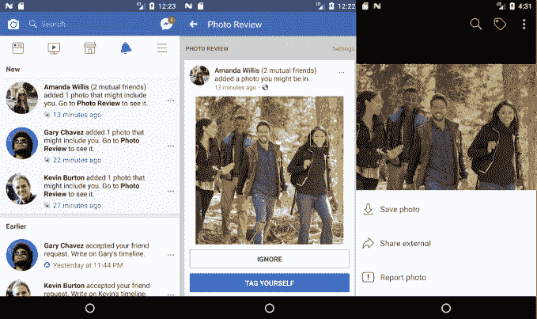

# 脸书的面部识别功能现在可以找到你在 TechCrunch 中没有标记的照片

> 原文：<https://web.archive.org/web/https://techcrunch.com/2017/12/19/facebook-facial-recognition-photos/>

# 脸书的面部识别现在可以找到你没有标记的照片

脸书希望确保你知道并控制你的人上传的照片，即使他们没有标记你。所以今天，脸书[推出了](https://web.archive.org/web/20221218091519/https://newsroom.fb.com/news/2017/12/managing-your-identity-on-facebook-with-face-recognition-technology/)一项新的面部识别功能，名为 Photo Review，当你的脸出现在新发布的照片中时，它会提醒你，这样你就可以标记自己，随它去，要求上传者把照片拿下来，或者向脸书报告。

这个功能应该给人们信心，没有他们的照片漂浮在脸书，他们可以看到，但只是不知道。这也有助于阻止假冒。但脸书告诉我，它没有计划使用面部识别来增强广告定位或内容相关性排序，比如向你展示更多来自朋友的新闻推送帖子，这些帖子发布了你的未标记照片或与你在未标记照片中出现的位置相关的广告。

如果你出现在某个人的公开照片中，你会得到通知。对于其他照片，只有当您在该照片的观众中时，您才会收到通知，以保护上传者的隐私，而不会提醒您不允许查看的照片。个人资料的照片审查部分将记录您所有未标记但已识别的照片。

脸书应用机器学习产品经理 Nipun Mather 告诉我，这个功能旨在给人们更多的控制，让他们感觉更安全，并提供怀旧的机会。

脸书还增加了一个新的全面的照片和视频面部识别选择退出隐私设置，这将删除你的面部模板，并停用新的照片审查功能以及旧的标签建议，当朋友发布你的照片时，旧的标签建议使用面部识别来加速标签。这些都将在未来几周内在各地推出，除了欧洲和加拿大，在欧洲和加拿大，隐私法禁止脸书的面部识别技术。

脸书也使用这项功能来帮助视力受损的人。现在，脸书的机器视觉功能[可以描述照片中的内容](https://web.archive.org/web/20221218091519/https://techcrunch.com/2016/04/04/facebooks-tool-to-help-the-blind-see-images-just-launched-for-ios/)也可以大声读出未标记朋友的名字。

“随着时间的推移，我们的目标是让这些功能随处可用。。。但现在我们把重点放在标签建议可用的市场上，”脸书的副首席隐私官 Rob Sherman 说。

虽然标签建议可能会被视为削弱隐私，但照片审查可能会被视为增强隐私，并可能获得监管机构的批准。无论是你想从脸书带走的未经授权的照片，还是你不想被标记但想监控评论的尴尬照片，或者有人试图冒充你，照片审查让人们更加了解他们的肖像是如何被使用的。