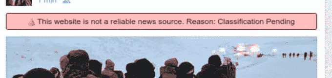

# 关于脸书假新闻检测器的报道显然是一个插件

> 原文：<https://web.archive.org/web/https://techcrunch.com/2016/12/01/facebook-fake-news-flags-reliable-news-source/>

***更新:**该功能似乎是 Chrome 插件 [B.S. Detector](https://web.archive.org/web/20230319190336/https://www.producthunt.com/posts/b-s-detector) 的实现，一些用户将其作为脸书自己的测试。我们将继续调查，但目前看来这不是脸书的特色。是的，讽刺是丰富的。*

脸书在新闻供稿中的假新闻链接上方向一些用户显示红色警告标签，这似乎是一次有限的测试。TechCrunch 从一个来源获得了下面的警告截图。警告上写着“这个网站不是一个可靠的新闻来源。原因:分类待定“在某些情况下，‘国家支持的新闻’似乎是一个原因。

这些警告是脸书首席执行官马克·扎克伯格上个月提出的对抗假新闻的新方法的第一批可见迹象之一。我们已经联系了脸书，请求置评，如果我们收到回复，将会更新。

假新闻标志测试似乎已经运行了一个多星期，尽管它们似乎正以出现的速度从一些用户的订阅源中消失。这种行为符合脸书通过向其庞大用户群中的一小部分人进行有限的实时展示来定期测试新产品功能的方式。

截图中的警告消息来自今天现场出现的测试实例。它显示了一个来自 occupydemocrats.com 的有标记的故事，一个被列入[广泛流传的假新闻来源列表](https://web.archive.org/web/20230319190336/http://d279m997dpfwgl.cloudfront.net/wp/2016/11/Resource-False-Misleading-Clickbait-y-and-Satirical-%E2%80%9CNews%E2%80%9D-Sources-1.pdf)的网站。标题是“2000 名退伍军人刚刚抵达立石，在抗议者周围形成‘人盾’。”

值得注意的是，这个特别的新闻故事被证实是真实的，并且被[《纽约时报》](https://web.archive.org/web/20230319190336/http://www.nytimes.com/2016/11/29/us/veterans-to-serve-as-human-shields-for-pipeline-protesters.html) 和[路透社](https://web.archive.org/web/20230319190336/http://www.reuters.com/article/us-north-dakota-pipeline-idUSKBN13P2C8)以及其他可靠的事实核查渠道所采用。这表明脸书将整个网站而不是个别新闻列入黑名单。这也表明了脸书系统中潜在的假阳性，准确的报道被打上“不可靠”的警告。

黑客新闻用户 [ideonexus](https://web.archive.org/web/20230319190336/https://news.ycombinator.com/item?id=13016913) 上周提到了同样的警告功能:

> 巧合的是，我今天上了 FB，开始在两个朋友的帖子上看到一面红旗，上面写着，“这个网站不是一个可靠的新闻来源”。理由:【理由】“有国家赞助新闻之类的，不保密的理由。这面旗帜出现在一篇关于 Pokemon Go 的文章上，这显然是耸人听闻的猜测，也是一个关于乔治·索罗斯的阴谋网站。

脸书因允许假新闻在新闻 Feed 上扩散而遭受了 T2 的强烈批评，因为一些人认为恶作剧和误导性的故事帮助了唐纳德·川普当选。虽然起初该公司不愿承认假新闻是一个大问题，但媒体压力促使其采取行动。

假新闻是威胁知情民主的祸害，尽管脸书独自成为真相警察是有风险的。没有适当的透明度，可能会导致审查和偏见的指控，也是公司运营的噩梦。与外部验证服务机构、媒体或学术机构合作，可以让脸书对假新闻进行分类，而不必完全控制或负责决定什么是真的。