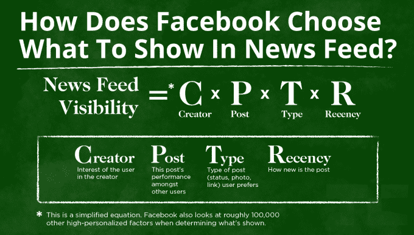

# 脸书选择用人工智能来打击假新闻，而不仅仅是用户报告 

> 原文：<https://web.archive.org/web/https://techcrunch.com/2016/11/14/facebook-fake-news/>

脸书发言人告诉 TechCrunch，脸书今年为 clickbait 构建了两个版本的修复程序，并决定信任算法机器学习检测，而不仅仅是用户行为。

今天，脸书受到更多指控，称其散布假新闻帮助唐纳德·特朗普当选。一份新的 [Gizmodo 报告](https://web.archive.org/web/20221005185201/http://gizmodo.com/facebooks-fight-against-fake-news-was-undercut-by-fear-1788808204)称，脸书搁置了今年早些时候的一项计划更新，该更新可能会识别假新闻，因为它会不成比例地贬低右翼新闻机构。

脸书直接否认了这一点，告诉 TechCrunch“这篇文章的指控是不真实的。我们没有基于对任何一个政党的潜在影响而建立和保留任何新闻源的变化。”

然而，TechCrunch 从脸书获得了更多关于 Gizmodo 讨论的更新的细节。

早在 2015 年 1 月，脸书推出了一项旨在[打击虚假新闻](https://web.archive.org/web/20221005185201/https://newsroom.fb.com/news/2015/01/news-feed-fyi-showing-fewer-hoaxes/)的更新，该更新降级了那些被用户严重标记为虚假的链接，这些链接后来经常被发布它们的用户删除。这个系统仍然存在。

2016 年 8 月，脸书发布了另一个新闻订阅更新[，旨在减少点击诱饵故事](https://web.archive.org/web/20221005185201/https://newsroom.fb.com/news/2016/08/news-feed-fyi-further-reducing-clickbait-in-feed/)。脸书通过让人类识别 clickbait 故事的旧新闻标题中的常用短语，训练了一种机器学习算法。然后，机器学习系统将识别并降级以这些点击诱饵短语为特色的未来故事。

根据脸书的说法，它为 2016 年的 clickbait 更新开发了两种不同的选项。一个是基于用户报告的 2015 年恶作剧检测器的分类器，另一个是专门为通过计算机算法检测 clickbait 而构建的机器学习分类器。

脸书表示，它发现特制的机器学习 clickbait 探测器表现更好，误报和漏报更少，所以这就是脸书发布的。Gizmodo 所指的未发布版本可能就是搁置的更新。脸书告诉我，右翼故事的不平衡 clickbait 降级并不是它没有发布的原因，但政治倾向仍然是一个问题。

选择依赖机器学习算法，而不是围绕用户报告进行修复，这与脸书最近努力减少其策展中潜在的人为偏见是一致的，这本身就存在问题。

今年早些时候的一份 Gizmodo 报告称，脸书的人类趋势策展人利用他们的编辑自由压制保守趋势。脸书否认了这些指控，但解雇了它的策展团队，转向一个更具算法性的系统，没有人类书写的趋势描述。随后，脸书因虚假报道成为潮流而受到批评，《纽约时报》报道称，“潮流话题事件麻痹了脸书对其产品做出任何可能损害其客观性的重大改变的意愿。”

如果脸书推出了未发布版本的 clickbait 修复程序，它可能会像对待更多老生常谈的恶作剧一样，依赖审查用户报告的员工的主观意见。与此同时，政治活动家或巨魔可能会滥用报道功能，如果准确的报道与他们的观点相冲突，就会大量标记为虚假。

这种棘手的情况是在政治两极化的环境下，参与度排名的社交媒体成为大规模流行的新闻发布渠道的必然结果，在这种环境下，竞选目标和广告收入刺激了错误信息。

## 谁是真理的仲裁者？

脸书以及 Twitter 和谷歌等其他新闻分销商面临着挑战。可以用事实来反驳的明显的谎言只是问题的一部分，也许更容易解决。可能被认为是点击诱饵的夸张和严重编造的故事可能更难对付。

因为脸书和其他一些平台奖励参与，新闻机构被激励尽可能耸人听闻地构建故事。虽然长期运行的党派渠道可能要为夸张负责，但专门利用脸书等网络的病毒式传播而建立的新渠道不会面临同样的反响。他们可以专注于短期流量和广告收入，如果人们厌倦了他们的内容，他们可以简单地用不同的品牌重新启动。

简化用户对虚假或夸大报道的标记，将事实核查网站附加到可疑文章上，以及阻止尚未证明其准确性但优先考虑货币化的域名的分发，可能是对抗假新闻雪崩的一些方法。显然还需要做更多的工作。

但是要求像脸书这样的网络成为真相警察可能是有风险的。这可能会迫使它就审查什么进行更广泛的呼吁，这将不可避免地招致指责。至少，偏向于参与度排名的技术平台允许用户单独决定他们读到的内容是虚假的还是夸大的。脸书的首席执行官马克·扎克伯格重申了这一观点，他写道:“我认为我们必须非常谨慎，不要成为真理的仲裁者。”

现在，如果脸书允许假新闻传播是该死的，因为它依靠用户自己思考，但如果它不允许假新闻传播是该死的，因为它决定审查什么，这剥夺了用户的选择权。这家社交网络将不得不谨慎选择下一步行动。