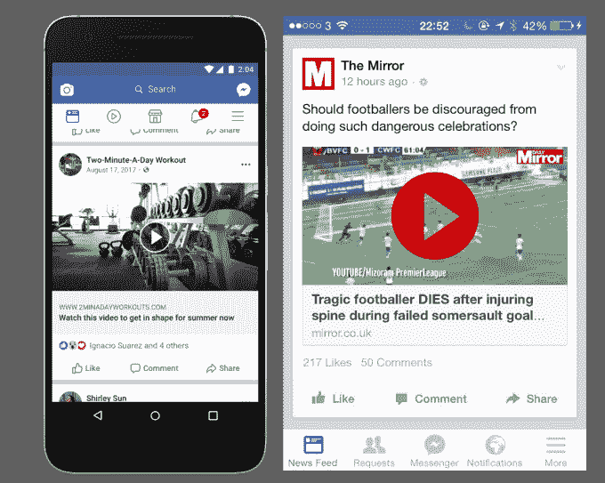
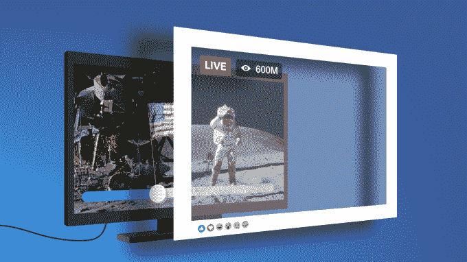

# 脸书降低了视频点击诱饵和假播放按钮的排名

> 原文：<https://web.archive.org/web/https://techcrunch.com/2017/08/17/facebook-fake-play-buttons/>

有没有被骗去点击脸书上的一个假播放按钮，打开一个链接，而不是开始一个视频？我反复这样做了，并在 2014 年写了一篇名为[“哟，脸书，禁止带有虚假视频播放按钮的链接”](https://web.archive.org/web/20230404075856/https://techcrunch.com/2014/06/14/fake-play-button/)的报道。

[现在](https://web.archive.org/web/20230404075856/https://newsroom.fb.com/news/2017/08/news-feed-fyi-taking-action-against-video-clickbait/)脸书正在这么做。今天，它开始降低在预览图像中显示虚假播放按钮的链接的新闻提要的排名，以及实际上只是作为视频文件上传的静态图像的视频。使用这些诡计的出版商将会看到这些故事的发行量大幅减少。不过，脸书不会完全删除这些帖子，除非它们违反了它的其他政策。

这里有两个垃圾邮件发送者用来窃取您的点击的虚假播放按钮的例子:

News Feed 产品经理 Greg Marra 告诉我，根据几年来禁止描绘不存在的功能的政策，脸书已经禁止在广告中使用假播放按钮。但是这种灾难仍然存在于新闻提要中。

“我们已经听说有人对假播放按钮感到沮丧，”马拉说，因此今天的更新。「滥发讯息者正利用这些手法，诱使人们点击低质素网页的连结。脸书告诉我，它现在正在训练它的机器视觉人工智能，以分类和检测预览图像中的虚假播放按钮。

一位发言人告诉我，“虽然从统计数据来看，这种现象的发生率很低，但是使用脸书的人遇到这些欺骗性的做法时，他们表现出的挫折感很高。”。

脸书[说](https://web.archive.org/web/20230404075856/https://www.facebook.com/facebookmedia/best-practices/click-bait)如果出版商想表示链接后面有视频，他们应该通过开放图形元标签来表示。他们也可以在标题或描述中使用“观看”或“视频”这样的词。

新闻订阅链接预览中的假视频播放按钮，如左图所示，会误导人们点击广告覆盖的网站，如右图所示。

脸书也有类似的问题，出版商[循环播放预先录制的视频，称之为现场直播](https://web.archive.org/web/20230404075856/https://techcrunch.com/2017/01/06/the-live-ing-dead/)，或者只是在电脑上显示倒计时，称之为现场直播。TechCrunch 在一月份呼吁脸书禁止这些恶作剧，而 T4 在五月份对此进行了打击。

还有一个问题是，出版商将虚假的即时文章“闪电”图标放在标准网站上非即时文章链接的预览图片上。这是因为人们更有可能点击即时文章，因为它们加载速度更快。

与此同时，脸书在新闻提要中对视频的强调激发了出版商上传静态图像作为视频以获得更多眼球的新威胁。这些静态图像视频也将被降级。脸书正在使用一种“运动评分”系统来检测视频中的运动，从而对这些剪辑进行分类和降级。

今天的变化是对点击诱饵的大规模多管齐下的打击的一部分。脸书现在用多种语言对误导 T4 或隐瞒信息的标题进行降级，减少垃圾邮件发送者过度分享的链接，与外部事实审查员合作，降低虚假新闻的等级，从不同角度宣传相关文章，让人们怀疑夸大的点击诱饵。

每次更新后，脸书都解决了 clickbait 问题，为合法内容的新闻提供了更多空间。试图观看一个只有无数分钟相同图像的视频会让你焦头烂额，这侵蚀了人们对新闻源的信任，使人们将来不太可能观看视频。

通过去除这些恼人的体验，用户可能会愿意浏览更长时间，观看更多来自朋友和出版商的视频，以及观看为脸书飙升的利润提供资金的利润丰厚的视频广告。