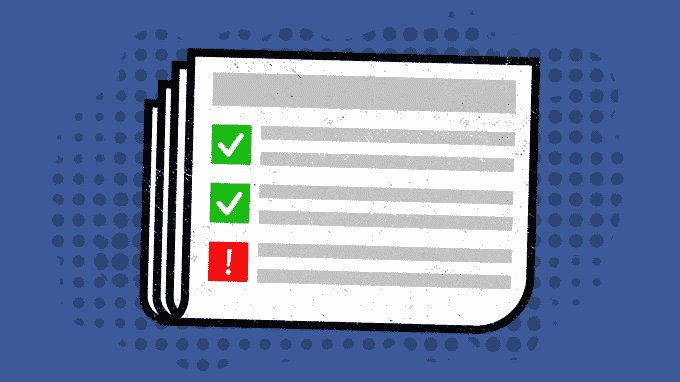

# 脸书降低了被广告淹没的垃圾网站的新闻链接排名

> 原文：<https://web.archive.org/web/https://techcrunch.com/2017/05/10/facebook-fights-foot-fungus-ads/>

在今天宣布的新闻提要算法变化中，脸书将埋葬低质量网站的链接，并拒绝携带指向这些网站的广告。脸书将“低质量网站”定义为“包含很少实质性内容，并且覆盖着破坏性的、令人震惊的或恶意的广告”这包括托管弹出广告和间隙广告，成人广告或吸引眼球但令人恶心的广告，用于对抗脂肪或足部真菌的产品。

这一变化可能有助于脸书打击假新闻，因为造假者通常是出于经济动机，在广告中掩盖他们的虚假信息文章。

高质量网站的推荐流量可能会略有上升，而随着未来几个月更新的逐步推出，劣质网站的推荐流量将会下降。脸书告诉我，这一变化将使其拒绝为数不多的广告展示，而这些展示为其赚了微不足道的钱，因此它应该不会对脸书的收入产生重大影响。

新闻订阅的脸书产品经理 Greg Marra 告诉我，脸书是基于对用户关于是什么扰乱了他们的新闻订阅体验的调查做出这个决定的。他们经常提到的一个痛点是将他们推向“误导、耸人听闻、垃圾邮件或其他低质量体验”的链接。。。(包括)色情内容、令人震惊的内容以及其他真正具有颠覆性的内容。”

今天的变化很重要，因为如果用户不信任他们在新闻订阅中看到的链接和广告的另一边的内容，他们就会减少点击。这可能会减少脸书的广告收入，以及它从控制推荐流量中获得的权力。从新闻源发送到一个低质量、令人震惊的网站也可能让用户感到沮丧，并导致他们结束脸书浏览会话，剥夺社交网络的进一步广告观看、参与和内容共享。

图片:布莱斯·德宾/

脸书之前曾试图通过 [2014 年新闻订阅更新](https://web.archive.org/web/20230404164740/https://newsroom.fb.com/news/2014/08/news-feed-fyi-click-baiting/)来减少低质量网站的链接，抑制人们在观看后立即返回新闻订阅的网站。

为了实现更新，马拉告诉我，脸书“审查了成千上万的网页，  ，确定哪些是低质量的内容。”它使用这些数据来训练一个人工智能系统，以不断扫描新闻提要中共享的新链接，寻找与低质量网站训练数据集匹配的链接。然后，它降级这些网站，并阻止他们购买脸书广告。

脸书用于将网站分类为低质量网站的参数包括:

*   > **广告量相对于内容不成比例。**这包括广告，但不包括法律义务，如 cookie 政策或对付费墙等私人内容的登录。

*   > **含有性暗示或令人震惊的内容。**见相关政策[煽情内容](https://web.archive.org/web/20230404164740/https://www.facebook.com/policies/ads/prohibited_content/sensational_content)和[成人内容](https://web.archive.org/web/20230404164740/https://www.facebook.com/policies/ads/prohibited_content/adult_content)。

*   > **包含恶意或欺骗性广告**的页面，其中包含我们政策中定义的[禁止内容](https://web.archive.org/web/20230404164740/https://www.facebook.com/policies/ads/prohibited_content)。

*   > **使用弹出广告或插播广告，**扰乱用户体验。
    > 
    > 

福布斯是这类广告最著名的主持人之一，在你阅读文章之前，它会显示一个令人讨厌的全屏插播广告。当被特别问到《福布斯》是否会受到攻击时，马拉委婉地承认“插页 popover 广告是人们告诉我们具有破坏性的事情之一。

如果脸书能让人们相信他们点击的链接会带来高质量的内容，它就能继续成为互联网的主页。