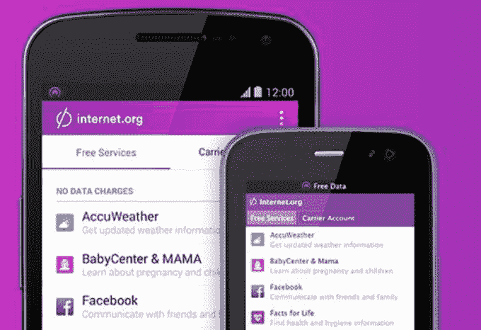
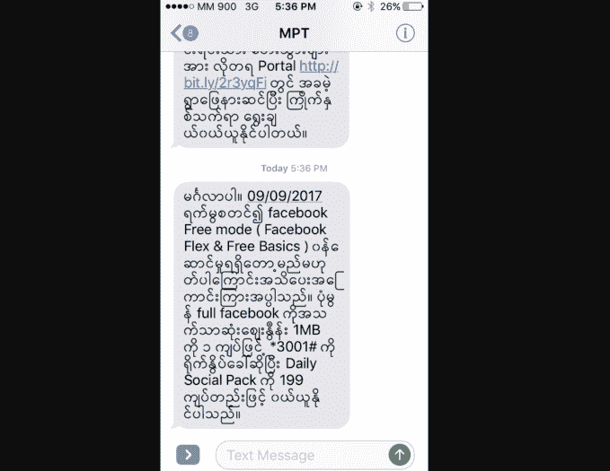

# 脸书的免费基础项目去年在缅甸悄然结束 

> 原文：<https://web.archive.org/web/https://techcrunch.com/2018/05/01/facebook-free-basics-ending-myanmar-internet-org/>

就在上周，脸书还在吹捧其 Internet.org 项目 [Free Basics 的增长，该项目旨在为发展中国家的用户提供免费的有管理的网络访问，但该应用并不是在所有地方都奏效。正如](https://web.archive.org/web/20221229200212/https://techcrunch.com/2018/04/25/internet-org-100-million/)[最初报道的大纲](https://web.archive.org/web/20221229200212/https://theoutline.com/post/4383/facebook-quietly-ended-free-basics-in-myanmar-and-other-countries?zd=1&zi=l6cwnzu2)和 TechCrunch 证实的那样，免费基础项目已经在缅甸结束，缅甸可能是脸书目前最有争议的非西方市场。

其承诺“让更多人上网并帮助改善他们的生活”的使命声明是无害的，但脸书的[Internet.org 战略](https://web.archive.org/web/20221229200212/https://info.internet.org/en/story/free-basics-from-internet-org/)极具侵略性，针对该公司尚未渗透的市场的爆炸性用户增长进行了优化。Internet.org 发起的“免费基础”( Free Basics)是一款应用程序，为发展中国家的用户提供一个“免费”的以脸书为中心的更广阔的互联网版本。

该应用为愿意注册脸书的用户提供互联网接入，这不会影响他们的移动计划——比如天气和当地新闻——但会让他们呆在一个特别定制的平台围墙花园里。在一些之前连接率较低的国家，结果是社交网络变成了互联网本身的同义词——正如我们所见，这可能导致一系列非常现实的问题。

大纲报告称，免费基础教育已经在六个国家和地区结束，包括玻利维亚、巴布亚新几内亚、特立尼达和多巴哥、刚果共和国、安圭拉、圣卢西亚和萨尔瓦多。脸书告诉 TechCrunch，两家国际移动提供商已经退出该计划，这意味着这些国家免费基础服务的终结。

正如脸书的一位女发言人告诉 TechCrunch 的，脸书仍在推进该计划:

> 我们被免费基础的采用所鼓舞。现在，它已在全球 50 多个国家和 81 个移动运营商合作伙伴处推出。今天，全世界有 1500 多种免费基础服务，通过与移动运营商合作提供给人们。
> 
> 绝大多数选择继续提供该服务的参与运营商仍然使用免费基础服务。我们仍然致力于通过打破连接障碍，让世界各地更多的人上网。

脸书向 TechCrunch 证实，免费基础服务确实于 2017 年 9 月在缅甸结束，距离 2016 年 6 月在该国推出仅一年多一点。该公司澄清说，缅甸国有电信公司缅甸邮电(MPT)与缅甸政府合作，于去年 9 月关闭了所有免费服务，包括免费基础服务。此举是缅甸政府更广泛监管努力的一部分。

MPT 通知缅甸用户免费基础服务结束

在一份新闻稿中，MPT 描述了该法规如何影响了该国三大电信公司的政策:

> ……作为负责任的运营商，[MPT、Ooredoo 和 Telenor]遵守合理的价格竞争惯例——健康市场的标志，并遵守行业最佳惯例和道德商业准则。
> 
> 这[包括]遵守邮电部 2017 年 6 月 28 日的定价和资费监管框架中规定的权威实施的底价，包括避免免费分发或销售 SIM 卡以及以低于成本(包括交付)的价格提供服务和手机等行为。

在缅甸，脸书的免费基础服务与限制免费 SIM 卡发行的同样的价格下限规定相冲突。

在其他地方，脸书的免费基础项目由于其他原因正在逐渐减少。在 telecom Digicel 的案例中，该公司向 TechCrunch 证实，由于商业原因，它终止了在萨尔瓦多[和一些加勒比海市场](https://web.archive.org/web/20221229200212/https://www.digicelgroup.com/en/where-we-are/caribbean-and-central-america.html)的免费基础服务，这一决定不是 Internet.org 或脸书采取任何行动的结果。

由于免费基础程序是脸书和当地移动提供商合作的一部分，后者可以随意终止对该应用程序的访问。不过，还不清楚这款应用是否在所有不再提供的国家都是如此。

2016 年，[印度监管脸书的免费互联网协议](https://web.archive.org/web/20221229200212/https://www.theguardian.com/technology/2016/may/12/facebook-free-basics-india-zuckerberg)不存在，在此过程中有效阻止了脸书进入其最受欢迎的新市场。从那时起，直言不讳的批评者称脸书的 Internet.org 努力从数字殖民主义到处理针对宗教少数群体的暴力的国家的火药桶中的火花。

尽管如此，根据脸书的说法，即使在一些市场干涸的时候，这个项目也在悄悄地扩大。2017 年末，脸书将苏丹和科特迪瓦加入了其免费基础花名册。今年，脸书在喀麦隆启动了这项计划，并在哥伦比亚和秘鲁增加了移动合作伙伴。

缅甸现在对免费基础服务的获取受到限制，但脸书表示，其连接该国的努力——以及其 5400 万新增或尚未转化的脸书用户——还没有结束。