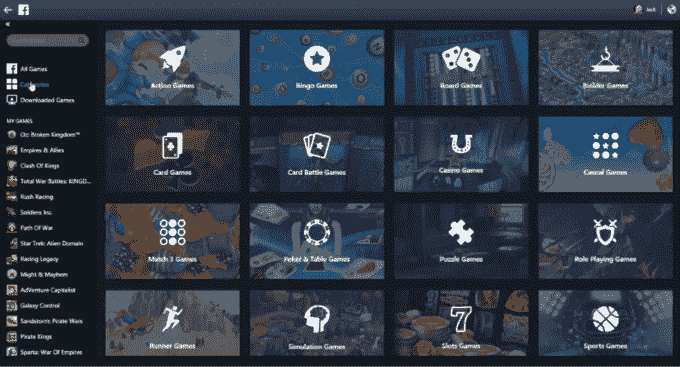
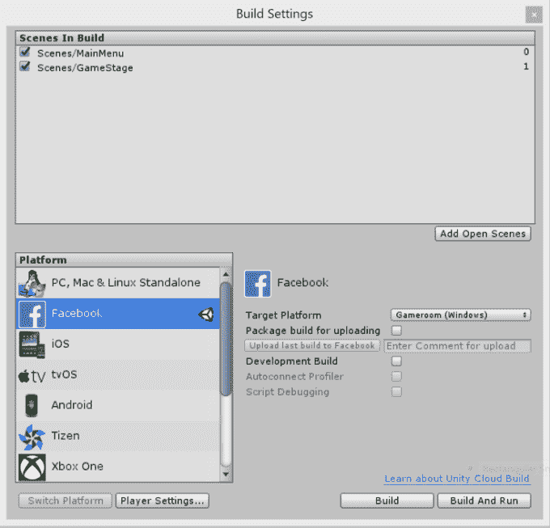

# 脸书正式宣布推出其 PC Steam 竞争对手 TechCrunch game room

> 原文：<https://web.archive.org/web/https://techcrunch.com/2016/11/01/facebook-gameroom/>

# 脸书正式宣布其 PC Steam 竞争对手 Gameroom

在手机游戏输给 iOS 和 Android 之后，脸书正在大举进军 PC 游戏，今天开发者发布了其 [Gameroom](https://web.archive.org/web/20230102151009/http://gameroom.com/) Windows 桌面游戏平台。经过几个月的更名、beta 测试和开发征集，脸书[向所有开发者开放了 beta 版本](https://web.archive.org/web/20230102151009/https://developers.facebook.com/docs/games/gameroom)，并正式命名为 Gameroom。该应用公开[供用户在 Windows 7 及更高版本上下载](https://web.archive.org/web/20230102151009/https://www.facebook.com/gameroom/)。

Gameroom 允许用户在一个专用的 PC 应用程序中玩网络、移动和本地 Gameroom 游戏，不受新闻提要的干扰。

Gameroom 将不得不再次与 Valve 的 Steam 平台进行一场艰难的战斗，该平台拥有超过 1.25 亿活跃用户，在任何给定的时间都有数百万人在玩游戏。脸书需要说服开发者，Gameroom 将分享其社交网络的巨大影响力，因此值得他们这么做。然后，它将不得不说服游戏玩家，更多的社交体验是值得投入一个新平台的。如果脸书成功了，拥有一个博彩目的地有很多潜在的好处。

它可以从游戏支付中获得 30%的收入削减。它可以将用户更深地捆绑到脸书身份层，使他们更难抛弃社交网络。这可能会推动广告销售，因为开发商希望在脸书的新闻推送中推广他们的游戏，或者如果脸书允许的话，可能会在 Gameroom 中进行广告投放。它可以从玩家的游戏流中生成脸书直播内容。

回到 2009 年脸书在桌面上的全盛时期，由于 Zynga 这样的开发商，它在游戏支付上建立了庞大的业务。随着用户抛弃休闲网页游戏转向手机，这个帝国崩溃了，但现在脸书希望用一款 PC 应用程序赢回他们。

将游戏从 Unity 直接导出到脸书游戏室

今天在 [Unity 的游戏开发平台发布会](https://web.archive.org/web/20230102151009/https://developers.facebook.com/blog/post/2016/11/01/unity-editor-beta/)上，脸书宣布了“脸书街机”[的发布和更名。明年发布的 Unity 5.6 将允许开发者将他们的游戏](https://web.archive.org/web/20230102151009/https://www.youtube.com/watch?v=h5iBcVYluRs)[直接输出到脸书游戏室](https://web.archive.org/web/20230102151009/https://developers.facebook.com/docs/games/gameroom)，以及 WebGL 标准。脸书的全球游戏平台总监 Leo Olebe 吹捧脸书将如何在游戏室推出新游戏，以帮助开发者。

脸书在 5 月份首次透露它正在开发游戏街机[,同时推出全球公开测试版，然后透露了更多关于其 Unity 合作伙伴关系以及桌面应用程序如何在 8 月份工作的细节。但是现在 Gameroom 已经开放，有太多的射击游戏、策略游戏、谜题和休闲游戏供人们尝试。接下来是正式的消费者发布会。](https://web.archive.org/web/20230102151009/http://www.adweek.com/socialtimes/facebook-games-arcade-beta/639432)

Steam 可能是现有铁杆游戏玩家的最爱，但脸书打赌，还有一大块尚未开发的主流游戏也准备好了。

