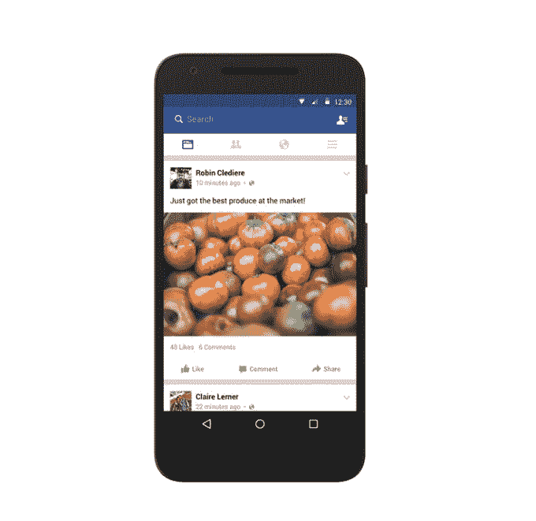

# 脸书获得离线模式 

> 原文：<https://web.archive.org/web/https://techcrunch.com/2015/12/10/facebook-gets-an-offline-mode/>

脸书本周表示，它将开始推出新技术，让移动连接速度较慢的用户仍然可以在他们的新闻订阅中看到新的故事，即使在连接不好或无法到达脸书的服务器时。此外，用户将能够在离线时对帖子发表评论，当你的连接恢复时，这些评论将被发布到应用程序中。

该公司解释说，这些变化的目标是更好地帮助发展中市场的人，他们主要通过手机在较慢的 2G 连接上访问社交网络。

然而，脸书的新闻订阅最初的设计方式并没有考虑到这些用户在试图通过这些滞后的连接观看网络上的新内容时会有多么困难。

由于新闻提要可以说是脸书应用程序上最重要的目的地，该公司设计了一种方法，让用户看到的内容看起来新鲜，而不必强迫用户等待新的故事加载。从现在开始，脸书正在测试一项更新，它将查看你手机上所有以前下载的故事(那些你还没有看过的)，然后根据相关性对它们进行排名。该公司表示，这种排名算法也将考虑图像是否可用。

然后，该应用程序将向你展示这些“新”故事——实际上，这些故事是你已经下载但还没有通过进一步向下滚动你的新闻提要来获得的。这个过程将极大地改善最终用户的体验，因为在等待内容加载时，他们不会看到微调器，而只会看到帖子。

当您的连接恢复时，脸书将恢复正常下载和排名的故事。

它还将测试其他改进，当你有良好的连接时，可以全天下载新故事，这样当连接缺乏时，你总是有相关的内容可以阅读。

脸书还说，你现在还可以像在网上一样与这些故事和帖子互动。

过去，你可以在离线时喜欢和分享帖子，而新的更新将允许你对帖子发表评论。当然，严格来说，这些评论在你重新上线之前是不会被发布的，但是它们至少给了你一个准备评论的方法，并且让你感觉你在正常使用脸书，尽管你没有联网。

尽管这些变化主要是为了帮助新兴市场的人获得更好的脸书体验，但对发达地区的人来说也有好处。例如，如果你在信号不好的地方，甚至完全没有信号——比如地铁隧道或拥挤的活动现场——你也可以利用这些功能。

脸书表示，目前正在测试这些新功能，并“随着时间的推移”推出这些功能，以收集反馈。这意味着，在你自己的脸书应用中，你可能会也可能不会立即看到这些变化。

脸书在这方面的举动引人注目——还有其他大型互联网公司(和小公司！)应该考虑模仿自己。

世界上大部分地区[还没有接入互联网](https://web.archive.org/web/20221224201932/https://www.facebook.com/isconnectivityahumanright)——相反，只有 27 亿人在线，略多于世界的三分之一。脸书、谷歌和其他科技巨头正在努力解决这一问题，他们推出了无人机和高空气球等远程举措，在缺乏互联网接入的地区提供互联网接入。但是越来越多的互联网连接和越来越低的设备成本意味着人们正在快速加入网络。

随着新市场的连接，他们完全跳过了 PC 时代，而是通过移动设备加入互联网。但他们不一定拥有与发达地区相同的强大连接——这就是为什么将脆弱的互联网连接设计为公司产品路线图的一部分是有意义的。