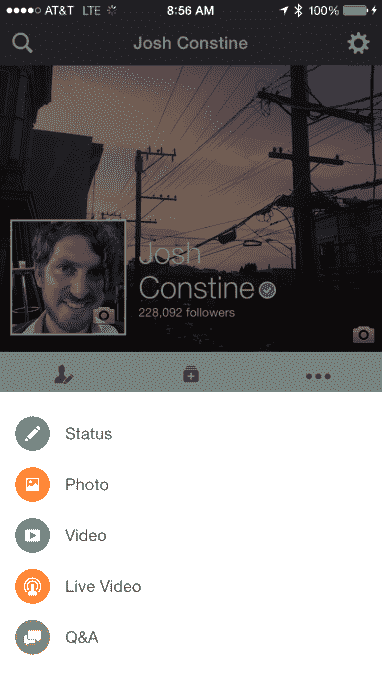
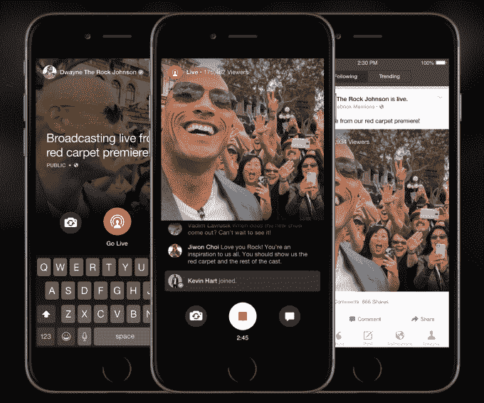

# 脸书通过“实时”流媒体发布经过验证的个人资料，并仅向关注者发布

> 原文：<https://web.archive.org/web/https://techcrunch.com/2015/09/10/facebook-gives-verified-profiles-its-mentions-app-with-live-streaming-and-posts-just-to-followers/>

记者们可能会开始分享更多他们与脸书的链接，因为现在他们终于可以选择不再向他们的朋友发送垃圾邮件，而是只向他们的公众粉丝发帖。

今天，脸书的记者和其他经过验证的个人资料[可以访问](https://web.archive.org/web/20221210033109/http://media.fb.com/2015/09/10/mentions-and-live-for-verified-profiles/)之前为经过验证的页面保留的[提及 iOS 应用](https://web.archive.org/web/20221210033109/https://beta.techcrunch.com/2014/07/17/facebook-launches-mentions-the-exclusive-fb-app-for-playing-the-fame-game/)，[正如我们报道的](https://web.archive.org/web/20221210033109/https://beta.techcrunch.com/2015/08/12/facebook-live-livestreaming/)他们将会访问。它包括普通用户没有的[潜望镜式直播](https://web.archive.org/web/20221210033109/https://beta.techcrunch.com/2015/08/05/facescope)和 Reddit AMA 式问答&功能。但是，新发现的只能向关注者而不是朋友发帖的能力，可能对脸书产生最大的影响。

## 让自我推销不那么尴尬

脸书在 2011 年末推出了推特订阅功能，允许普通用户聚集不是他们朋友的粉丝，但可以看到他们的公开帖子。问题是，要与你的追随者分享，你也必须与你的朋友分享。我抱怨脸书改变了这个。

对许多像我一样的记者来说，这很不舒服。人们不一定会成为我们的朋友，因为他们想用我们所有的文章和视频来抨击我们。但这就是人们追随我们的原因。只有能够同时向所有人分享公共帖子，才会让我们看起来像是在试图利用我们的朋友来获得流量。

这对分享他们创作的新闻记者产生了严重的寒蝉效应。而在 Twitter 上，大多数人对发布自己作品的链接并不感到后悔。但在脸书，像我这样的人只会分享他们最重要或最容易获得的作品。

## 脸书，直接新闻来源

现在，拥有经过验证的个人资料的记者和其他任何人都可以自由地向他们的粉丝分享他们的作品，而不必强加给他们的朋友。在 Mentions 应用中，当撰写状态更新时，经过验证的个人资料可以使用受众隐私选择器公开发布，并且对每个人都可见，但只会出现在关注者的新闻订阅中，而不是朋友。他们还可以使用标准的公开发布来发布每个人的新闻。

我知道我现在打算与我的脸书粉丝分享更多我的 TechCrunch 文章。总的来说，这可能会让脸书的新闻显得更加个人化。记者们不再主要来自代表媒体的版面，他们自己将能够更好地报道时事。

脸书提及经理瓦迪姆·拉夫鲁西克对此表示赞同，他告诉我，“你可能有只有你的追随者才会感兴趣的内容，我们真正希望这将能够做到的一件事是……通过能够专门针对他们的内容来培养这些观众……真正与这些观众交谈。”

这可能有助于脸书寻求与 Twitter 竞争社交新闻中心的地位。它通过新闻推送带动的读者越多，新闻媒体就越依赖脸书。这使得他们更有可能采用像快速加载即时文章这样的程序，或者购买脸书广告。

## 提及更多(并非全部)

脸书在 2014 年 7 月推出了提名权，但只提供给新闻媒体和流行乐队等认证页面。它允许更灵活地监控提及、评论和墙贴，并使其易于进入大趋势话题的讨论。唯一真正独特的功能是问答，但除此之外，它并不重要。

但随着脸书上个月推出与 Periscope 和 Meerkat 竞争的移动直播功能“live ”,提及变得更加重要。该功能仅在提及中可用。

Live 允许贵宾开始实时流广播，该广播出现在他们的追随者的新闻提要中，并向最近与他们互动的粉丝发出通知。观众可以通过叠加在广播公司屏幕上的评论进行实时回应。

之后，这些视频流会变成保存的视频，人们可以在脸书上观看，除非广播公司删除它们，这与 Meerkat 和 Periscope 不同，前者的视频流会立即消失，后者只能播放 24 小时。广播公司也能从他们的信息流中获得分析。

Lavrusik 告诉我“生活进行得很顺利。特别是，我们为什么要尽快发布这一消息，是因为记者们对我们有很多要求。”该公司甚至公布了一些直播的[技巧。[如果你想看我第一次讨论这些变化对脸书的影响的直播，](https://web.archive.org/web/20221210033109/https://www.facebook.com/facebookmedia/best-practices/live)[点击这里](https://web.archive.org/web/20221210033109/https://www.facebook.com/JoshConstine/videos/10101877614447393/?permPage=1)。]

虽然它仍然只在 iOS 上[，但现在已验证的个人资料将被允许登录到提及。Lavrusik 说，脸书正在不断增加更多的帐户，以验证个人资料计划，目前有“数以千计”。记者、名人和公众人物可以](https://web.archive.org/web/20221210033109/https://www.facebook.com/about/mentions/)[在这里申请验证](https://web.archive.org/web/20221210033109/https://www.facebook.com/help/contact/356341591197702)。