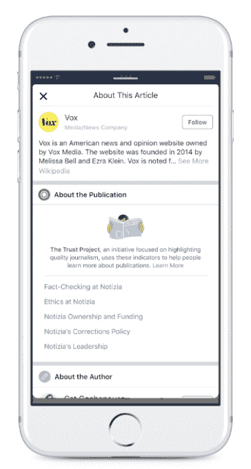
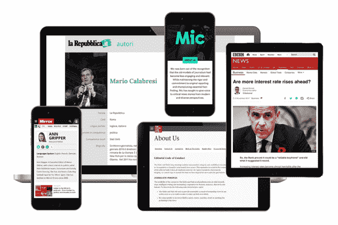

# 脸书、谷歌和其他公司加入信任项目，努力提高在线新闻的透明度

> 原文：<https://web.archive.org/web/https://techcrunch.com/2017/11/16/facebook-google-and-others-join-the-trust-project-an-effort-to-increase-transparency-around-online-news/>

“假新闻”和其他错误信息、在线宣传以及人们认为真实的讽刺内容通过搜索引擎和社交媒体充斥着网络，并在人们如何看待今天的新闻机构及其报道质量方面造成了裂痕。一项名为[信任项目](https://web.archive.org/web/20230404183439/https://www.scu.edu/ethics/focus-areas/journalism-ethics/programs/the-trust-project/)的无党派努力正在通过帮助在线用户区分可靠的新闻和宣传内容或错误信息来解决这种情况。

如今，这一努力的一个关键部分——称为“信任指标”——正在脸书上线，提供关于新闻机构道德和实践的易于获取的透明信息。

这在实践中是如何工作的:[从今天脸书](https://web.archive.org/web/20230404183439/https://media.fb.com/2017/11/16/launching-new-trust-indicators-from-the-trust-project-for-news-on-facebook/)开始，一个图标将出现在新闻提要的文章旁边。根据信托项目的[公告](https://web.archive.org/web/20230404183439/https://www.scu.edu/ethics/focus-areas/journalism-ethics/programs/the-trust-project/trust-project-launches-indicators/)，当你点击这个图标，你可以阅读出版商分享的关于他们组织的“道德和其他标准，记者的背景，以及他们如何工作”的信息。

脸书、谷歌、必应和推特都承诺展示这些指标，尽管并非所有的实现都已经上线。

在谷歌上，信任指标将出现在谷歌新闻、谷歌搜索和其他搜索新闻的谷歌产品中，该公司[今天在博客文章](https://web.archive.org/web/20230404183439/https://www.blog.google/topics/journalism-news/sorting-through-information-help-trust-project/)中解释说。然而，谷歌表示，它仍在确定这些指标将如何显示。

该信托项目本身是由圣克拉拉大学马库拉应用伦理中心的记者萨利·莱曼发起的，由 Craigslist 创始人克雷格·纽马克的慈善基金、谷歌、约翰和詹姆斯·l·奈特基金会、民主基金和马库拉基金会资助。

“在当今数字化和社交网络化的世界里，比以往任何时候都更难分辨什么是准确的报道、广告，甚至是错误的信息，”莱曼在一份声明中说。“越来越多持怀疑态度的公众希望了解新闻背后的专业知识、企业精神和道德规范。信任指标将工具交到人们手中，让他们能够评估新闻是否来自他们可以依赖的可靠来源。”

具体来说，信任项目已经发布了由超过 75 家新闻机构的领导创建的八个信任指标，这些指标将为组织的道德和实践提供额外的透明度。

这些措施如下:

*   > **最佳实践:*你的标准是什么？谁资助了这个新闻频道？插座的使命是什么？再加上对道德、不同声音、准确性、做出修正和其他标准的承诺。***

*   > **作者专长:*这是谁举报的？*** 关于撰写这篇报道的记者的详细信息，包括专业知识和他们从事过的其他报道。
    > 
    > 

*   > **工种:*这是什么？*** 从新闻报道中区分观点、分析和广告商(或赞助商)内容的标签。

*   > **引用和参考:**对于调查性或深度的故事，更大程度地获取事实和论断背后的来源。
    > 
    > 

*   > **方法:**也用于深度报道，关于记者为什么选择追踪一个故事以及他们如何进行这个过程的信息。
    > 
    > 

*   > **本地采购？**让人们知道故事何时源于当地或具有专业知识。
    > 
    > 

*   不同的声音:新闻编辑室引入不同观点的努力。
*   > **可操作的反馈:**新闻编辑室在设置报道优先级、促进报道过程、确保准确性和其他方面吸引公众帮助的努力。
    > 
    > 

首批采用信任指标的新闻机构将于本月上线，包括德国新闻机构 dpa、《经济学人》、《环球邮报》、《独立杂志评论》、Mic、意大利《共和报》和《新闻报》、Trinity Mirror 和《华盛顿邮报》。Haymarket Media Group 将在年底前在三个品牌上实施这些指标，在接下来的六个月中，还将有几个品牌开始展示这些指标。

在脸书，包括 Vox Media(选择网站)和美联社在内的出版商都参与了测试，但[没有透露](https://web.archive.org/web/20230404183439/http://mashable.com/2017/11/16/facebook-trust-indicators-fake-news-problem/?utm_source=feedly&utm_medium=webfeeds#0_hG4eqi7ZqK)出版商的完整名单。

WordPress 插件也将提供给合格的出版商。

特朗普总统领导的“假新闻”的口号有助于削弱一些美国公民对媒体的信任。今天，根据[盖洛普民意测验](https://web.archive.org/web/20230404183439/http://news.gallup.com/poll/195542/americans-trust-mass-media-sinks-new-low.aspx?g_source=MEDIA&g_medium=topic&g_campaign=tiles)，只有三分之一的美国人说他们对新闻媒体有“很大程度”或“相当程度”的信任。但这并不是仅限于美国的问题。在英国，在 2017 年路透社调查机构的[中，只有 43%的人表示新闻是可信的，较去年大幅下降。其他地方也存在类似的问题。](https://web.archive.org/web/20230404183439/https://reutersinstitute.politics.ox.ac.uk/sites/default/files/Digital%20News%20Report%202017%20web_0.pdf)

这就是为什么信托项目的努力不仅限于美国——它与世界各地的新闻机构联盟合作。

该信托项目的努力是在脸书和谷歌等主要科技公司的相关尝试之后进行的，以处理错误信息和宣传在其平台上传播的问题。

最近几个月，脸书和 T2【谷歌都采取了事实核查举措和[其他努力](https://web.archive.org/web/20230404183439/https://techcrunch.com/2017/08/03/facebook-related-articles/)，但这些都被[批评为解决问题“太少，太迟”。错误信息仍然可以像病毒一样传播，而假新闻作者可以简单地改变网址，以避免他们被揭穿的内容被贴上“有争议”的标签。《卫报》最近](https://web.archive.org/web/20230404183439/https://www.theguardian.com/technology/2017/nov/13/way-too-little-way-too-late-facebooks-fact-checkers-say-effort-is-failing)[报道](https://web.archive.org/web/20230404183439/https://www.theguardian.com/technology/2017/nov/13/way-too-little-way-too-late-facebooks-fact-checkers-say-effort-is-failing)，一些早期调查显示，这些努力甚至可能造成伤害，因为没有标签的故事——即使是假的——也被认为是真的。

当然，信托项目的信任指标是另一回事。他们不再给内容贴上有争议的标签，而是允许用户更多地了解新闻背后的组织，并对内容得出自己的结论。

当然，从长远来看，这是否真的有帮助还有待观察。