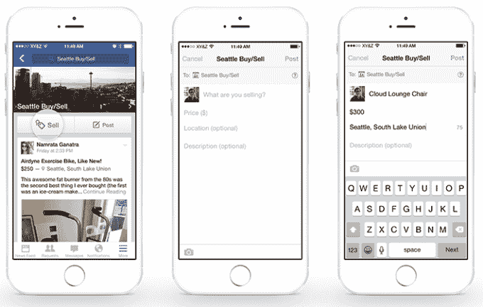

# 脸书测试团体广告，它的下一个潜在摇钱树 

> 原文：<https://web.archive.org/web/https://techcrunch.com/2016/10/10/facebook-group-ads/>

脸书在不淹没新闻源的情况下赚取更多收入的最新技巧是向其群体功能的 10 亿用户提供广告。在人们报告看到“我们正在测试群组广告”的通知后，TechCrunch 进行了询问，脸书证实了澳大利亚、加拿大、爱尔兰和新西兰的移动和桌面版本的群组是测试的一部分。

脸书在一份声明中告诉 TechCrunch:“我们已经开始测试向脸书群体中的人投放广告，并将在确定我们将如何前进之前评估回应。”这些广告看起来和新闻源广告一样。他们将通过群组话题以及标准的基于身份的定位来定位。

脸书表示，它将在 2017 年年中达到[最大](https://web.archive.org/web/20221230170314/http://marketingland.com/ad-load-questions-overtook-facebooks-latest-earnings-call-186354)新闻供稿广告负载，这意味着它需要新的收入来源来继续其多年来一直强劲的收入增长势头。提升 Instagram 的广告负载和今天发布的新的按用户付费的企业协作工具[脸书工作场所](https://web.archive.org/web/20221230170314/https://techcrunch.com/2016/10/10/facebook-workplace/)可以承担部分责任。脸书也在测试新形式的视频直播插播广告，甚至是 Messenger 中来自商家的赞助信息。

但是，创造额外广告收入的最简单的方法可能就是将脸书的传统浏览更多地开放给广告投放，而 Groups 是一个巨大的宝藏。

群体是脸书最早的特色之一，最初是一种表示你支持某项事业或想法的非功能性方式，从人权到踩在易碎树叶上的喜悦。2010 年,[彻底改变了](https://web.archive.org/web/20221230170314/https://techcrunch.com/2010/10/06/facebook-groups/)的功能，成为人们可以交流的论坛，而不仅仅是会员。

到 2014 年，Groups 已经发展到 5 亿用户，并拥有自己的[独立应用](https://web.archive.org/web/20221230170314/https://techcrunch.com/2014/11/18/facebook-launches-standalone-groups-app/)。从那时起，由于商业和其他社区的买卖团体，它的规模翻了一番。从家庭、小团体和愚蠢的文化基因分享，到兴趣俱乐部、抗议组织者和专业讨论场所，团体已经成为脸书体验的一个主要部分。

正是这种目的的多样性可以提升团体广告的价值。如果脸书能够找到一种可靠的方法来对这些群体进行分类，以增强广告的针对性，它就可以向不同兴趣的人提供高度相关且利润丰厚的广告。

与他们是否经常光顾一个曼联球迷的团体相比，喜欢曼联足球队页面的人是一个相对较弱的目标信号。后者可以更准确地表明有人可能购买体育商品。脸书将不得不学会识别那些可以神秘命名或跨越一堆主题的小组的主题。

现在每月有 4 . 5 亿人使用买卖群。脸书刚刚为他们推出了一个专门的[市场](https://web.archive.org/web/20221230170314/https://techcrunch.com/2016/10/03/facebook-marketplace-2/)功能。这些群体也可能成为广告商的强大东道主。例如，他们可以允许一个电子品牌向浏览电视或电脑销售群的用户展示广告。当然，社交网络必须避免展示太多的广告，以免激怒访问者并阻碍使用。

脸书集团通过为新闻传播和私人信息共享提供一个中间地带而蓬勃发展。十年后的今天，各种团体将开始为脸书的底线做出贡献。如果还不清楚的话，脸书愿意在货币化的问题上继续玩下去。