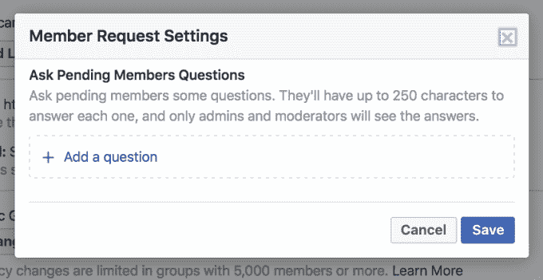

# 脸书团体现在可以通过问卷调查来筛选新成员

> 原文：<https://web.archive.org/web/https://techcrunch.com/2017/05/12/facebook-groups-questions/>

# 脸书团体现在可以通过问卷调查来筛选新成员

脸书正在兑现马克·扎克伯格的承诺，通过改善脸书团体的管理工具来建立社区(T2)。现在，群管理员可以为请求加入他们的群的人设置最多三个问题来回答。这使得管理员可以筛选潜在成员，以确保他们适合该组，并将建设性地添加到讨论中，而不仅仅是垃圾邮件或 troll 组。

脸书表示，这一功能现已推广到全球 100%的群组管理员。脸书发言人告诉 TechCrunch:

> “对管理员来说，筛选新成员申请需要时间和跑腿——尤其是对于那些围绕特定激情或目标建立的小组。对于这些组，管理员在接纳新成员之前通常有特定的标准。建立这些开放式问题使他们能够更快地审查和批准成员请求；反过来，寻求支持或共同兴趣的人可以更快地与他人联系。”

群组管理员可以在其群组的设置菜单中找到“向待定成员提问”选项。然后，他们可以选择最多 3 个问题，潜在成员可以回答每个问题，最多 250 个字符。只有管理员和版主可以看到问题的答案，这些答案不会发布到组中。点击“加入”的用户会被要求立即填写问卷，而被邀请加入的用户会收到一个链接到该表格的通知。申请者可以编辑他们的答案，直到他们被审查。

以前，如果管理员想询问为什么有人想加入他们的群组，他们必须要么加他们为好友，要么尝试发送一条脸书消息，这条消息可能会隐藏在他们的消息请求中。对于大多数管理员来说，一个一个地做这件事并跟踪答案可能太费力了。这导致他们要么不加区别地接纳可能虐待该群体的人，要么根据个人资料中的有限信息拒绝这些人——将他们排除在该群体的社区和支持之外。

早在二月份，扎克伯格写道:“我们在在线社区，也包括线下社区看到的一件事是，拥有一个积极参与、有才华的领导者是打造一个强大社区的关键因素之一……但目前我们的团队产品并没有真正为领导者提供便利。”

让小组领导来定义这些问题，并根据答案来选择谁被录取，这给了他们更多的控制权。这可能会导致更有成效的讨论，减少干扰和不必要的帖子，这些帖子可能会导致成员关闭某个组的通知。

下个月，脸书将在芝加哥举行首次团体管理员社区峰会。在那里，我们可能会期待更多基于扎克伯格宣言中概述的目标的产品发布。这些功能可能包括创建子群组、为版主设置更具体的角色和权限，以及收集关于不同内容或群组增长的性能分析。