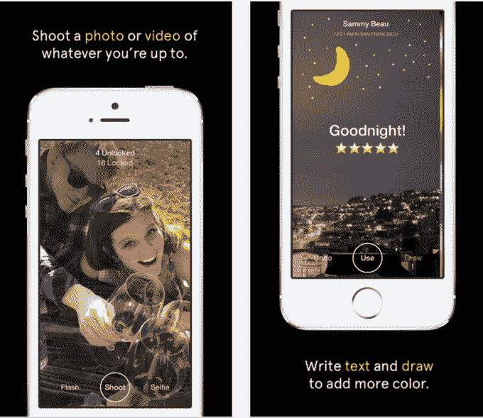

# 脸书用 Slingshot  再次尝试 Snapchat

> 原文：<https://web.archive.org/web/https://techcrunch.com/2014/06/09/facebook-has-another-go-at-snapchat-with-slingshot/>

脸书承诺，它将“把自己打成碎片”，通过把脸书的主要应用拆分成专注于特定功能的迷你应用，来更好地在移动领域竞争。今天，它通过一款名为 [Slingshot](https://web.archive.org/web/20230404124414/https://itunes.apple.com/my/app/id878681557?mt=8) 的新照片和视频分享应用实现了之前声明的意图，现已在部分市场推出。*【见下面的更新:脸书正在拉应用程序。]*

该应用程序旨在允许朋友们分享他们当前正在做的事情的照片和视频，通过将这些内容“扔”给服务上的其他人。然而，与竞争对手 Snapchat 不同的是，朋友们看不到你的照片，除非他们反过来把东西扔回去。

这个功能虽然有点噱头，但似乎是专门为增加弹弓的病毒效应和传播而设计的。通过挖掘用户天生的好奇心，他们可能会被激励与朋友分享，以便“解锁”他们收到的新照片。

根据 Slingshot 的应用商店描述，像竞争对手 Snapchat 一样，你可以用自己的标题和图画给图像加注释。然而，当谈到这些股票的“短暂性”时，该应用程序似乎有些不同。虽然该应用程序承诺，如果你很忙，你可以稍后查看解锁的照片，但一旦它们被刷走，它们就永远消失了。

新的弹弓应用程序与另一个名为 [Taptalk](https://web.archive.org/web/20230404124414/https://www.taptalk.me/) 的新版本非常相似，据报道称，这是脸书工程师们最喜欢的一款应用程序，他们正在积极努力克隆体验[。Slingshot 还模仿了一个名为 Rando 的应用程序所推广的“slinging”概念，这个应用程序在今年三月不幸夭折。当然，脸书早些时候臭名昭著地试图用 Poke 更直接地克隆 Snapchat，Poke 是一个失败的应用程序，最近](https://web.archive.org/web/20230404124414/https://techcrunch.com/2014/05/20/investors-circle-taptalk-after-facebook-clone-rumors/)[从 App Store 下架](https://web.archive.org/web/20230404124414/http://www.techmeme.com/140509/p32#a140509p32)。

目前，新的 Slingshot 应用程序仅在特定市场提供，因为这似乎是一个测试或阶段性推出。(我们已经联系了脸书进行确认。)在发布之时，Slingshot 还没有在美国市场上市，所以我们目前还无法测试这款应用的具体工作情况，但我们会在上市时提供更长时间的评测。

与此同时，精选市场(见下表)可以[在 iTunes](https://web.archive.org/web/20230404124414/https://itunes.apple.com/my/app/id878681557?mt=8) 上下载该应用程序。目前似乎还没有安卓版本。

**市场:AU、NZ、JP、HK、SG、CN、KR、IN、RU、TW、VN、MY、PH、TH、ID、PK、SA、AE、LK、KW、LB、QA、MO、KZ、MD、AM、JO、KE、MU、UG、BH、BN、OM、BY、UZ、AZ、YE*

**更新**:Verge[报道](https://web.archive.org/web/20230404124414/http://www.theverge.com/2014/6/9/5794388/facebook-takes-another-stab-at-snapchat-with-slingshot-app)该应用不再可用，尽管我们仍然看到它在美国东部时间下午 4:40 出现在特定市场。这款应用从未在美国商店出售，但现在你必须在 iTunes 内更换商店才能看到它，因为应用商店页面关闭了。这可能表明脸书正在撤回该应用程序，事实证明——例如，即使当你在马来西亚的商店里，如果你点击下载该应用程序，你会得到一个错误。脸书没有发表评论。

**更新 2** :脸书发言人现在告诉我们*“今天早些时候，我们意外发布了一个版本的弹弓，这是一个我们正在开发的新应用。有了 Slingshot，你可以同时与许多人分享每天的精彩瞬间。它很快就会准备好，我们期待您的试用。”*