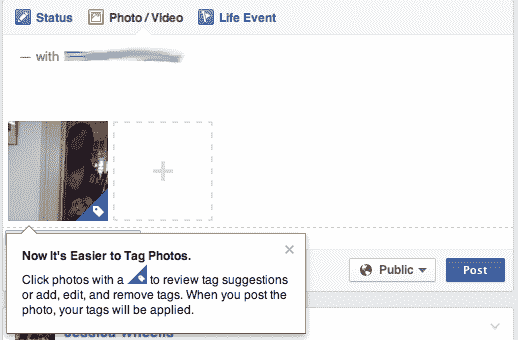

# 欧洲脸书用户可以使用标签建议功能，查看美国朋友的照片

> 原文：<https://web.archive.org/web/https://techcrunch.com/2014/09/02/facebook-has-restored-some-facial-recognition-in-europe-tagging-u-s-friends-photos/>

2012 年，[脸书](https://web.archive.org/web/20221205115129/http://www.facebook.com/)受到隐私倡导者的抨击，[最终关闭了](https://web.archive.org/web/20221205115129/https://beta.techcrunch.com/2012/09/21/facebook-turns-off-facial-recognition-in-the-eu-gets-the-all-clear-from-irelands-data-protection-commissioner-on-its-review/)欧盟所有的面部识别服务，这些服务可以自动识别并提示你上传到社交网络的照片中朋友的名字。但是你知道吗，脸书似乎已经在欧洲恢复了这项服务的一个方面。脸书现在向在欧洲上传照片到脸书的用户推荐照片标签，但前提是照片主体是来自美国的朋友，并且*只有在这些朋友在他们的个人资料上启用了标签推荐功能的情况下*。

脸书的面部识别功能“标签建议”重新浮出水面，最初是由一位脸书朋友引起我的注意的。根据我自己的时间表和其他几个在欧盟注册账户的朋友的时间表，我们做了一些测试，下面是我们的发现:

如果你上传了一个朋友的照片，他的账户注册在美国，并且这个人已经启用了识别他或她的图像的功能，那么这个人的面部就会被识别出来(尽脸书的技术所能),并且这个人会被标记为:

据我们所知，这不会影响欧盟用户的面部照片。换句话说，如果你上传了一张欧洲朋友的照片，他们不会被标记。如果你上传两个人的照片，一个在美国，另一个不在，只有美国人会被标记，如果他在隐私设置中启用了该功能。像这样:

这似乎是最近的变化:正如你在上面的第一张图中看到的，你现在也可以看到标签建议的提示，以添加其他标签，并查看来自脸书的其他建议。似乎角落里的标签图标只是为一些符合上述标准的图片而设计的。

我在英国的朋友已经向我证实了这种方式，在德国也完全一样，我的朋友[matthus Krzykowski](https://web.archive.org/web/20221205115129/http://www.crunchbase.com/person/matthaus-krzykowski)告诉我。

我们联系了脸书，想了解更多关于这里发生了什么，他们什么时候开启的，以及是否会有更多的细节。现在，这里有一些背景:

“标签建议”功能是脸书已经使用和开发了一段时间的东西，部分是由以色列初创公司 Face.com 的技术支持的，该公司于 2012 年被[收购](https://web.archive.org/web/20221205115129/https://beta.techcrunch.com/2012/06/18/facebook-scoops-up-face-com-for-100m-to-bolster-its-facial-recognition-tech/)。至少 Face.com 的一些员工还在为脸书工作。

但是，虽然 tag suggest 在美国等市场一直很受欢迎，但脸书[早在 2012 年 9 月](https://web.archive.org/web/20221205115129/https://beta.techcrunch.com/2012/09/21/facebook-turns-off-facial-recognition-in-the-eu-gets-the-all-clear-from-irelands-data-protection-commissioner-on-its-review/)就为欧洲用户关闭了它，以回应[列出的脸书需要在其平台上改变的功能，这些功能被爱尔兰数据保护局(DPA)](https://web.archive.org/web/20221205115129/http://dataprotection.ie/docs/Facebook_Audit_Review_Report/1232.htm) 标记出来。德新社的报告是为了回应 2011 年由马克斯·施雷姆提出的隐私投诉而编写的，正是这位奥地利法律专业的学生，现在正牵头对该公司涉嫌侵犯隐私的[集体诉讼](https://web.archive.org/web/20221205115129/https://beta.techcrunch.com/2014/08/21/european-facebook-class-action-suit-attracts-60k-users-as-it-passes-first-court-hurdle/)(脸书的眼中钉，实际上是)。*

由于脸书的国际总部位于爱尔兰，爱尔兰市场的法院和监管机构做出的裁决会产生广泛的影响，这些裁决会影响脸书在整个欧盟的运作。

但是，尽管脸书在 2012 年做出了一个非常明确的决定，对所有新的欧洲用户关闭面部识别功能，并在当年 10 月之前删除现有欧洲用户的所有标签建议数据，但它也留下了一个漏洞，让它如何能够活到标签建议的另一天。

> “作为我们在欧洲的监管机构，爱尔兰数据保护专员办公室一直在与我们合作，以确保我们不断提高我们已纳入现有工具的高控制标准，”一名发言人当时表示。
> 
> “这次审计是持续监督过程的一部分，我们很高兴，正如数据保护专员所说，最新的公告证实了我们不仅符合欧洲数据保护法，而且我们已经超越了他们最初的一些建议，并完全致力于数据保护合规性的最佳实践。”

然而，这位发言人继续明确表示，当脸书想出如何与监管机构达成一致时，它将重新审视面部识别:

> “值得我们重申的是，一旦我们就用 DPC 通知和教育用户的最佳方式达成一致，我们希望重新推出这个有用的工具。”

虽然这一天还没有到来，但我们似乎至少在这方面迈出了一小步。

*有关更多背景信息…Schrems 和其他人反对像脸书的面部识别这样的事情的论点是，它给了个人更少的控制，让他们如何在脸书的数据库中被标记和组织，以及潜在的货币化。争论的另一面是，这可能是一种标记和提醒朋友他们照片的有用方式，目前还不清楚这些数据是否会被重新利用，从而对你的服务体验产生负面影响。我个人支持对你的数据进行更多的控制，如果这是你个人想要的，因为如果你实际上不在乎这种或那种方式，这仍然给了个人较少控制的选择。

*更新了帖子，进一步澄清了只有启用标签建议的美国用户才能在他们欧洲的脸书网络上传的照片中提出建议的标签。*