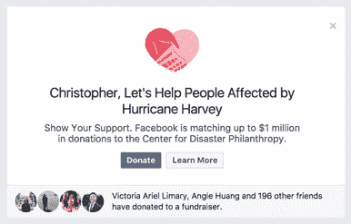

# 脸书将匹配哈维救济捐赠高达 100 万美元

> 原文：<https://web.archive.org/web/https://techcrunch.com/2017/08/29/facebook-hurricane-harvey-fundraising/>

# 脸书将匹配哈维救济捐款高达 100 万美元

随着热带风暴哈维继续淹没德克萨斯海湾沿岸，脸书的用户有了一个为救援工作捐款的理由。脸书周二宣布，它将为其用户筹集的哈维救灾资金提供高达 100 万美元的匹配资金。

为了向平台上的 Harvey recovery 努力捐赠符合条件的资金，脸书用户可以关注他们新闻订阅顶部的消息，敦促他们捐款，或者他们可以通过[灾难慈善中心的脸书页面](https://web.archive.org/web/20230326183911/https://www.facebook.com/funds4disaster)直接捐款。

多年来，脸书越来越多地将自己定位为一个筹资工具，以及在危机时刻联系朋友和亲人的工具。今年 6 月，脸书宣布其安全检查功能——用户在紧急情况和自然灾害中标记自己“安全”的工具——将集成对特定危机筹款的支持。虽然安全检查并非没有批评，但脸书利用其神秘的社会参与能力为救灾筹款的能力，是这个世界上最大的社交网络更明显的净效益之一。