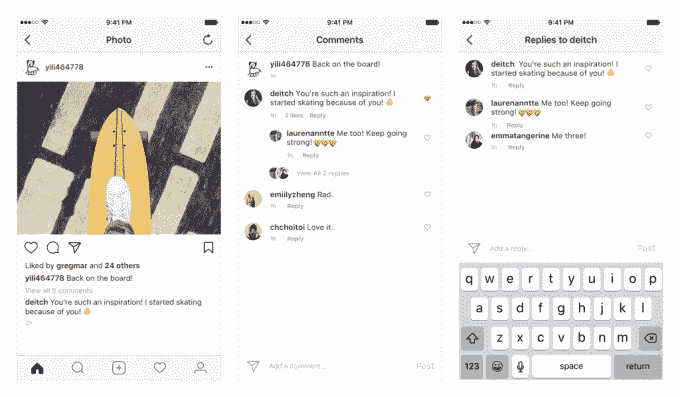
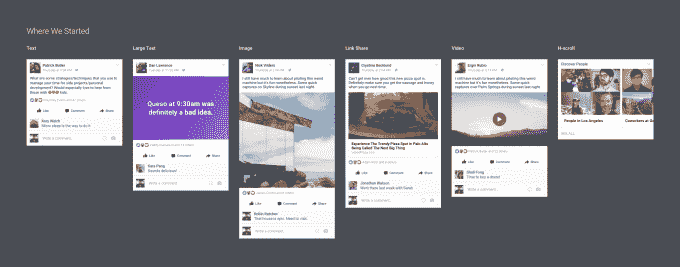
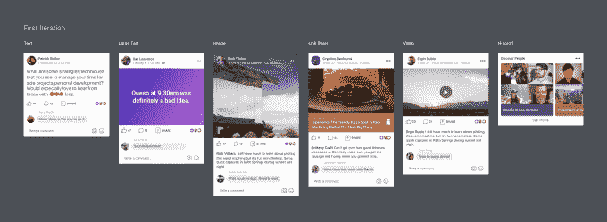
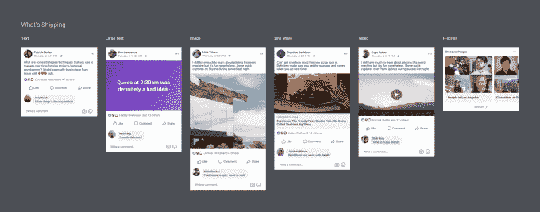
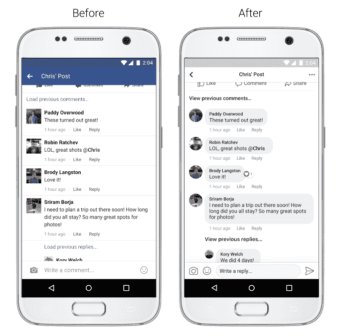
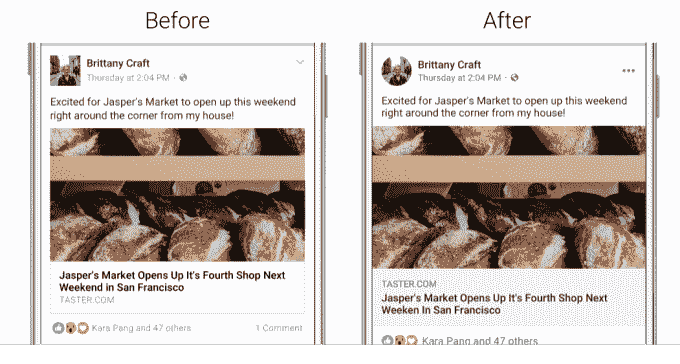
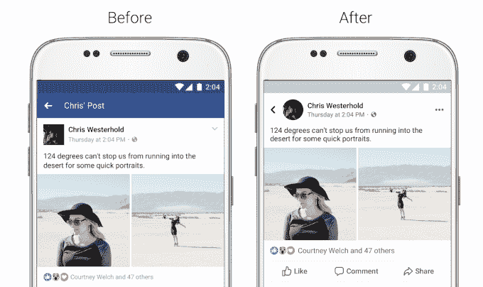

# 脸书和 Instagram 为可读性进行了重新设计

> 原文：<https://web.archive.org/web/https://techcrunch.com/2017/08/15/facebook-instagram-comments/>

从 line drawings、Reddit 和 Messenger 中获得灵感，脸书正在彻底改革新闻订阅的设计，使其更加易读、可点击和可评论。具体来说，脸书现在让线程在注释中的开始和结束变得更加清晰。与此同时， [Instagram](https://web.archive.org/web/20230404155746/https://instagram-press.com/blog/2017/08/15/keep-the-conversation-going-with-comment-threads/) 今天进行了小小的重新设计，评论卷轴现在被穿入，这样你就可以在公共场合进行次级对话。

脸书定期更新其设计，通常剥离不必要的“铬”，或用户界面框架，以创造一个更光滑，更可读的外观。脸书上的空白空间越来越多，这可能是为了减少长时间浏览时的眼睛疲劳，让你朋友的内容更生动地弹出屏幕。

脸书的设计团队[写道](https://web.archive.org/web/20230404155746/https://medium.com/facebook-design/evolving-the-facebook-news-feed-to-serve-you-better-f844a5cb903d)“我们不想只是‘摆弄边缘’，而是让数十亿人每天使用的东西不那么令人沮丧。”

脸书和 Instagram 的变化将在未来几周内推广到所有 iOS 和 Android 用户。

## 脸书评论

脸书正在采用信使泡泡风格进行评论。这将使线程更加明显，但也鼓励人们在私人信息中通常进行的快速对话。脸书最近一直试图让评论更有活力，快速对话成为他们自己的聊天窗口。

## 导航和类似按钮

脸书用一种新的未填充的线条绘制风格使它的导航和反馈按钮变得更大更容易识别。新闻订阅、视频、市场、喜欢、评论和分享按钮现在都采用了这种外观。与此同时，脸书将经典的全球通知图标换成了更标准的警报铃。这些都可以减少对眼睛的干扰，让你专注于脸书的内容，而不是它的 chrome。

其他易读性的重新设计包括更高对比度的文本，更容易看到，以及占用更少空间和更人性化的圆形侧面照片。链接预览现在也变大了一点，这可以让更多的人点击并向其他网站发送推荐流量。然而，脸书说，今天的变化不应该影响网页的覆盖范围或流量。URL 域现在更加突出，出现在链接标题的上方，这可以减少用户点击模仿流行新闻出版商 URL 的虚假/恶作剧网站的可能性。

## 知道自己身在何处

脸书想确保你不会迷失在饲料的几层深处。现在，当你深入查看 News Feed 上的一篇文章时，你会看到一个更明显的标题和一个更大的黑色后退按钮。脸书还说，你可以“点击前先看看某个链接会把你带到哪里”，尽管它已经有了链接预览、简介和 URL，所以我们在这里要求澄清。

## 设计伦理

随着脸书和 Instagram 重新设计自己以提高使用率，一个关于设计伦理的问题出现了。造一个更好的捕鼠器对社会有益吗？脸书和 Instagram 当然允许社区和朋友团体发展联系，但什么时候富有成效的交流和感性的娱乐会让位于无意识的滚动？

正如前谷歌设计伦理学家 Tristan Harris 在他的 TED 演讲中所讨论的那样，对社交网络参与的过度优化已经创造了令人上瘾的应用程序，甚至达到了破坏性的程度。

多年来，我多次询问脸书的高管，如首席信息官 Chris Cox 和新闻反馈副总裁 Adam Mosseri，公司是否正在研究如何防止或尽量减少脸书广告驱动的商业模式导致的网络成瘾，我从未得到直接的回答，表明他们认为这是一个优先事项。

他们确实关心用户的体验，考克斯告诉我“我们正在达到一个规模，值得认真考虑我们可以做些什么来使社交媒体成为最积极的力量。”但是你总是可以拥有太多的好东西。

高管们告诉我，脸书希望确保你花在应用上的所有时间都是“有意义的”。然而，在某些时候，当人们独自坐在黑暗中一遍又一遍地刷新信息时，可能值得提出网瘾和心理健康提示，或者鼓励他们通过信息直接与朋友联系。

也许有一天，我们的应用程序将被重新设计，不仅是为了吸引更多的注意力，也是为了在我们忽略其他一切的时候提醒我们。