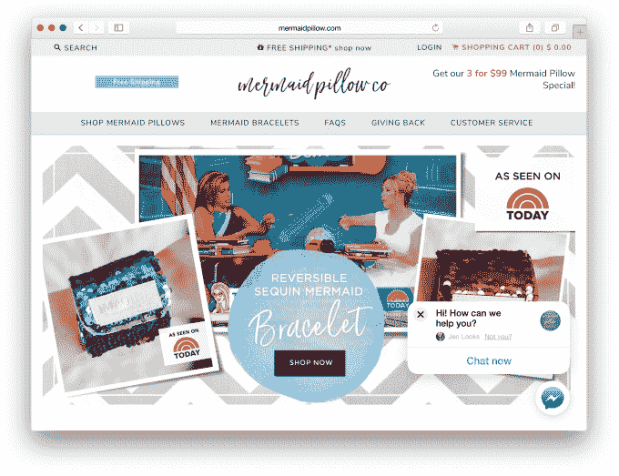
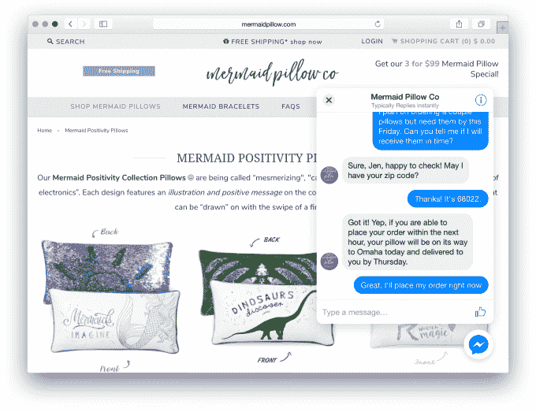

# 脸书推出商业网站信使插件 

> 原文：<https://web.archive.org/web/https://techcrunch.com/2017/11/07/facebook-introduces-a-messenger-plugin-for-business-websites/>

Facebook Messenger 正在进入企业自己的网站。这家社交网络公司今天宣布在[封闭测试版](https://web.archive.org/web/20221007062553/https://www.facebook.com/help/contact/183001548938810)中推出一个新的客户聊天插件，该插件将允许客户使用 Messenger 在其网站上直接与企业对话，并在网络、移动和平板设备上继续这些对话。

虽然市场上已经有大量的网站客户支持和聊天插件，但脸书的优势在于其平台和覆盖范围。

使用 Messenger 的能力不仅意味着企业可以在一个应用程序中使用自己，该应用程序现在拥有大约[12 亿每月用户](https://web.archive.org/web/20221007062553/https://beta.techcrunch.com/2017/04/12/messenger/)并且还在增长，Messenger 平台还支持支付、理解自然语言的机器人和富媒体等功能。

脸书表示，这些功能也将在网站插件的测试版中得到支持，新的体验将及时添加，因此该插件与 Messenger 应用程序本身一样“功能丰富”。

像其他网络聊天系统一样，Messenger 聊天插件被设计为悬停在企业网页上方，并由熟悉的蓝色 Messenger 图标指示。

当客户开始与企业聊天时，他们将看到与他们已经习惯的在移动设备上使用应用程序相同的 Messenger 界面。

当客户离开网站时，他们仍然可以使用 Messenger 应用程序从手机或平板电脑上查看或继续他们的对话。(如果企业不能立即响应用户通过 Messenger 从网上发来的请求，这也很有用。)

对于已经在脸书有相当规模的业务，并通过他们的脸书页面定期与客户接触的企业来说，为他们的网站提供一个聊天插件可能是有意义的，因为他们不必为来自网络的用户查询维护一个单独的渠道。它还可以减轻公司支持电子邮件的压力，这是今天许多网站引导客户提问的地方。

然而，对于通过聊天系统进行故障排除和技术支持的网站来说，聊天插件可能没有那么有用，因为它不与其他后端支持系统连接，例如，当聊天会话是引导客户找到正确支持代理的起点时。它也缺乏专业系统提供的一些更强大的分析工具。对于通过聊天对在线线索进行分类的企业来说，这可能并不理想。

[图库 ids="1564566，1564565，1564564，1564561，1564560，1564559，1564558，1564555，1564569，1564568，1564563，1564562，1564557，1564556"]

Messenger 平台的这一新功能只是脸书最近几个月瞄准商业客户的几种方式之一。今年早些时候，该公司[推出了](https://web.archive.org/web/20221007062553/https://beta.techcrunch.com/2017/04/18/facebook-bot-discovery/)新的发现机制来寻找信使机器人，并允许其“M”应用内助手在与对话相关时建议企业的机器人。脸书甚至[测试了](https://web.archive.org/web/20221007062553/https://beta.techcrunch.com/2017/01/25/facebook-messenger-begins-testing-ads-and-theyre-big/) Messenger 广告，这将允许企业向应用程序的用户提供聊天、购物、注册等服务。

这个新插件现在正在由许多合作伙伴进行测试，包括 AdoreMe、法航、Argos、Aviva、Bodeaz、Goibibo、Keto Mojo、KLM、美人鱼枕头、Spoqa、Total Activation、Volaris 和 Zalando。脸书说，在测试期间，其他感兴趣的企业可以[注册，以便在聊天插件广泛可用时得到通知。](https://web.archive.org/web/20221007062553/https://www.facebook.com/help/contact/183001548938810)