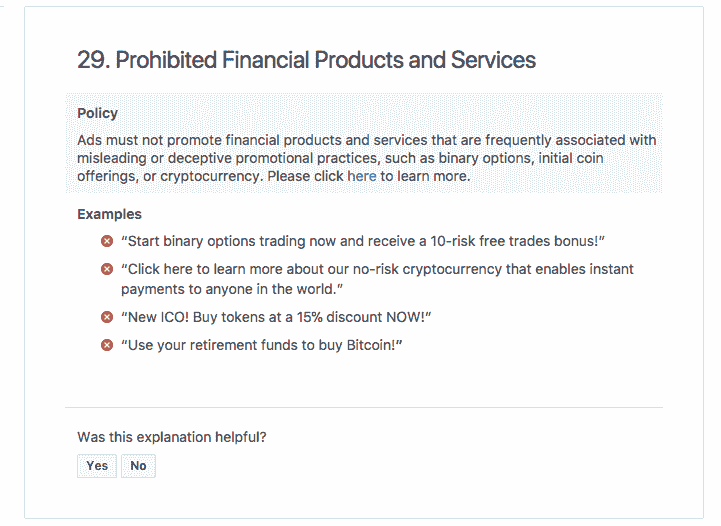

# 脸书禁止加密货币和 ICO 广告

> 原文：<https://web.archive.org/web/https://techcrunch.com/2018/01/30/facebook-is-banning-cryptocurrency-and-ico-ads/>

# 脸书禁止加密货币和 ICO 广告

脸书有一个关于加密货币、二元期权和首次发行硬币的新广告政策。该政策明确禁止宣传那些“经常与误导或欺骗行为相关联”的产品和服务的广告，[脸书产品管理总监 Rob Leathern 今天在一篇博客文章中写道。](https://web.archive.org/web/20230404151918/https://www.facebook.com/business/news/new-ads-policy-improving-integrity-and-security-of-financial-product-and-services-ads)

比特币、莱特币和以太币等加密货币以及最初的硬币发行都已成为主流，这迅速导致了一些骗局。虽然脸书表示，它希望人们“继续发现和学习”这些产品和服务，“但有许多公司正在宣传二元期权、ico 和加密货币，目前并没有诚信经营，”learn 写道。

Leathern 承认该政策相当宽泛，但他说这是有意的。计划是继续努力更好地检测与加密货币、ico 和二元期权相关的欺骗性和误导性广告。

随着时间的推移，脸书表示，随着信号的改善，它将重新审视这项政策及其执行机制。同时，脸书鼓励人们举报违反这一政策的内容。

“这项政策是我们正在进行的努力的一部分，以提高我们广告的完整性和安全性，并使骗子更难从脸书的存在中获利，”Leathern 写道。

