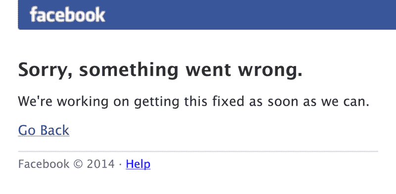
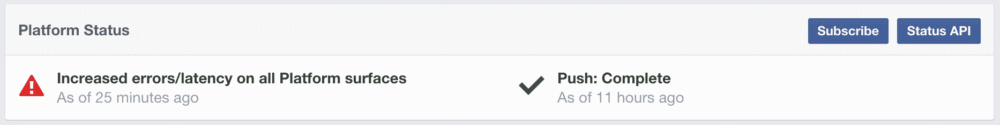

# 许多人都认为脸书不行了 

> 原文：<https://web.archive.org/web/https://techcrunch.com/2014/08/01/facebook-is-down-for-many-2/>

# 许多人都认为脸书失败了

对于许多人来说，脸书似乎正在经历低谷。如果你加载这个网站，你会得到一个如下图所示的错误。该网站已经关闭了大约 10 分钟。

类似地，移动应用程序出现网络错误，您的内容不会刷新。一些 TechCrunch 的作者可以加载网站，但当他们点击某个东西时，他们会得到错误信息。所以如果你幸运的话，你将能够加载主页，但是你不会有任何进展。

说到开发者平台，我甚至无法加载[状态页面](https://web.archive.org/web/20230130230206/https://developers.facebook.com/status/)来查看第三方应用是否受到影响。Instagram 似乎正在发挥作用，至少是部分作用。你不能喜欢一张照片或者关注一个人。

那么，你的工作效率怎么样？与此同时，如果你真的不想工作，这里有几个你不想错过的有趣的 TechCrunch 故事:

*   马特·伯恩斯花了几天时间研究小米设备和苹果设备之间的相似之处，以下是他发现的。
*   Josh Constine 公布了广受欢迎的推特账户@HiddenCash 的真实身份。
*   如果你正在寻找一款新的便携式相机，达雷尔·埃瑟林顿可能已经找到了最适合你的相机。

**更新:** [脸书](https://web.archive.org/web/20230130230206/http://www.crunchbase.com/organization/facebook)已经下来 30 分钟了。开发者平台状态页面现在加载并显示脸书的平台在过去的 25 分钟内遇到了问题。

大约 45 分钟后，脸书似乎正在慢慢恢复。页面加载非常慢。再过几分钟，一切都会恢复正常。

https://twitter.com/rharpe/status/495246876241707009

* * *

