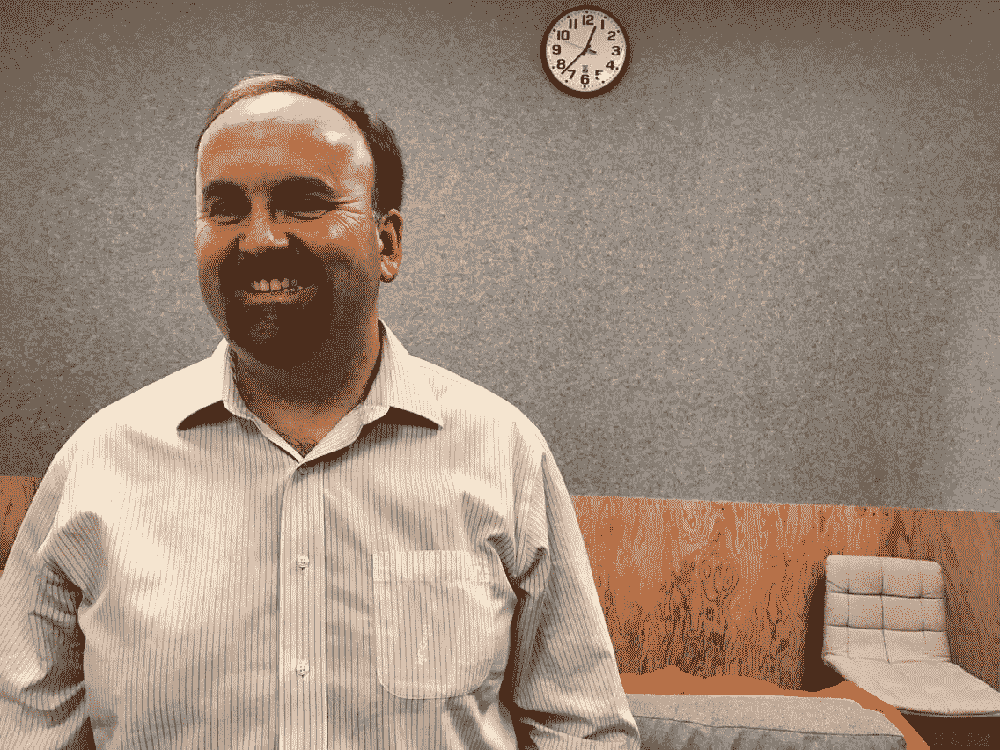

# 脸书通过预测你会看哪里来改善 360°视频体验 

> 原文：<https://web.archive.org/web/https://techcrunch.com/2017/04/19/facebook-is-improving-the-360-video-experience-by-predicting-where-you-will-look/>

# 脸书通过预测你会看哪里来改善 360°视频体验

在 F8 的舞台上，脸书的应用机器学习总监华金·奎诺内罗(Joaquin Quinonero)描述了该公司用来改善 360 视频观看体验的一项新技术。由于其大小，这种格式很难交付，但脸书正在使用机器学习来减少每次必须渲染的像素数量。通过预测观众下一步会看哪里，可以优先呈现该位置——这对于互联网接入质量较低的用户尤其有用。

360°视频的现状是被动反应而非主动渲染。脸书虚拟现实视频团队的工程总监迈克·考沃德(Mike Coward)向我反映了用户的沮丧，他描述了在虚拟现实中转头只能看到模糊场景的不愉快。

一个部分解决方法是优化压缩。但该公司的团队已经在使用机器学习来选择一千多种视频片段的压缩技术。另一种减少流负载的方法是减少你渲染的内容。脸书的方法没有全面降低质量，而是提高了你接下来最有可能看到的东西的分辨率。

迈克·考沃德，脸书虚拟现实视频团队的工程总监

第一步是利用公司的资源来监控人们在观看 360 视频时实际上在看哪里。脸书的虚拟现实视频团队创建了一个热图，突出显示了用户在视频中观看的最受欢迎的地方。在那里，脸书使用深度神经网络构建了一个生成性显著图。这个模型使得对以前没有被观看或研究过的新视频进行预测成为可能。

如果人类被赋予预测某人可能会看哪里的任务，他们可能会研究他们的自然环境，并寻找可能引起人们兴趣的异常现象——想想鸟类或驶过的汽车。

抽象到神经网络，物理的汽车和鸟类不再重要。脸书的模型在大规模视频语料库上进行训练，以识别视频帧的有趣子集。科沃德告诉我，当面对海洋中的冲浪者时，模型能够挑选出最有趣的冲浪者，尽管事实上两者都是快速移动的实体。

在实现预测模型后，脸书能够将 VR 设备的分辨率提高 39%。除了提高分辨率，让没有强大网络连接的人也能观看 360°视频之外，这项技术有朝一日还可能为创作者提供如何让视频更具吸引力的抢先建议。