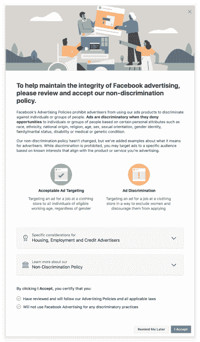

# 脸书正在移除 5000 多个广告定位选项，以防止歧视性广告 

> 原文：<https://web.archive.org/web/https://techcrunch.com/2018/08/21/facebook-is-removing-over-5000-ad-targeting-options-to-prevent-discriminatory-ads/>

脸书[今天早上宣布](https://web.archive.org/web/20221206020232/https://www.facebook.com/business/news/keeping-advertising-safe-and-civil)将改变其广告定位系统的工作方式，以解决滥用其平台基于种族和宗教等因素歧视和排斥观众的问题。该公司表示，现在正在删除超过 5000 个广告定位选项，这些选项可能被滥用来在其平台上放置歧视性广告。

这一消息是在美国住房和城市发展部(HUD)对脸书提出新的[投诉](https://web.archive.org/web/20221206020232/https://www.hud.gov/press/press_releases_media_advisories/HUD_No_18_085)，[指控其帮助](https://web.archive.org/web/20221206020232/https://techcrunch.com/2018/08/19/hud-complaint-accuses-facebook-ads-of-violating-fair-housing-act/)房东和房屋卖家违反公平住房法案后不久发布的。它说脸书的广告设置无视法律，允许广告商瞄准特定的人群。

“当脸书使用它收集的大量个人数据来帮助广告商进行歧视时，这无异于当着某人的面把门关上，”负责公平住房和平等机会的助理部长安娜·玛丽亚·法瑞斯在该部门发布的一份声明中说。

脸书回应称，这种做法在其广告政策中是被禁止的，并将继续与 HUD 合作解决其投诉。

今天，该公司表示，它将删除 5000 多个有可能被滥用的目标选项。

该公司在一篇博客文章中解释说:“虽然这些选择已被合法地用于接触对某种产品或服务感兴趣的人，但我们认为最大限度地降低滥用风险更重要。”脸书没有提供被删除选项的列表，但指出这些选项与宗教和种族等属性有关。

它还表示，将通过其广告管理器工具向美国广告客户推出新的认证，这将要求广告客户在发布住房、就业或信贷广告时，适当注册他们是否遵守脸书的非歧视政策。广告客户需要完成认证，包括接受政策教育并通过表格同意。

脸书表示，这一认证将及时到达其他国家，并将通过其其他工具和 API 提供。

今年早些时候，[脸书曾表示，](https://web.archive.org/web/20221206020232/https://www.facebook.com/business/news/reviewing-targeting-to-ensure-advertising-is-safe-and-civil?ref=fbb_blog)将更新其产品，通过雇佣更多广告审查员和使用机器学习技术，在歧视性广告投放前将其捕捉。它还引入了新的提示，在广告商发起广告活动之前提醒他们反歧视政策。

然而，问题不仅仅在于广告商选择了某些选项来锁定个人广告，他们还利用广告定位选项来排除其他人。[脸书在 4 月份表示](https://web.archive.org/web/20221206020232/https://www.facebook.com/business/news/reviewing-targeting-to-ensure-advertising-is-safe-and-civil?ref=fbb_blog)其结果是将数以千计的类别从排斥目标中移除，包括与种族、民族、性取向和宗教相关的类别。

然而，该公司多年来一直因其广告定位工具可能被滥用而受到批评。

例如，早在 2016 年，脸书不得不[禁用](https://web.archive.org/web/20221206020232/https://techcrunch.com/2016/11/11/facebook-sort-of-disables-ethnic-affinity-targeting/)一个针对住房、就业和信贷相关广告的“种族亲和力”定位选项，此前 ProPublica [的一份报告](https://web.archive.org/web/20221206020232/https://techcrunch.com/2016/11/11/facebook-sort-of-disables-ethnic-affinity-targeting/)指出，这些工具可能被用于住房和就业领域的歧视性广告，这是非法的。它[后来推出了更多的信息性信息，更新了广告政策，并开始测试识别非法广告的工具。](https://web.archive.org/web/20221206020232/https://techcrunch.com/2017/02/08/facebook-updates-its-ad-policies-and-tools-to-protect-against-discriminatory-practices/)

这家[公司最近因允许广告商根据与用户的政治信仰、性取向和宗教相关的兴趣来锁定用户而受到抨击](https://web.archive.org/web/20221206020232/https://techcrunch.com/2018/05/16/facebook-faces-fresh-criticism-over-ad-targeting-of-sensitive-interests/)，根据现行的欧洲数据保护法，这些类别现在被视为“敏感信息”。该公司当时的回应是解释用户如何管理他们的广告偏好。

《今日脸书》表示，随着对这些工具的进一步完善，它将在未来几个月分享更多的广告定位更新。