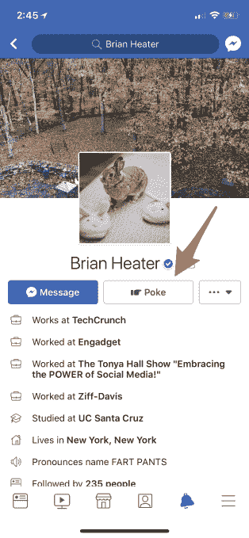

# 脸书正试图让戳再次发生 

> 原文：<https://web.archive.org/web/https://techcrunch.com/2017/12/11/facebook-is-trying-to-make-the-poke-happen-again/>

脸书的“戳”功能从未真正消失过，但现在社交网络给了它一个更突出的位置——甚至考虑扩大休闲问候选项集，包括其他选项，如眨眼，挥手，击掌或拥抱。

虽然脸书从未真正停止过这个古老的功能，这是一种在网络上获得某人注意力的快速方式，但现在它给了这个戳一个非常明显的位置。

在手机用户资料的顶部，戳按钮位于消息按钮旁边，就在你朋友的名字和照片的下方。

扑克是脸书最古老的特色之一。它存在的时候，社交网络[还被称为 facebook](https://web.archive.org/web/20230125185559/http://www.slate.com/articles/technology/technology/2014/02/facebook_s_poke_function_still_a_mystery_on_the_social_network_s_10th_anniversary.html) ，网站上没有今天这么多事情可做。戳的含义从未被定义，因为脸书决定把它留给解释。

“当我们创造这个戳的时候，我们认为有一个没有任何特定目的的功能会很酷，”脸书曾经解释过。“人们对戳有许多不同的解释，我们鼓励你提出自己的意思。”

当然，许多人认为戳戳是一种虚拟的调情方式，而其他人则认为这更像是一个玩笑。朋友之间的扑克战争也随之而来。

现在，看起来脸书想再给这位大佬一次机会。

新的戳按钮的位置也使意外戳更容易发生，当你的目标是消息按钮，或者只是浏览用户的个人资料。

出于这个原因，似乎不是每个人都对这个新按钮感到兴奋:

因为该功能来自脸书历史的早期，所以对于一些不知道该功能做什么或为什么会有它的用户来说，这个戳实际上有点神秘。其他人，谁记得戳，认为它已经被删除，刚刚返回:

但这一戳从未被永久关闭——它只是被藏在导航中。现在，这是不可能错过的。

脸书也还没玩完。

该公司一直在测试一系列新的问候方式，包括你好、击掌、拥抱和眨眼，以及最近发现的戳、[Next Web](https://web.archive.org/web/20230125185559/https://thenextweb.com/facebook/2017/12/07/facebooks-testing-greetings-buttons-that-are-like-pokes-on-steroids/)。

对于那些已经加入测试组的用户，这些按钮也位于用户资料的顶部，并显示为明亮的彩色按钮。(今年早些时候，[也测试了一个“你好”按钮](https://web.archive.org/web/20230125185559/https://twitter.com/MattNavarra/status/870639278103175169)。)

[https://web.archive.org/web/20230125185559if_/https://www.youtube.com/embed/IOJDtob6Jy4?feature=oembed](https://web.archive.org/web/20230125185559if_/https://www.youtube.com/embed/IOJDtob6Jy4?feature=oembed)

视频

*上图:脸书新问候功能的演示*

问候的想法是为脸书用户提供更多联系朋友的方式，而不仅仅是发布个人资料、评论和直接发消息。有了这些更轻量级的互动，你可以毫不费力地向朋友展示你在想他们。

但是脸书需要小心推出戳和问候。例如，在过去，一些女性说脸书戳经常感觉像一个令人毛骨悚然的调情工具。如果脸书的任何人都可以访问新的问候按钮或新的戳按钮，而不仅仅是用户的朋友，它们可能会被滥用，成为在线骚扰某人的一种方式。

我们知道，不是每个人都有问候按钮或新戳按钮的测试。脸书不愿证实是否或何时向所有人公开这些功能。