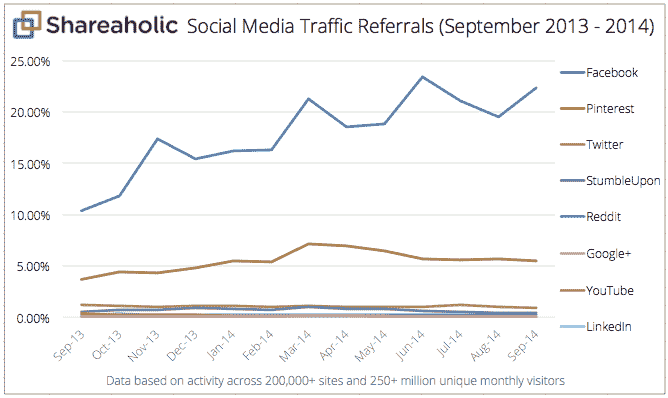
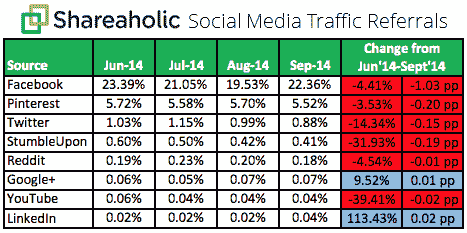

# 脸书保持社交推荐榜首，Twitter 进一步落后于 Pinterest 

> 原文：<https://web.archive.org/web/https://techcrunch.com/2014/10/27/facebook-keeps-top-spot-for-social-referrals-twitter-drops-further-behind-pinterest/>

Twitter 上个季度报告了健康的收入和良好的用户增长数字，打破了预期；现在，所有的目光都将聚焦于[今天晚些时候发布的第三季度收益](https://web.archive.org/web/20230129095358/https://investor.twitterinc.com/eventdetail.cfm?EventID=151060)，看它们是否会重复这一节拍。但是，随着社交网络继续将其业务打造为一个平台——不仅仅是人们发推特抱怨恼人的上班通勤的媒介，也是人们发现和点击其他内容、购买物品以及与其他人分享链接的地方——[Shareaholic](https://web.archive.org/web/20230129095358/https://blog.shareaholic.com/social-media-traffic-trends-10-2014/)发表的研究揭示了它在这样做时可能面临的另一个挑战。与其他社交媒体网站相比，Twitter 的流量推荐份额正在下降。

根据这家总部位于波士顿的公司的数据，脸书目前吸引了超过 22%，或超过五分之一的所有基于社交的流量推荐，并在去年看到其流量增长了近 116%，使其成为无可争议的流量推荐王。

排名第二的是 Pinterest，虽然距离很远，但它占了上个月所有推荐流量的 5.5%，去年上升了约 50%。

与此同时，Twitter 排在更远的第三位。目前，它在所有社交推荐流量中的份额不到百分之一(准确地说是 0.88%)，与一年前相比，其份额下降了 25%。

Shareaholic 表示，它的数据是基于对超过 20 万个网站的分析，这些网站覆盖了 2.5 亿独立月访问者。

除了 Twitter，StumbleUpon、Reddit、Google+、YouTube 和 LinkedIn 的社交推荐人数甚至变得更少——这些专业人士的社交网站不遗余力地将自己定位为人们发布和分享新闻的地方。

“对于大多数出版商、营销人员和网站所有者来说，剩下的五个社交网络是容易被遗忘的流量来源，”Shareaholic 写道。“总体而言，它们贡献了上月网站总流量的 0.74%，这还不到 Twitter 一家的访问量。”

扭转这种困境，仍然有很大的移动和增长空间。总的来说，在 Shareaholic 分析的网站中，来自前八大网站的流量仅占总流量的 29.49%，实际上剩余的 70%分布在其他网站中。去年，前八名产生了 16.44%的推荐流量，因此一些快速整合显然正在进行中。

看看 Shareaholic 的数据，Twitter 的表现一方面是更广泛趋势的产物。大的变得越来越大，其余的也会因此而倒下。

在这种情况下，脸书是最大的:Shareaholic 的 Danny Wong 告诉我，在该公司测量社交推荐流量的整个时间里，脸书从未*而不是*处于第一的位置，随着时间的推移，脸书获得了更多的用户，并玩了它的算法，引入了视频和其他格式，它只增加了它的百分比。

事实上，除了脸书和 Pinterest，前八名中唯一一个在过去一年有增长的社交网络是 Google+，增长了 57%，尽管基数很小，只占所有社交媒体推荐的 0.07%。

一些[声称](https://web.archive.org/web/20230129095358/https://techcrunch.com/2014/07/09/yelp-google-anti-trust/)谷歌在搜索结果中将 Google+推到了其他网站的前面；如果事实确实如此，这可能是 Google+发展壮大的部分原因。

另一方面，Twitter 的衰落是对 Twitter 为突出其媒体平台地位所做努力的评论。

尽管像[这样的例子来自《卫报》](https://web.archive.org/web/20230129095358/https://blog.twitter.com/2013/guardian-says-twitter-surpassing-other-social-media-for-breaking-news-traffic)声称 Twitter 比其他社交网络给《卫报》带来更多的突发新闻流量，Shareaholic 的数据似乎暗示这可能是例外，或者是少数用户的情况，而不是常态。在 Twitter 最近通过上周发布的 Fabric SDK 向更多移动服务扩张的背景下，这也很有趣。

Shareaholic 的数据中值得指出的另一件事是，Pinterest 的影响力似乎与脸书相似，与其规模成正比。Pinterest 尚未披露其最新用户数量，因此我们无法将其与脸书进行比较，但 comScore 的数据显示，2014 年 9 月，Pinterest 的月访问量接近 3000 万，而脸书的月访问量超过 1.32 亿。正如 Pinterest 拥有更大社交网络大约四分之一的流量一样，它也拥有大约四分之一的社交份额。相比之下，comScore 认为 Twitter 当月的月用户约为 3600 万。

以最近一个季度的进展为例，Shareaholic 分析了超过 30 万个网站的流量，Google+只是两个崛起者之一，另一个是 LinkedIn。Wong 指出，几乎无处不在的连续下降几乎肯定是季节性的，而不是其他任何因素，因为在夏季的几个月里，交通流量通常较慢。

图片: [Flickr](https://web.archive.org/web/20230129095358/https://www.flickr.com/photos/carlos_maya/5165377895/in/photolist-dtBSgg-anA9LU-7YVszp-b8zyNz-9g9z91-8SrUTz-bX2iF9-5ZRLhX-bEgMn7-7MU55g-9jX7Qa-FDbra-dVdgSB-8CFPRy-5NAgHs-j3FsRK-8WGn48-ovaab6-aNneLB-mYCzJ-8ugtMJ-a5yH8N-8kh6y1-vUj8L-9rji9c-9Liu2L-a9tDjq-paVrSP-p2WVuB-8eG5qr-6H2XFG-7NycQc-4PdKMi-9pLTVR-AecuQ-3G9PJv-ofvGf-8HUe3m-7oxXAS-aNnfFR-ddMPPw-96Z6NM-meM1zy-4uJYz6-6x2mU8-dXrCPx-7w966J-7G5c3W-4Pi2d1-bWM7ND)