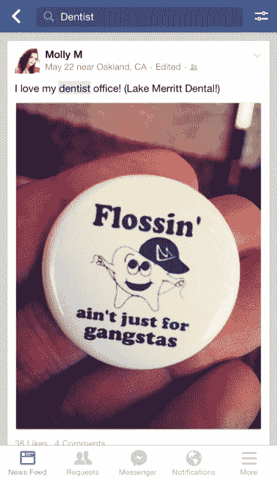
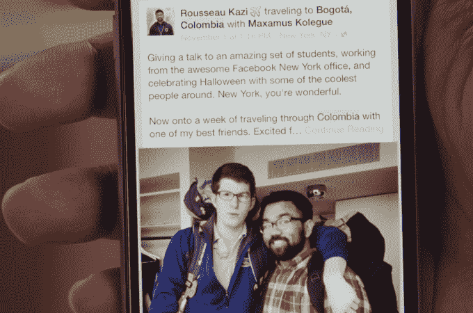
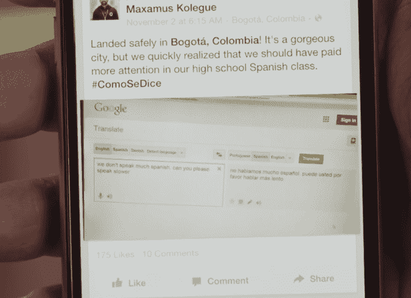

# 脸书将图形搜索引入手机，让你可以通过关键词 找到 Feed 帖子

> 原文：<https://web.archive.org/web/https://techcrunch.com/2014/12/08/facebook-keyword-search/>

脸书终于开始认真对待搜索了。如今，随着[关键词搜索](https://web.archive.org/web/20230404054407/http://search.fb.com/)的推出，谷歌在寻找答案方面面临挑战，Twitter 在检查实时聊天[方面也面临挑战。在推出语义“我的朋友谁…”搜索网络上的人、地点和照片两年后，Graph Search 在美国的](https://web.archive.org/web/20230404054407/http://newsroom.fb.com/news/2014/12/updates-to-facebook-search/) [iOS](https://web.archive.org/web/20230404054407/https://itunes.apple.com/us/app/facebook/id284882215?mt=8) 上推出，同时还有一个新的关键字搜索选项，用于挖掘朋友的旧新闻提要帖子。

*[看看我对新脸书搜索的全面动手评测](https://web.archive.org/web/20230404054407/https://techcrunch.com/2014/12/08/every-post-is-an-opinion/)*

产品经理 Rousseau Kazi 告诉我，脸书的个性化搜索结果首先侧重于帮助人们重新发现他们在 feed 中看到的想法、经历和记忆。不过，搜索“牙医”或“玉米煎饼”可能会出现来自朋友的推荐，与谷歌搜索结果形成竞争。与此同时，搜索“迈克·布朗”或“101 交通”可能会出现朋友们最近提到的内容或新闻文章，类似于 Twitter。

脸书的移动搜索将不会有广告或任何新的关键词广告。但由于关键词可以带来有利可图的购买意图，我敢打赌脸书最终会在这里试验广告，看看它们是否能成为真正的收入来源。企业肯定会愿意花钱将自己插入到“餐馆”或“律师”的搜索结果中。

关键词搜索对脸书来说是一个巨大的进步，因为它索引并解锁了之前被快速推送或深埋在人们个人资料中的内容。“人们希望有一种便捷的方式从社区中找到这些集体想法，”Kazi 说。

这种可及性改变了“晦涩难懂的隐私”在脸书的有效运作方式。你的隐私设置不会改变，关键字搜索只会显示与你共享的内容，如朋友的帖子或朋友评论的帖子，而不是公开帖子或页面帖子。但是如果一个朋友想容易地找到你说你“喝醉了”的帖子，现在他们可以了。用户应该看看他们的时间表，或者用他们的名字搜索一些令人反感的词，并在结果中使用内嵌的隐私选择器来隐藏任何令人反感的内容。

Kazi 告诉我，最终，脸书也计划发布公共帖子，让更多的不可谷歌搜索的围墙花园被编入索引。如果你仍然不确定脸书是否会对这个搜索巨头构成威胁，卡齐的这些话说服了我:

"脸书有你在其他任何地方都得不到的丰富信息。"

“每篇帖子或多或少都是对你不知道会被问到的问题的回答。”

## 摇摇欲坠的第三支柱

当脸书在 2013 年 1 月推出 Graph Search 时，马克·扎克伯格称赞搜索是其产品的第三大支柱，与新闻提要和时间轴并列。但是直到现在，Graph Search 才真正名副其实。

首先，语义搜索引擎很复杂。你不必像在谷歌上那样用熟悉的关键词搜索，而是必须使用复杂的短语，比如“我的朋友的朋友，他们住在旧金山附近，喜欢 TechCrunch。”这有助于找到你所去城市的朋友，或者喜欢某个乐队并想和你一起去音乐会的人。有招聘、约会或跟踪的小众用例(如果你搜索“[姓名]的照片”，你会看到他们在时间线中隐藏的照片，但没有取消标记)，但没有太多的日常需求。

脸书搜索产品经理 Rousseau Kazi

很多人不理解语义输入法，脸书仍然没有想出如何让它在其他语言中工作，所有这些打字在手机上很笨拙…或者理论上是这样。脸书说，图形搜索将在 2013 年进入移动领域，但今天才刚刚推出。

Kazi 承认“短语相当复杂”，但为缓慢的进展辩护，称脸书花了大量时间与用户体验研究人员一起研究带入实验室的用户，以弄清楚人们想要什么。该公司还加强了图形搜索背后的核心工程，以便将来更容易改进。

脸书的研究发现，人们的最大需求是移动访问和帖子搜索，所以这就是它所做的。

## 关键词图搜索如何工作

脸书的新搜索体验将在未来几天内面向 100%的桌面和 iOS 用户，并计划在解决问题后面向安卓系统。不过，你可能还没有。你仍然可以使用语义搜索，但也可以输入一个或几个关键词，在你的网络中找到包含这些词的 feed 帖子。例如，如果你是我的朋友，你可以搜索“乔希·康斯坦因跳舞”来查看我出丑的帖子。

搜索结果通过个性化算法进行排名，该算法将关键词的流行度与新闻提要式的排名相结合，这种排名基于你与作者的亲密程度以及其他信号的负载。帖子出现在 feed 设计中，关键字以蓝色突出显示，拼写纠正功能提供了帮助。如果结果是照片，您可以在身临其境的照片浏览器界面中浏览它们。

我看到的新脸书搜索的演示让它看起来又快又直观。虽然一个真正的“高级搜索”选项会有所帮助，但是有一些过滤器可以控制你看到的帖子的种类。脸书有很多机会搞砸这件事，但它看起来令人满意。

[更新:我现在已经收到了在移动设备上的首次展示，我对 post search 能够挖掘出的东西印象深刻。[这是我的亲身实践总结](https://web.archive.org/web/20230404054407/https://techcrunch.com/2014/12/08/every-post-is-an-opinion/)。

我搜索“牙医”,它返回了几十个帖子，包括大约七个附近的朋友发帖说他们喜欢他们的牙医，或者要求推荐并得到满满的评论。我从来不记得看到过这些帖子，但关键字搜索让它们浮出水面，帮助我利用它们所知道的信息。

搜索“Ferguson ”,可以调出朋友们在 45 分钟前提到的内容，让我可以好好看看朋友们分享的关于迈克·布朗悲剧的文章。“有趣的酒吧”为我找到了一些很酷的喝酒的地方，但也给我展示了相当多的噪音，比如在酒吧贴的“看到我的闺蜜真有趣”的帖子。总的来说，脸书关键词搜索的实用性给我留下了深刻的印象。]

## 晦涩减少了隐私

只有朋友或朋友互动过的帖子才有资格显示在搜索中。这意味着即使你公开发布了一些东西，随机的陌生人也不一定能找到它们。有些人可能希望他们的帖子可以像在开放的 Twitter 搜索中一样被发现。但曾几何时，当脸书主要面向大学生时，人们可能会对公开发布更加漫不经心。

完全公开的帖子搜索可能会导致人们不知不觉地陷入尴尬或成为新闻，因为有人挖了他们的一个帖子。开放搜索可能会彻底改变“公共”作为隐私设置的方式，人们可能会不舒服。

Kazy 解释说:“找到你可能已经忘记的东西会更容易。只要你让信息查找变得更容易，这些信息就更有可能被看到。”

明智的做法是，脸书将允许你改变你用关键词搜索找到的帖子的隐私，所以它实际上是一个隐私工具。你不必一个月一个月地浏览你的时间线，你只需要输入一些生动的词汇，并确保你不会返回任何东西。

## 脸书全知

除了唤起记忆之外，关键词搜索还可以释放购买意图，这使得谷歌的广告如此有价值。脸书可以成为一个地方，让你看到你的朋友们对一个重大世界问题的看法，而不是依赖于 feed 或标签。它不是像 Twitter 一样的整个世界的脉搏，而是更亲密地看看你的社区是怎么想的。Kazi 指出“让人们能够快速了解朋友们对某个世界的看法是非常强大的。”

这两个应用程序都有很大的改进空间。如果能看到脸书弄清楚如何聚合帖子或观点，那就太好了，所以我得到的不是一堆结果，而是更明确的答案。如果我搜索“有趣的酒吧”或“干洗店”，脸书会首先告诉我哪些是我搜索结果中提到最多的。它不会显示我最好的朋友说“有趣”的顶部的栏，而是显示我其他朋友的 10 个“有趣”的同义词。

至于在 Twitter 上，按时间倒序排列关键词的选项会有很大帮助。如果我现在搜索“纽约”，我希望能够在“朋友”最近发布的关于埃里克·加纳(Eric Garner)抗议关闭纽约的新闻故事和更多关于在那里做什么的常青树建议之间进行选择。像我这样的记者和其他特别好奇的人也会喜欢完整的公共帖子搜索。

当然，让人们真正改变他们的搜索行为比听起来要难。Facebook Graph Search 已经可以显示你喜欢的或登记的企业，但它并没有对谷歌的本地企业搜索产生任何明显的影响。脸书将需要强有力的教育活动，向我们灌输它现在是一个搜索引擎的想法。

Kazi 的结论是,“更宏大的搜索愿景是我们想让你有能力挖掘你的网络和世界的智慧。这是迈向那个目标的一步。”