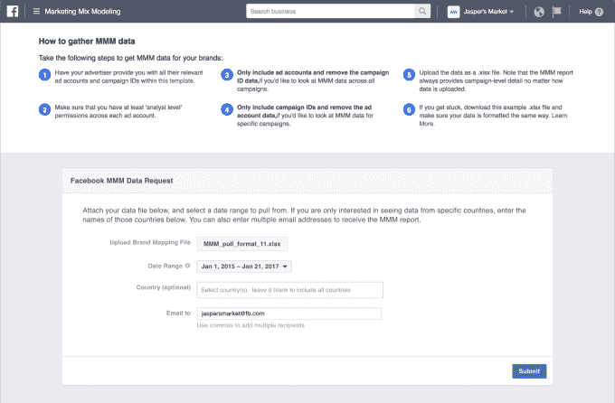

# 脸书推出了一个营销组合建模门户，用于将脸书广告与电视、平面广告等进行比较

> 原文：<https://web.archive.org/web/https://techcrunch.com/2017/01/31/facebook-launches-a-marketing-mix-modeling-portal-for-comparing-facebook-ads-to-tv-print-more/>

脸书今天[宣布了](https://web.archive.org/web/20230326073504/http://newsroom.fb.com/news/2017/01/greater-transparency-through-measurement-partnerships/)一系列关于其测量合作伙伴计划的更新，包括扩大与 Nielsen 和 comScore 的合作关系，以及增加一个新的合作伙伴 DoubleVerify。该公司还提供了当前整合状态的细节，以及一个新的在线门户网站的推出，以帮助营销人员了解他们的脸书广告与电视或印刷等其他平台相比的表现。

过去，该公司因没有提供明确的指标而受到指责，去年年底，脸书公布了一系列指标漏洞和错误，导致关键数据的报告不准确。通过与尼尔森和 comScore 等第三方合作，目标是确保广告商能够信任他们的广告投放数据。尼尔森和 comScore 在去年春天成为脸书的合作伙伴。

这些合作伙伴一直在与脸书整合，以衡量广告客户关心的印象、覆盖范围、绩效和其他指标。

今天，脸书表示，尼尔森的数字广告评级产品现在可以用于衡量 8 个以上市场的桌面和移动设备的覆盖范围和目标表现，这意味着它现在支持全球 25 个市场。

与此同时，comScore 已经与脸书就视频印象的可视性验证进行了合作，该公司表示，现在正开始通过其经过验证的 Campaign Essentials 产品测试美国观众在桌面和移动设备上的目标范围。脸书解释说，这个指标对广告商来说更重要，因为它是媒体计划的基础，并被用来评估广告活动的成功。

由于今年 11 月首次宣布的最终整合，包括 comScore、Integral Ad Science 和 Moat 在内的几家合作伙伴现在也可以提供展示广告何时进入和出现在脸书屏幕上的指标。(然而，关于这个指标仍有一些争论，因为它与行业标准不同——一秒钟内 50%的像素用于显示，或者连续两秒钟用于视频， [AdExchanger 指出](https://web.archive.org/web/20230326073504/https://adexchanger.com/platforms/facebook-bows-buy-side-mmm-rollout/))。

脸书表示，它已经将其可视性测量扩展到脸书更多的地方。最初，这仅适用于脸书的视频，但后来扩展到包括 Instagram 视频，现在，comScore 和 Integral Ad Science 也可以测量视频。

DoubleVerify 也将加入进来，以支持视频和显示。当整合完成后，脸书将有 24 个全球第三方测量合作伙伴可供广告商使用。

也许最值得注意的是，脸书还推出了在线营销组合建模(MMM)门户网站，测量合作伙伴可以直接从脸书、Instagram 和观众网络为他们的客户收集数据。在这里，他们将能够比较哪些广告(包括电视、数字和印刷广告)最能帮助他们达到预期效果。脸书说，超过 150 个品牌已经在利用这些信息做出营销决策。