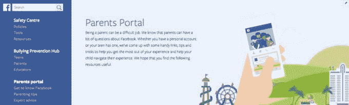

# 脸书推出家长门户网站，帮助人们浏览孩子的社交体验 

> 原文：<https://web.archive.org/web/https://techcrunch.com/2016/12/13/facebook-launches-parents-portal-to-help-folks-navigate-their-kids-social-experience/>

全球有 18 亿人使用的社交网络应用脸书没有提供这些用户中有多少是未成年人的数据，即 18 岁以下的人(T2 理论上有 13 岁以上的人)。但如今，当你考虑到该公司今天发布的一些消息时，这个数字可能会很大:脸书推出了一个新的家长门户网站，旨在帮助成年人通过脸书的社交媒体平台管理他们的未成年人费用。

需要澄清的是，这不是一套指导方针，可以教父母年轻人的行话，或者让他们了解他们的孩子想要从当今的世界或脸书得到什么；或者给他们一种监控或删除孩子账户的方法。(正如脸书[在](https://web.archive.org/web/20221205155736/https://www.facebook.com/help/156236274442491?helpref=uf_permalink)之前所说，隐私法禁止这样做。)

相反，这是一套安全指南和资源，以帮助第一次使用脸书的用户，特别是想注册并了解脸书的年轻人。

生活在网站的安全部分(它本身是在 10 月更新的[)，家长门户网站正好位于应对在线欺凌的指导方针之下。](https://web.archive.org/web/20221205155736/https://beta.techcrunch.com/2016/10/24/facebook-expands-safety-center-to-50-languages-doubles-down-on-bullies-with-60-partners/)

它包括一些基础知识，比如如何第一次在脸书上注册，如何导入联系人，以及如何在你的日程表上发帖。它还提供了一些基本的安全提示，如如何创建安全密码，如何阻止内容以及如何报告内容。它提供了指向 13 岁以下儿童持有的报告帐户的链接。

还有一个[部分的提示](https://web.archive.org/web/20221205155736/https://www.facebook.com/safety/parents/tips)给父母，帮助他们弄清楚脸书是如何融入他们更广阔的世界的父母该做什么和不该做什么，以及一般的网络安全。还包括与[互联网倡导组织](https://web.archive.org/web/20221205155736/https://www.facebook.com/safety/parents/expertadvice)的链接，这些组织专注于制定和执行与儿童在线相关的政策。

育儿门户网站正在以 50 种语言推出，看起来脸书正试图吸引来自世界各地的支持团体作为这一努力的一部分。

对该公司来说，开放母门户的举措来得正是时候。

虽然脸书本身没有谈论有多少年轻人使用它，但调查发现，如今脸书不是青少年中最受欢迎的应用程序。

然而，这显然是脸书(像所有基于广告的在线媒体一样)希望挖掘更多用户和使用的人群。

脸书吸引年轻用户的其他努力，比如它的 Lifestage 应用，都失败了。根据 App Annie 的数据，今年早些时候推出的 iOS 版应用程序目前在美国排名第 945 位，而安卓版应用程序根本没有进入排名。与此同时，SensorTower 表示，该应用程序的总下载量不到 1.5 万次。

脸书的主要目的可能是在一个地方为未成年人制定指导方针(到目前为止，脸书在其支持和帮助页面的不同领域提供了一些建议，没有单一的中心参考点)。但家长门户网站间接也是吸引更多年轻用户的另一种方式:让家长熟悉如何让他们的 13 岁以上的孩子上社交网络，向他们展示这并不可怕，脸书可能会发现它为更多年轻人进入其平台打开了大门。