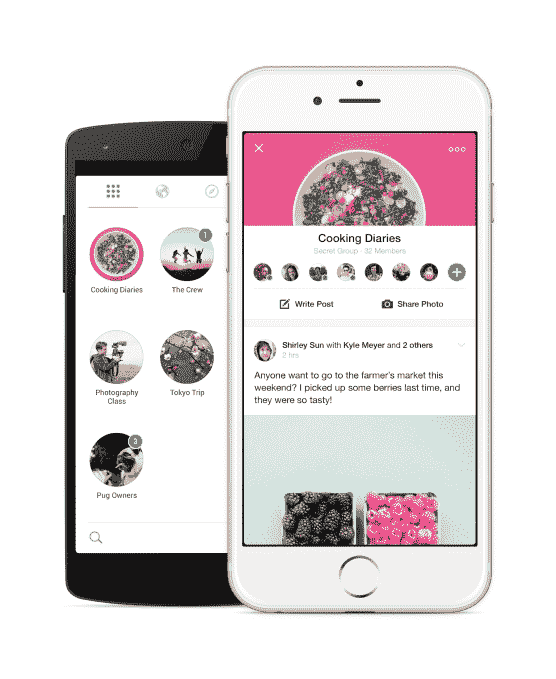
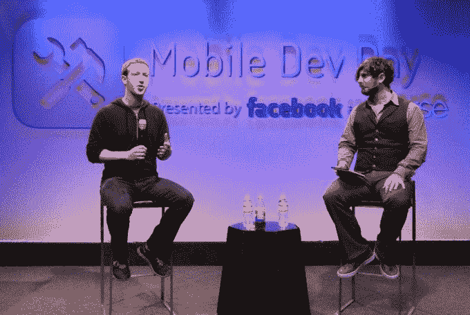
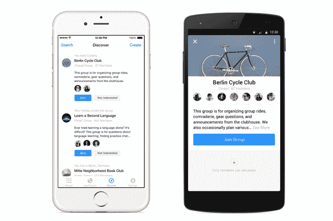
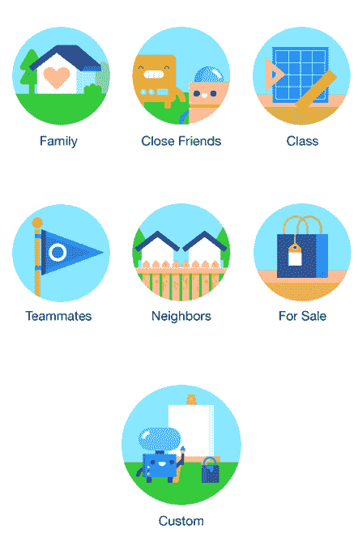

# 脸书推出独立群组应用程序，推动微分享

> 原文：<https://web.archive.org/web/http://techcrunch.com/2014/11/18/facebook-launches-standalone-groups-app/>

每月有 7 亿人使用脸书群，但这是在移动设备上的二等体验，速度很慢，而且被埋在社交网络的主要应用程序中。所以今天[脸书发布了一个独立的群组应用](https://web.archive.org/web/20230315144546/http://newsroom.fb.com/news/2014/11/introducing-the-facebook-groups-app/)，它有强大的通知控制和群组发现部分。你不会被迫使用它，因为群组功能将保留在脸书应用中，你也不会快速切换到它。

[适用于](https://web.archive.org/web/20230315144546/http://www.facebookgroups.com/) [iOS](https://web.archive.org/web/20230315144546/https://itunes.apple.com/app/id931735837) 和 [Android](https://web.archive.org/web/20230315144546/https://play.google.com/store/apps/details?id=com.facebook.groups) 的群组应用可以为试图防止社区陷入混乱的管理员提供巨大帮助，并加快每个人的消费体验，从家庭和朋友派系到研究群组和支持网络。它明亮、快捷，可以在新闻源之外开启更多的私人分享。

“没有人真的这么做。我们认为我们提供的是独一无二的”，该集团应用程序的项目经理 Shirley Sun 说。

尽管雅虎(Yahoo)和谷歌(Google)激烈争夺群发邮件列表的主导权，但令人惊讶的是，以内容为中心的丰富的社交供稿群服务非常缺乏，脸书很乐意利用这一点。让更多的人与团队一起组织他们的个人生活和项目也可以激发人们对该公司目前正在试点的企业“[脸书在工作](https://web.archive.org/web/20230315144546/https://techcrunch.com/2014/11/17/source-facebook-is-testing-facebook-at-work-separately-hosted-version-to-roll-out-in-a-few-months/)”产品的兴趣。脸书最终可能会与 Slack 或 Yammer 竞争，这是一个垫脚石。

## 给予团体关注

一年前，当我在脸书总部的内部移动开发日的舞台上采访马克·扎克伯格时，他实际上已经通知了独立群组应用的发布。他解释说:“如果你有类似群组的东西，它在脸书的主要应用程序中总是处于二等地位，甚至在消息传递方面也是如此。为了让这些东西真正能够发挥它们的全部潜力，我认为随着时间的推移，我们必须创造更多具体的体验。”

早在 2011 年，随着 Messenger 的推出，脸书就已经看到了对一流移动聊天体验的需求，但许多其他受欢迎的功能都被留在了主应用程序的隐藏菜单中。

[团体](https://web.archive.org/web/20230315144546/https://www.facebook.com/about/groups)从一开始就一直是脸书的特色。回到 2005 年的时代，它们更多的是作为你个人资料的保险杠贴纸，而不是组织社区。大学生们会加入“不明派对伤害”小组，宣扬他们喝醉时受伤有多“酷”。

但在 2010 年，[脸书重新推出了现代版的群组](https://web.archive.org/web/20230315144546/https://techcrunch.com/2010/10/06/facebook-groups/)，作为一种与特定人群分享信息的方式，远离新闻源。然而，尽管做了一些改进，这一功能并没有得到太多的喜爱，尤其是在手机上。

2014 年 1 月，脸书公布了其[创意实验室](https://web.archive.org/web/20230315144546/https://techcrunch.com/2014/01/30/facebook-creative-labs/)计划，旨在构建单一用途的移动应用程序，并从纸张开始试验新功能，以及风格化的独立新闻订阅主页。

然后在二月，脸书开始开发团体应用程序。孙告诉我，团队开发独立应用的想法“一直在我们的脑海中”，随着越来越多的用户转向移动，这种冲动变得更加强烈。这个社交网络现在拥有超过 4.56 亿的纯移动用户。是时候让团队发光了。

## 使用群组应用程序

从哲学上来说，独立的应用程序不会改变群组的意义。这只是让它更干净，更快捷，更便于移动。

一旦你登录脸书，你现有的所有群将被可视化地放置在两个宽的网格中，显示他们的标题、封面照片和通知徽章的小圆圈。它们是根据你使用每个群组的频率排序的，所以有新通知的群组可能在文件夹下面，如果你没有看到推送新帖子或回复触发，这可能有点棘手。

点击任何一个，你会发现一个光滑的群组订阅，有着鲜明的白色背景，而不是主应用程序的灰色画布。一个特殊的通知设置可以让您将一个或所有群组静音一个小时，或者直到第二天早上，如果您需要一些安静。

建群也超级容易。选择关于这样一个家庭、班级或队友的内容，给它一个标题，选择它的公开/封闭/秘密可见性设置，并添加一些朋友。如果你选择家庭或密友作为类型，脸书智能默认你的组是秘密的。您还可以将主屏幕快捷方式添加到您喜爱的群组，以便更快地访问。

手机的一个新功能是群发现部分，它将帮助你根据你的朋友、附近活跃的人或与你兴趣相关的社区来找到要加入的人。

为了刺激增长，脸书将慢慢开始在该功能最活跃的用户和管理员的移动群组上展示该应用的宣传片。

目前还没有货币化的计划，因为脸书已经从新闻订阅中赚了很多钱。在过去的九个季度里，它一直跑在街上。不过，从长远来看，脸书可以从一个常见的群体用例中获得收入:商务。

非洲岛国毛里求斯有超过四分之一的人口，250，000 人，生活在一个类似 Craigslist 分类广告的群体中。该公司已经在开发一个购物按钮，让你不用离开脸书就能购物，因为你有一张存档的信用卡。这可能会扩大到允许点对点销售。

孙的结论是，脸书并不需要这个新应用程序的所有用户。"这个应用程序是一个补充的、可选的体验，是为已经是超级用户的人设计的."如果经常使用群组的用户更深入地了解这个特性，并且群组本身变得更加活跃，她会很满意的。

## 微分享的空间

并非所有东西都适合新闻提要。小组非常适合围绕项目进行有目的的交流。但是有一整个领域的亲密分享可以由团体来主持。脸书多年来试图让人们微分享到特定的朋友列表，但控制可能会令人困惑，而且你总是有可能误分享给每个人。

扎克伯格定律表明，人们每年分享的东西是以前的两倍，但这并不意味着他们一定会在脸书这样做。许多人通过 Snapchat 这样的应用程序分享给一小群朋友。如果 Groups 大受欢迎，它可能会鼓励亲密的朋友群体之间快速、即兴的分享，在广播和私人信息之间创造第三空间。

如果团队被锁在导航菜单地牢里，这是不可能发生的。