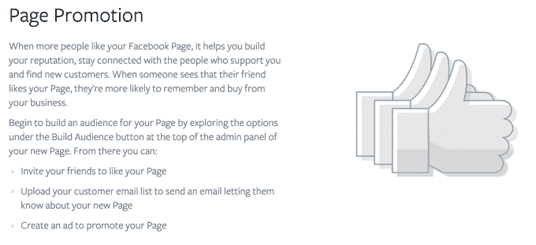

# 脸书打击非广告推广的 Feed 帖子，诱饵和购买了 Likes  的切换页面

> 原文：<https://web.archive.org/web/https://techcrunch.com/2014/11/14/facebook-likes-now-worth-less/>

“买这个！”“现在安装！“竞赛！”脸书即将开始惩罚商业页面，这些页面被 T2 发布带有这类词汇的垃圾营销帖子。脸书将会把它们展示给更少的粉丝，即使这个页面为获得这些粉丝支付了广告费用。在对 50 万用户进行研究后，他们发现他们希望看到更少的宣传内容，而且让他们恼火的大多数帖子不是广告，而是他们喜欢的页面上的有机显示帖子，脸书决定改变规则。

制裁将于 2015 年 1 月生效，因此一些企业将被迫很快改变他们的页面发布策略，或者看到他们的有机覆盖范围下降，这对推荐流量可能是毁灭性的。

尽管是以提高用户新闻质量的名义做的，但整个情况是一个令人不安的诱饵和开关。多年来，脸书一直在推动企业购买广告，这些广告能为他们的页面赢得喜欢，这样他们就可以通过新闻源免费获得这些广告。脸书没有说对商家可以在这些帖子里放什么有任何限制。突然之间，赞会变得没有那么多价值，尤其是对于那些使用 feed 来卖东西的直接回复商家。

例如，[在这里，脸书说](https://web.archive.org/web/20230404142726/https://www.facebook.com/business/products/pages)“当更多的人喜欢你的脸书页面时，这有助于你建立声誉，与支持你的人保持联系，并找到新客户。”然后，它提出了一个很好的方法，那就是“创建一个广告来推广你的页面。”脸书没有提到，尽管它购买粉丝以保持与他们的联系，但它会惩罚发布这样帖子的页面:

有机页面发布量[下降](https://web.archive.org/web/20230404142726/https://techcrunch.com/2014/04/03/the-filtered-feed-problem/)是这成为一个问题的原因。随着人们添加更多的朋友，喜欢更多的页面，分享更多的内容，但人们花在阅读提要上的时间大致保持不变，这就增加了竞争，导致每个人的帖子的触及范围减少。脸书试图通过打击点击诱饵、垃圾迷因和其他低质量内容来充分利用有限的注意力。

但是现在，脸书正在对网页上的垃圾营销帖子进行核攻击。

脸书说:

> “根据我们调查的人，有一些一致的特征让有机帖子感觉太促销了:

1.  > 只推送人们购买产品或安装 app 的帖子

2.  > 推送人们进入没有真实上下文的促销和抽奖活动的帖子

3.  > 重复使用广告中完全相同内容的帖子

以下是一些脸书认为不可接受的帖子，并在发帖页面上进行制裁:

脸书说，“虽然发布我们上面提到的大量内容的页面将会看到分发量的显著下降，但大多数页面不会受到这一变化的影响。”它还告诉我，如果一个页面的粉丝持续喜欢或点击“垃圾”帖子，脸书会继续向他们展示硬推销的营销信息。

它不会在 feed 中显示更多或更少的广告，但如果企业认为这一变化也会贪婪地推动他们购买更多广告，从而提高他们发布的单个帖子的影响力，这是情有可原的。整个惨败可能会让企业对购买脸书广告更加怀疑。

问题是脸书多久前就知道这种页面覆盖范围的下降会发生，以及它可能不得不打击垃圾页面。如果它知道喜欢变得越来越不值钱，但没有向像广告一样购买的人传达这一点，那是相当欺诈的。

该公司声称页面对企业仍然很重要，但事实是新闻提要是他们接触粉丝的主要方式，也是为什么喜欢很重要。脸书的歌和舞是，页面可以成为跨设备业务的目的地，10 月份有 10 亿人访问了页面，其中 7.5 亿来自移动设备。尽管如此，快速访问页面并不等同于每天在提要中看到它们。

最终，脸书为用户所做的是正确的。这将使提要更有趣，并教会品牌创造引人注目的内容。问题在于脸书多年来欺骗页面管理员购买赞，但现在却大幅降低了这些赞对一些企业的价值。我闻到了集体诉讼的味道。