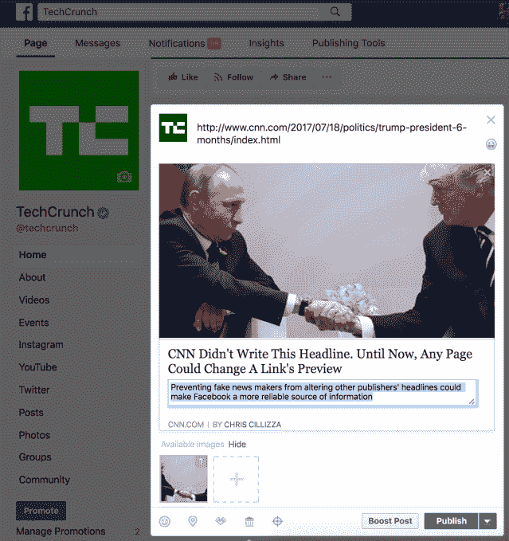

# 脸书通过修改链接预览打击假新闻传播 

> 原文：<https://web.archive.org/web/https://techcrunch.com/2017/07/18/facebook-link-preview-modification/>

# 脸书打击通过修改链接预览传播的假新闻

到目前为止，任何发布链接的脸书页面都可以改变新闻提要预览中出现的标题、正文和图像。这使得假新闻发布者能够引诱并改变读者去访问他们没有想到的文章，或者让它看起来像是合法的新闻发布者在发布煽动性或虚假的标题。但它也让真正的新闻媒体 A/B 测试链接预览，为不同的观众定制内容，并随着新闻报道的发展更新预览。

为了在不扼杀负责任的出版物的情况下打击虚假新闻，脸书现在开始[禁用](https://web.archive.org/web/20221001151222/https://media.fb.com/2017/07/18/next-steps-to-addressing-link-preview-modification/)所有页面编辑它们在页面编辑器或 API 中发布的链接预览的功能，一些原创出版商除外。

页面发布工具中为[链接所有权](https://web.archive.org/web/20221001151222/https://www.facebook.com/business/help/247886969033572?locale=en_US)新增了一个标签，允许那些被豁免的用户指定他们拥有的网络域名，并由脸书授权修改该域名链接的预览。所有想要豁免的页面必须在 2017 年 9 月 12 日之前获得链接所有权批准，届时将全面推出移除未经授权的预览编辑。

一个例子，如何任何脸书网页可以事先改变任何链接预览，以创造假新闻

脸书写道，“我们首先向媒体出版商推出这种[链接所有权]功能，包括新闻、体育和娱乐页面，因为我们发现许多这些页面类型会大规模修改指向它们自己文章的链接。”网站管理员仍然可以改变他们网站和文章上的[开放图表标签](https://web.archive.org/web/20221001151222/https://developers.facebook.com/docs/sharing/webmasters)，并用[开放图表调试器](https://web.archive.org/web/20221001151222/https://developers.facebook.com/tools/debug/sharing/)测试它们，为它们的内容配置默认预览。

在 4 月份的 F8 上，脸书[提到](https://web.archive.org/web/20221001151222/https://developers.facebook.com/docs/apps/changelog#v2_9_90_day_deprecations)对链接预览修改的改变将会出现在 API 中，但是对于许多依靠改变链接预览来优化内容的页面却没有解决方案。

这一改变可能会让脸书拆除一些允许假新闻大量传播的基础设施，而不必对每条内容单独做出判断。像这样的方法和[许多](https://web.archive.org/web/20221001151222/https://beta.techcrunch.com/2017/05/17/facebook-anti-clickbait/) [最近](https://web.archive.org/web/20221001151222/https://beta.techcrunch.com/2017/05/10/facebook-fights-foot-fungus-ads/) [新闻馈送算法的变化](https://web.archive.org/web/20221001151222/https://beta.techcrunch.com/2016/09/06/ultimate-guide-to-the-news-feed/)脸书已经允许它促进真相而不必直接监管谎言。这种策略可以防止它因偏袒政治光谱的一方而招致批评。