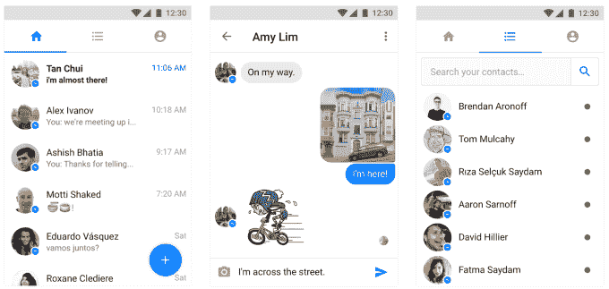

# 脸书将节省数据计划的 Messenger Lite 带到美国 Android 

> 原文：<https://web.archive.org/web/https://techcrunch.com/2017/10/02/facebook-lite-us-uk-canada-ireland/>

# 脸书将节省数据计划的 Messenger Lite 引入美国机器人

脸书的数据保存版 Messenger 不再仅仅面向网速较慢的发展中国家。现在，Messenger Lite Android [应用](https://web.archive.org/web/20221205213719/https://newsroom.fb.com/news/2016/10/empowering-the-world-to-stay-connected-introducing-messenger-lite/)正在[向美国、加拿大、英国和爱尔兰](https://web.archive.org/web/20221205213719/https://play.google.com/store/apps/details?id=com.facebook.mlite&hl=en)扩展，此前该应用已在 100 多个国家上市，其中大部分是发展中国家。Messenger Lite 包含了该应用程序的大多数关键功能，但跳过了 Messenger Day 和自拍镜头等会消耗数据的功能。不过，目前还没有推出 iOS 版本的计划。

以前，Messenger Lite 主要面向带宽较弱地区的用户，因此应用程序运行速度会更快。但现在，它向脸书最发达国家市场的扩张，使其成为青少年等精打细算的用户的工具，这些用户希望避免烧掉昂贵的兆字节，但仍能保持联系。

脸书的一位发言人告诉 TechCrunch:“我们很高兴能够将 Messenger Lite 带给四个新市场的 Android 用户，包括加拿大、爱尔兰、英国和美国。”。“Messenger Lite 是 Messenger 的精简版，提供了该应用程序的核心功能，同时让每个人都有机会与朋友和家人保持联系，无论设备或互联网连接质量如何。”

[脸书于 2016 年 10 月在五个国家首次推出 Messenger Lite](https://web.archive.org/web/20221205213719/https://beta.techcrunch.com/2016/10/03/facebook-launches-pared-back-android-chat-app-to-keep-growing-its-messaging-empire/) ，随后于 4 月份进行[全球扩张。现在](https://web.archive.org/web/20221205213719/https://beta.techcrunch.com/2017/04/27/facebook-sidesteps-snapchat-by-launching-messenger-lite-in-150-more-countries/)Sensor Tower 估计 Messenger Lite 自发布以来已经被下载了 4700 万次，主要是印度和巴西。

新的推出可以帮助脸书吸引更多的青少年使用 Messenger，无论是传统的还是精简的。这是因为如果下载 Lite 能让他们更快地回复更多信息，这就鼓励朋友们继续使用 Messenger，而不是默认使用 SMS 或 iMessage，或者转向 Snapchat。

Messenger Lite

事实证明，发展中国家对 Snapchat 来说是一个挑战。它的视频应用在低带宽条件下表现不佳。如果有朋友不能使用某个应用程序，人们最终会转向他们可以访问的应用程序。对于 Messenger 来说，要想在现有的 13 亿用户之外继续扩张，它需要尽一切努力实现最大的可访问性。

尽管从 Messenger Lite 用户身上赚钱可能更难，但对脸书来说这是值得的，因为聊天是移动使用案例的中心。如果它能把用户留在 Messenger 上，那么它更有可能把他们留在其他应用程序中。