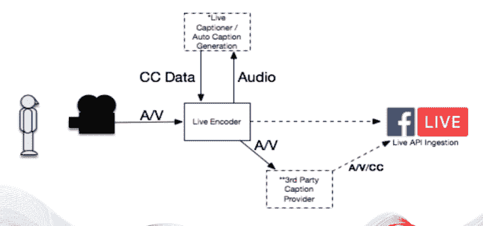
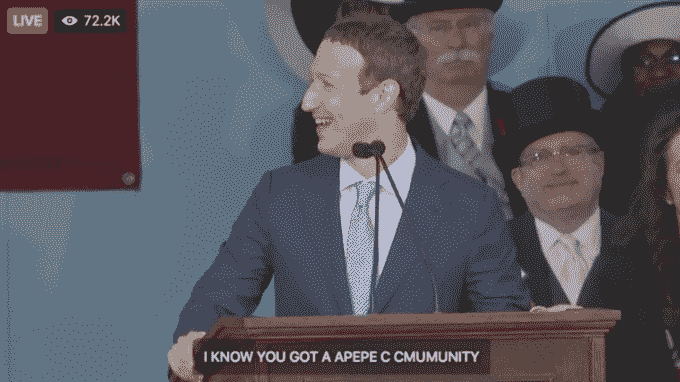

# 通过第三方隐藏字幕访问脸书直播 

> 原文：<https://web.archive.org/web/https://techcrunch.com/2017/06/06/facebook-live-captions/>

# 脸书 Live 可以使用第三方隐藏字幕

美国有超过 3800 万人是聋人或重听人，脸书希望他们能够观看五分之一的直播视频。因此，今天它迈出了第一步，通过允许出版商自己或在技术供应商的帮助下为他们的直播视频创建和播放[隐藏字幕，使脸书直播更容易理解，如](https://web.archive.org/web/20230125170615/https://newsroom.fb.com/news/2017/06/making-facebook-live-more-accessible-with-closed-captions/) [Ai-Media](https://web.archive.org/web/20230125170615/http://www.ai-media.tv/) 或 [Telestream](https://web.archive.org/web/20230125170615/https://www.telestream.net/captioning/overview.htm)

然而，脸书并没有像免费提供录制和上传的网页视频那样，通过其技术提供自动隐藏字幕。这将大大增加直播视频字幕的覆盖范围，但在直播所需的低延迟实时特性下，大规模提供字幕可能非常困难或昂贵。

相反，只有使用生成 CEA-608 标准隐藏字幕的 [Live API](https://web.archive.org/web/20230125170615/https://media.fb.com/2017/06/06/enabling-closed-captions-on-facebook-live-broadcasts/) 的出版商或与这样做的供应商合作的出版商才能添加字幕。

“让每个人都可以访问脸书是建设全球社区的一个关键部分”,脸书产品经理 Supratik Lahiri 和无障碍总监杰弗里·维兰德写道。如果用户启用该设置，这些标题将在移动设备和桌面上都显示给用户。

全世界 3 . 6 亿重听人不是脸书可以忽视的一个小群体。事实上，它们提供了可观的增长机会。如果脸书可以使用隐藏式字幕让他们观看视频，他们会花更多时间在应用程序上与人们联系，并看到更多产生收入的广告。

相比之下， [Twitter 缺乏任何隐藏字幕功能](https://web.archive.org/web/20230125170615/https://twittercommunity.com/t/closed-captions-support-in-twitter-videos/60881/10)除了视频发布者已经覆盖在他们的上传。 [Snapchat 去年增加了](https://web.archive.org/web/20230125170615/http://marketingland.com/snapchat-discovers-caption-button-makes-videos-audio-agnostic-170131)正式的隐藏字幕选项。 [YouTube 是先行者](https://web.archive.org/web/20230125170615/https://techcrunch.com/2012/02/28/youtube-improves-captions-with-new-formats-languages-and-more/)，在 2006 年加入了隐藏字幕，几年后又加入了基于自动语音识别的字幕。此后，它扩展到了现场视频和更多语言。

但是隐藏式字幕可能不准确，特别是对于直播，正如脸书本月发现的那样，在马克·扎克伯格的毕业典礼演讲中，哈佛的错误系统产生了许多笑话。

https://twitter.com/mcwm/status/867830516380307457/photo/1

因此，也许脸书现在不承担准确的现场字幕的责任是最好的。但是随着它的语音识别能力的提高和技术的发展，它可能会让每一个直播视频变得更容易获取。

*要了解更多关于技术无障碍的信息，请查看我们今天在三藩市举行的为期一天的 [TechCrunch 会议:正义](https://web.archive.org/web/20230125170615/https://techcrunch.com/event-info/sessions-justice/)会议的报道，在这里，我将与脸书第一位盲人工程师、无障碍专家马特·金聊天。*