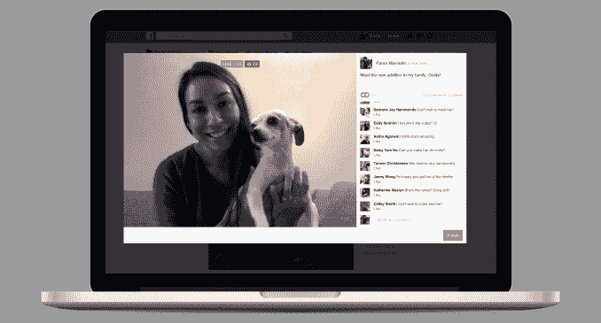
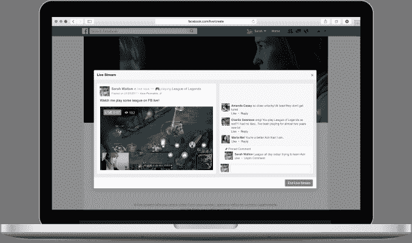

# 脸书直播增加了电脑游戏和桌面直播

> 原文：<https://web.archive.org/web/https://techcrunch.com/2017/03/22/facebook-live-desktop/>

# 脸书直播增加了电脑游戏和桌面直播

脸书正在打击 Twitch，同时也在超越其移动直播视频竞争对手。今天，所有用户都可以通过他们的网络摄像头直接从脸书的桌面网站进行直播，通过连接到桌面的专业设备和软件进行流式传输，并从他们的电脑上播放游戏。

此前，脸书[只允许页面](https://web.archive.org/web/20230301222216/https://techcrunch.com/2017/01/12/facebook-pages-can-now-go-live-from-the-desktop-add-live-contributors-and-more/)从他们的桌面流出，不允许用户流出，并且只与[的游戏开发商如暴雪](https://web.archive.org/web/20230301222216/https://techcrunch.com/2016/06/06/facetwitch/)有有限的游戏流合作。现在桌面状态更新编辑器上将有一个活动按钮。

使用流媒体硬件和软件直接向新闻源广播的能力，可以让创作者在屏幕上添加图形、标题和覆盖，使他们的流媒体更加花哨和精美。[以下是如何将硬件或软件连接到脸书 Live 的分步指南](https://web.archive.org/web/20230301222216/https://www.facebook.com/help/587160588142067)。

在桌面上开放让脸书直播超越了 Twitter 和 Periscope 的选择，并与 YouTube、Ustream 和 Livestream 等长期服务以及 YouNow 等初创公司展开竞争。脸书告诉我，它预见到桌面流媒体将对问答和视频博客等活动有用，在这些活动中，对于创作者和观众来说，手里拿着手机可能会颤抖和令人讨厌。

脸书积极推进直播，表明其目标是拥有“直播”这个动词，并成为人们在有值得分享的东西时进行广播的地方。虽然 Periscope 于 2015 年 4 月首次推出，但脸书很快推出了直播，并添加了一个直播 API，用于从专业设备进行广播。[潜望镜昨天才加了一个 API](https://web.archive.org/web/20230301222216/https://techcrunch.com/2017/03/21/in-push-for-more-live-video-twitter-officially-announces-the-producer-api/)。随着桌面平台的推出，脸书希望成为一个无处不在的广播工具。

虽然直播的内容可能还不是很好，而且有一些令人不安的暴力广播，脸书承诺将努力阻止，但这对于媒体来说仍然为时尚早。如果脸书现在可以锁定内容类型，它可以享受多年的广播，为其提供独家内容，以吸引用户到新闻提要和空间来运行利润丰厚的视频广告插播。虽然移动一直是脸书的重点，但增加桌面流媒体意味着你可以随心所欲地广播。