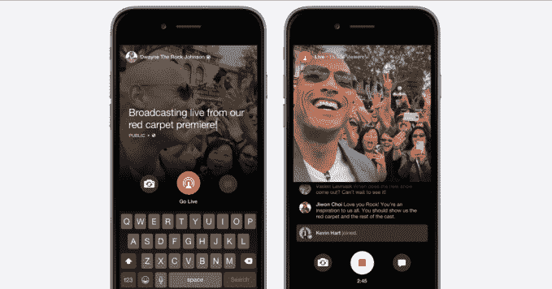
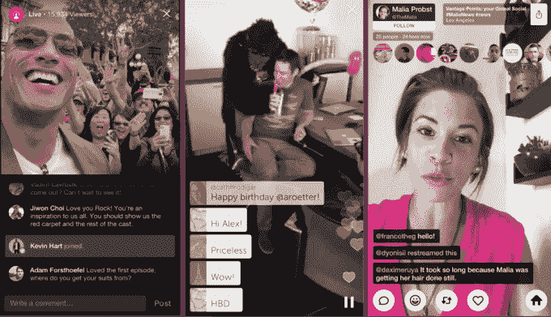
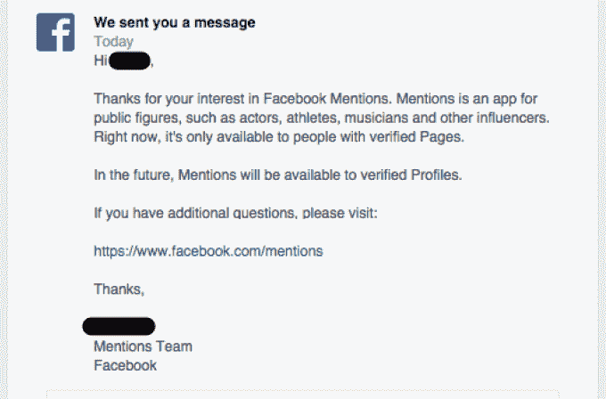
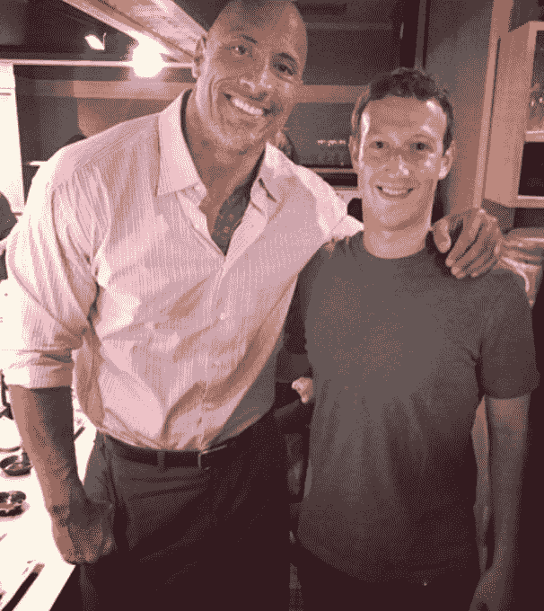

# 脸书证实直播将很快向记者开放，并验证个人资料

> 原文：<https://web.archive.org/web/https://techcrunch.com/2015/08/12/facebook-live-livestreaming/>

脸书计划不仅向名人开放其 Periscope 直播竞争对手。在回复已验证页面关于何时可以访问 [VIP 专用脸书应用提及](https://web.archive.org/web/20230404162519/https://techcrunch.com/2014/07/17/facebook-launches-mentions-the-exclusive-fb-app-for-playing-the-fame-game/)的请求时，该公司写道“将来，提及将对已验证的个人资料开放”。当我问它是否包括脸书直播时，它告诉我它计划很快将提及推广到经过验证的个人资料，其中包括直播。

鉴于脸书一周前改变了态度，当时它对更多人何时上线持谨慎态度，事情似乎进展很快，我预计 Live 将在假期前开放验证的个人资料。

8 月 5 日，[脸书推出了 Live](https://web.archive.org/web/20230404162519/https://techcrunch.com/2015/08/05/facescope/#.c09dfs:EVRo) ，这让广播公司可以在脸书上即时开始直播视频流。用户可以实时收看，并提交出现在广播公司屏幕上的评论。脸书向喜欢该广播公司页面的人展示新闻提要中的信息流，并向最近在脸书与该广播公司互动的粉丝发送即时通知。

[这个功能](https://web.archive.org/web/20230404162519/http://newsroom.fb.com/news/2015/08/connect-with-public-figures-through-live/)不要和脸书的原创内容采访系列[脸书直播](https://web.archive.org/web/20230404162519/https://live.facebooklive.com/)混淆，后者似乎已经停播。

在广播结束时，脸书直播流被永久保存为人们可以观看的视频，不像猫鼬流会立即消失，潜望镜只能重播 24 小时。这意味着直播不仅推动了实时互动，还增加了脸书的独家视频内容，可以在 feed 中显示，让利润丰厚的视频广告看起来更自然。

脸书现场，潜望镜，和猫鼬(左起)

当 Live 推出时，脸书只向有限的名人提供验证页面，如[“摇滚”德怀恩约翰逊](https://web.archive.org/web/20230404162519/https://www.facebook.com/DwayneJohnson/videos/10153719084514384/)、[塞丽娜威廉姆斯](https://web.archive.org/web/20230404162519/https://www.facebook.com/SerenaWilliams/videos/10153605963111834/)、[玛莎斯图尔特](https://web.archive.org/web/20230404162519/https://www.facebook.com/marthastewart/videos/10153566319866289/)和[麦可·布雷](https://web.archive.org/web/20230404162519/https://www.facebook.com/MichaelBuble/videos/10153072977474157/)。一些人用它来保存实时视频 Q & As，其他人发布公告，而少数人只是对着摄像机咆哮。

普通用户不能进行广播。这可能是因为该平台需要技术工作来扩展到该负载。[但我的理论是](https://web.archive.org/web/20230404162519/https://techcrunch.com/2015/08/05/facescope/#.c09dfs:EVRo)脸书希望从名人开始，教导用户什么是有趣的流媒体，并避免每个人都拍摄低质量的“你好，世界/这是我的早餐”广播，可能会让人们相信观看直播并不有趣。

但很快，脸书将向更广泛的已验证个人资料的用户授予该功能，这些个人资料是为不太出名的公众人物准备的，或者只是想从现有的个人资料中进行公开展示，而不是从头开始。这包括更多的艺人、运动员和政治家，但也包括许多像我一样的记者。

马克·扎克伯格曾与摇滚乐队会面，讨论名人如何更生动地接近粉丝

【更正:The Rock [最近将照片贴在了](https://web.archive.org/web/20230404162519/https://www.facebook.com/DwayneJohnson/photos/a.448580834383.229946.406433779383/10153724250519384/?type=1)的右边，但它是在脸书直播发布之前拍摄的，与马克·扎克伯格的对话是关于名人接触粉丝，而不是直播。]

Periscope 可能已经领先五个月，刚刚达到[1000 万注册用户](https://web.archive.org/web/20230404162519/https://techcrunch.com/2015/08/12/periscope-has-10m-registered-users-watching-40-years-of-video-per-day/)。但脸书正押注于其平台的规模和公众人物的大量现有粉丝，以超越竞争对手。

此次扩张使脸书直播向普及更近了一步。它可以把这个平台变成自发新闻的工具，就像 Periscope 已经开始变成的那样。而且，由于拥有经过验证的个人资料的人不必像真正的名人那样担心他们周围建立的巨大企业，这可能会刺激更多关于 Live 可以做什么的实验。

通过向更多的创作者开放，Live 可能很快会将竞赛、DIY 项目演练、电话访谈节目、第一人称冒险、书呆子新闻讨论等带到你附近的脸书窗口。