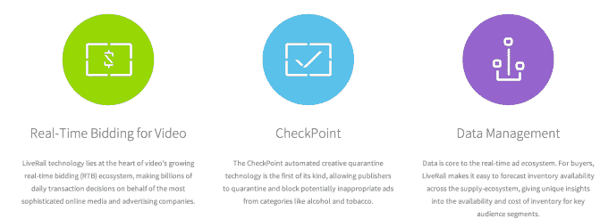
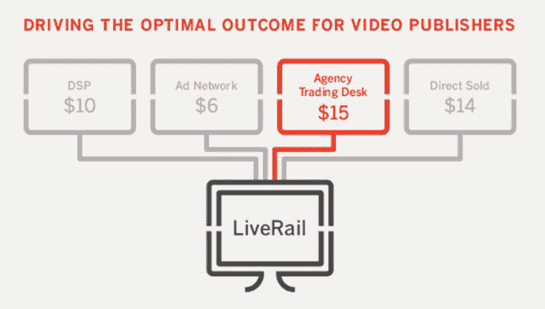

# 脸书以 4 亿至 5 亿美元收购 LiveRail，在各地提供视频广告，改善自己的技术

> 原文：<https://web.archive.org/web/https://techcrunch.com/2014/07/02/facebook-liverail/>

脸书刚刚收购了视频广告技术初创公司 T2 LiveRail，该公司在网络和移动设备上将营销人员与出版商联系起来，目标是每月向访问者投放 70 亿条视频广告。一位消息人士告诉我们，脸书为 LiveRail 支付了 4 亿至 5 亿美元，但脸书拒绝对条款发表评论。[太平洋标准时间下午 3:30 更新:另一个消息来源现在告诉我们 LiveRail 以 5 亿美元的价格出售，与我之前报道的 4 亿至 5 亿美元的价格范围相符。]

脸书确实表示，它将投资保持 LiveRail 的运行，并正在评估如何混合他们的数据，但它计划使用其数据来帮助 LiveRail 确定目标，反之亦然。收购这家拥有 170 名员工的公司可以帮助脸书拥有更大的视频广告份额，这是一个快速增长的互联网广告媒体。

LiveRail 的供应方平台成立于 2007 年，拥有庞大的客户群，包括美国职业棒球大联盟、ABC Family、A&E 网络、Gannett 和 Dailymotion。LiveRail 为出版商提供视频广告定位技术，这样他们就可以通过向他们相关的客户发送消息来赚钱，并帮助营销人员与开放视频广告库存的网站和应用程序建立联系。

从种子期到 C 轮融资，LiveRail 已经筹集了 1200 万美元，主要来自[圣荷西的 Pond Ventures](https://web.archive.org/web/20220901001313/http://www.crunchbase.com/organization/pond-ventures) 。我们听说它的收购价格是 4 亿到 5 亿美元，这对 Pond 来说是一个巨大的胜利。该交易要求脸书通知联邦贸易委员会和司法部监管机构，但可能不一定需要正式批准。然而，这不是一个微不足道的 acqhire 或 firesale 回升。LiveRail 做得很好，脸书不得不为此买单。

2013 年， [LiveRail 告诉 TechCrunch](https://web.archive.org/web/20220901001313/https://beta.techcrunch.com/2013/12/03/liverail-100-million-revenue/) 它有望实现 1 亿美元的收入，收入同比增长 300%。该公司显然考虑在 2014 年末进行 IPO，但脸书似乎提供了更好的报价。显而易见，为什么 LiveRail 害怕上市。上市的竞争对手在市场上受到了打击，YuMe 上市时的价格是 9 美元，现在是 5.95 美元，而震颤媒体的上市价格是 10 美元，现在已经跌至 4.61 美元。

[太平洋标准时间下午 5:30 更新:第三个消息来源告诉我们，2013 年 LiveRail 的总收入为 6000 万美元(低于 LiveRail 声称的 1 亿美元)，净收入为 2200 万美元。2014 年，该公司的总收入显然达到了 2 亿美元，息税折旧及摊销前利润(EBITDA)达到了 3000 万美元。]

LiveRail 最重要的部分是其实时竞价平台，该平台可以动态评估与其合作的出版商的公开视频广告库存，并为其营销客户找到最佳的广告机会。它与营销商和出版商的关系将有助于脸书实现其成为网络和移动广告巨头的愿望，而不仅仅是在自有资产上。

LiveRail 还拥有检查点技术，确保酒精、烟草和其他有年龄限制的产品的广告不会显示给孩子。同时，LiveRail 的数据管理系统预测视频广告库存波动，让广告买家计划他们的活动，并向出售广告空间的出版商报告什么样的内容使他们获得最高的费率。

脸书在五月的 f8 上正式推出了它的[脸书观众网络移动广告网络](https://web.archive.org/web/20220901001313/https://beta.techcrunch.com/2014/04/30/facebook-audience-network-mobile-ad-network-launches-at-f8/)。这使得移动应用程序与脸书合作，以他们的标准广告单元和定制的原生单元为目标。最终，脸书观众网络和 LiveRail 有可能合作，为各种应用带来精准定向的视频广告。

在脸书，该公司在三月份正式推出了 15 秒自动播放视频广告。这是它的电视广告版本，收费很高。LiveRail 可以将其定位专业知识与脸书庞大的用户数据结合起来，为电影预告片和其他视频广告找到合适的观众。

社交广告技术战争正在迅速升温。周一， [Twitter 收购了移动广告重新定位初创公司 Tap Commerce](https://web.archive.org/web/20220901001313/https://beta.techcrunch.com/2014/06/30/twitter-acquires-tapcommerce/) 。今年早些时候，它[以约 5000 万美元收购了原生广告格式创新者 Namo Media](https://web.archive.org/web/20220901001313/https://beta.techcrunch.com/2014/06/05/twitter-buys-namo-media-to-expand-its-native-ads-offering/) ，并以 3.5 亿美元的价格大举收购了移动广告交易平台 MoPub 。

随着电视和印刷预算转移到网上，谁能最有针对性地投放广告，谁就有一场争夺客户资金的大战。收购 LiveRail 将会给脸书带来巨大的帮助，因为电视广告正被重新设计为网络广告。如果运气好的话，这笔交易意味着你不太可能看到讨厌的视频广告，而这些广告是你永远不会买的东西。