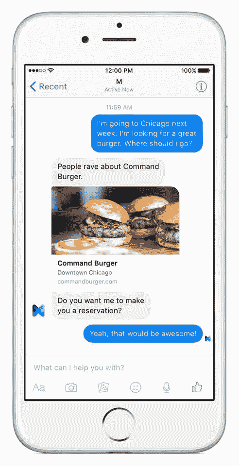

# 脸书 M Assistant 的热门请求包括餐馆建议和购物帮助

> 原文：<https://web.archive.org/web/https://techcrunch.com/2015/10/19/facebook-m-assistants-top-requests-include-restaurant-suggestions-and-shopping-help/>

Facebook Messenger 的 AI/人类混合助手 M 如何助你一臂之力？脸书测试的早期数据显示，人们希望在预订房间、寻找可以解决他们问题的当地企业以及购物方面得到帮助。

脸书将 M 活动描述为:“到目前为止，大多数人使用 M 来打发不太令人兴奋的家务，摆脱束缚，或者只是在生活变得真正忙碌时扩展他们的带宽。”

虽然个人助理功能只对非常小的用户测试组开放，但这些信息揭示了人们想从 M 以及 Magic 和 Operator 等竞争对手那里得到什么。但这也表明，这些助手的制造商可能必须教育用户他们的服务可以做的广度。

在早期的报道之后，脸书在八月提供了其在 T2 的 M 项目的官方细节。内置于 Messenger 中的 M 允许用户发送几乎任何请求，从在线家务协助到预订现实世界的服务或代表他们购物。目前，这些请求由脸书工人和人工智能共同处理。

希望随着时间的推移，人类将教会人工智能自己完成越来越复杂的任务。如果 M 获得成功，并且能够以可承受的价格推出，它可能会让人们的生活变得更容易，同时在聊天应用之间的激烈竞争中，[会增强他们对 Facebook Messenger](https://web.archive.org/web/20230306013350/https://techcrunch.com/2015/08/26/dial-m-for-murdering-other-chat-apps/) 的忠诚度。不过，如果规模太大成本太高，脸书可能会在这个项目上烧很多钱。

m 本身也有可能通过从为人们预订的购买或服务中获取利润来赚取收入。但对脸书来说，最大的机会是将用户进一步锁定在它的生态系统中，在这个生态系统中，它可以从新闻推送广告中赚到大量的钱。有一天，脸书甚至可以出售广告，说服你发起一个涉及广告商业务的并购请求。

 
现在，脸书告诉我，第一类请求是餐馆建议和预订。人们可能知道他们想要的食物类型、距离、价格范围，或者他们在餐馆中寻找的一些质量，M 帮助他们找到合适的食物并给他们一张桌子。

本地搜索请求是第二受欢迎的。在这里，M 帮助人们找到满足他们需求的当地企业、地方或服务。用户可能会问他们可以在哪里购买，预约，或看到附近的东西，M 会指引他们。

第三大请求类型是购买帮助。不用亲自去商店或处理在线支付流程，M 可以使用他们在脸书存档的支付信息代表某人购物。这样，用户只需付出最少的努力，愿望就能变成交付的产品。

其他最常见的请求类型包括订购鲜花、获取食物、安排旅行、查找即将到来的天气预报以及提醒即将到来的约会。

**脸书看到的 M 用法的一些例子包括:**

*   与有线电视公司协商取消服务或获得退款或折扣，而用户不必打电话给公司。
*   通过让 M 与汽车公司合作来处理租车的通行费违规，这样他们可以免除滞纳金并支付罚单。
*   在用户丢失钥匙后，将汽车拖走并在最后一刻预订酒店房间。
*   由于 M 与只说某种语言的当地人交流，他获得了旅行帮助并找回了丢失的物品。
*   通过安排供应商提供化妆品、鲜花、程序和美甲来策划婚礼。
*   通过安排航班、创建旅程和计划活动来预订假期。
*   协助初为人父母者研究儿童看护者，完成随机任务。

 
这些都不是短信或者任何随机聊天 app 能做的事情。这就是为什么它对脸书很重要。信息传递是一个很难区分的地方。

每个应用程序都处理短信和不断增加的其他通信类型，如照片、音频剪辑共享和视频聊天。但是由于脸书巨大的研发资源，它可能已经找到了让信使变得必不可少的方法。而且是以字母 m 开头的。