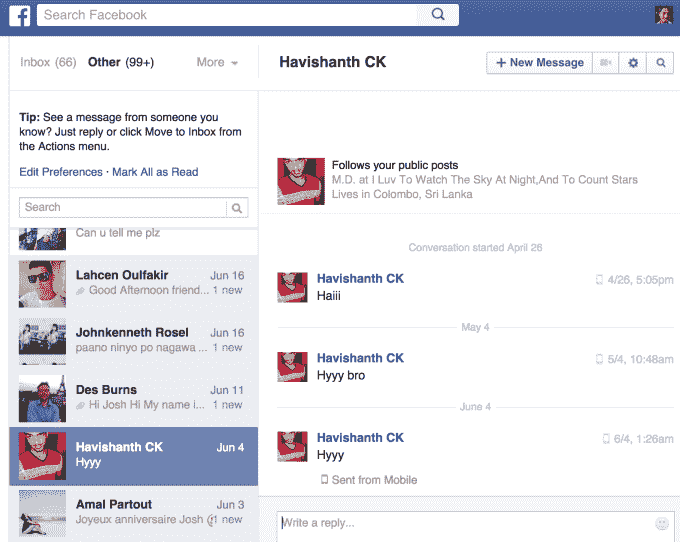
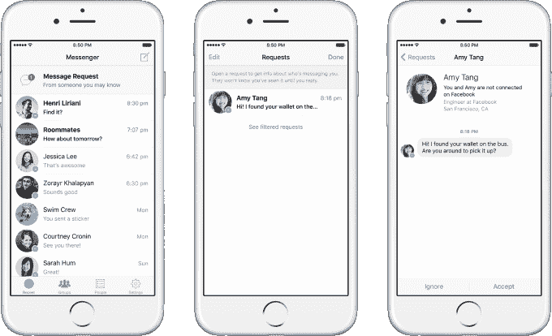
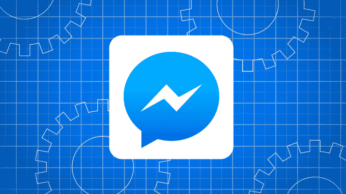
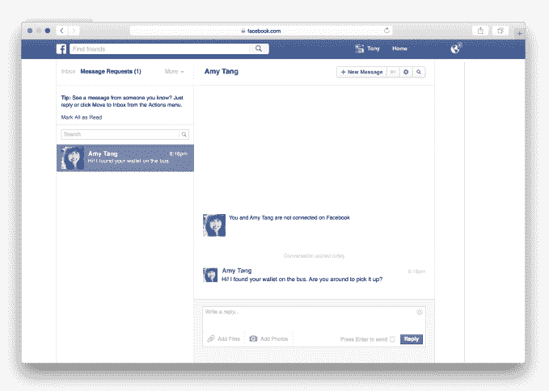
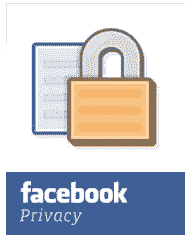
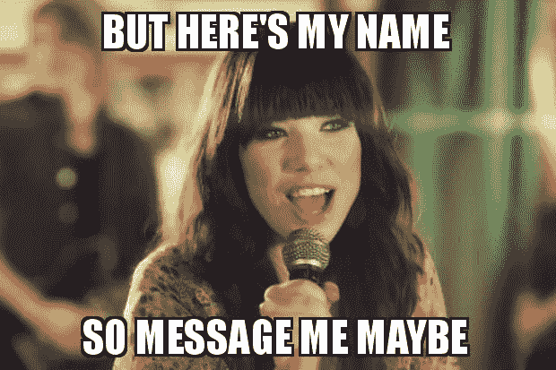

# Facebook Messenger 希望成为您的新消息请求电话号码

> 原文：<https://web.archive.org/web/https://techcrunch.com/2015/10/27/facebook-message-requests/>

电话号码哑。一旦别人有了你的，你就无法阻止他们联系你。

有人可能希望你给他们打电话，但是如果你没有他们的随机数字串，你就不能打。如果一个你从未谋面的人真的需要联系你，你可能会错过一些非常重要的事情。

Facebook Messenger 有一个解决这一切的计划。它诞生于社交网络有史以来最糟糕的产品之一的灰烬中。

## 不再错过连接

如今，Messenger 正在消灭功能失调的“另一个收件箱”。如果脸书信息不是由你的朋友或朋友的朋友发送的话，T2 就会在这里消失。很少有人知道它的存在。很少有人检查过。它甚至无法从 Messenger 的 iOS 或 Android 应用程序中访问。

我的一个朋友曾经收到过他失散多年的兄弟发来的脸书信息，他 30 年前在越南出生时就和他失散了。但是他有六个月没有看到这条消息，因为它被转到了他的另一个收件箱。在他意识到自己错过了什么之前，他发出了一个 LinkedIn 请求。

谢天谢地，这种事情不应该再发生了。从今天开始，脸书将在全球范围内推出另一个收件箱，名为“信息请求”。这意味着某人只需要你的名字就能联系到你，但是你可以控制他们是否能再次联系你。

## 好友聊天请求

现在，来自没有您电话号码的非好友的任何消息都将进入手机版 Messenger 顶部或网络版“消息”选项卡的消息请求中。

从那里，你可以分析谁应该回复，谁应该永久忽略。你会看到发件人的名字，[一些关于他们的公开信息](https://web.archive.org/web/20230404065145/https://techcrunch.com/2015/05/21/more-than-just-friends/#.c09dfs:8hRe)，比如他们的城市、工作或共同的朋友，以及信息。

但是寄信人不会知道你看过。回复后，该主题会进入您的普通收件箱，忽略，它会与任何看起来像垃圾邮件的内容一起隐藏在过滤请求文件夹中。

如果您已经与某人建立了联系，或者您有他们的电话号码，您的邮件将被允许进入他们的普通收件箱。需要注意的一个变化是，来自朋友的朋友的信息现在将被视为请求。脸书将不再认为有一个共同的朋友意味着你愿意和某人交谈。

本质上，消息请求就像是聊天的好友请求。只不过它们在脸书创造了一种新的关系——可以给你发信息的非朋友关系。有了这种区别，Messenger 释放了与您刚认识的人、您不认识但需要交谈的人甚至是企业联系的潜力。

## 这不是电子邮件

托尼·利奇不知道他父母的电话号码。Messenger 的消息请求产品经理并不是一个糟糕的儿子。他家就是经常搬家，每次都坚持把号码换成本地区号。“电话号码有点像 50 年代的遗物，”他告诉我作为人，我更了解(我的父母)。名字是更好的联系方式。"

因此，早在 2010 年，脸书就试图将你的名字变成你的电子邮件地址，但没有成功。该公司给每个人一个连接到 Messenger 的[username]@facebook.com 电子邮件地址，并有一个崇高的想法，人们可以在那里发送他们的电子邮件简讯、账单等。

信使报的托尼·利奇

他们没有。但是另一个你没有回复的普通邮件的收件箱变成了一个地牢，来自非朋友的重要邮件无人阅读。

它花了一段时间，包括与苹果在联系人同步方面的合作，之后脸书消息请求公司的工程主管 Michael Adkins 说“我们知道另一个文件夹不适合移动到移动系统。”如果它要超越用户抛弃的台式机，脸书必须砍掉另一个收件箱。

Leach 解释说:“我们已经听说了很多这样的故事，像疏远的父母试图重新联系，或者你丢了钱包，有人试图联系你。”“这就是为什么我们想用一个系统来取代它，让它更容易捕捉你想看的信息。”

这对脸书的商业也有好处。手机是人们消磨时间的地方。Messenger 越有用，用户就越深地被锁定在脸书的生态系统中，在那里他们会看到新闻推送广告，并产生能为脸书赚钱的数据。

## 用默默无闻的隐私换取有控制的开放

现在，脸书正在采取这一举措，将所有其他收件箱邮件放入邮件请求功能的隐藏过滤请求文件夹。展望未来，它希望能帮助你智能地解析非好友的信息，这是 SMS 永远无法做到的。

只要你的信息有意义，你现在就可以联系脸书 15 亿人口中的任何一个。这达到了利奇所说的“某种程度的开放，你可以与世界上的任何人联系，但仍然可以控制谁联系你，谁不联系你。”

最后一部分至关重要。毫无疑问，对于大多数人来说，这是隐私概念的一个变化。脸书正在用我们的“晦涩的隐私”换取“有控制的公开”。脸书信使报的负责人 David Marcus 自己指出“虽然这看起来是一个小变化，但实际上是一个基础发展。”

以前，关于联系某人的能力，我们有模糊的隐私:如果某人没有你的号码，他就不能给你打电话或发短信。但一旦他们这样做了，你几乎无法控制。即使你屏蔽了他们的号码，他们也可以更换号码或者使用别人的电话。Adkins 警告说:“一旦你给出了你的电子邮件地址，你就不知道他们会用它来做什么。“他们可以把它卖给别人。电话号码也是如此。”

结果是最初的安全级别，如果被超越，就会为骚扰提供机会。

现在有了脸书，我们将有控制的开放:有人只需要你的名字来联系你，但你可以更有效地阻止他们。删除或忽略消息请求，您将不再收到关于某人消息的通知。

由于脸书的垃圾邮件检测系统可以标记最近创建的朋友很少的帐户，即使他们创建了一个新帐户来骚扰你，Messenger 也可以自动阻止他们。Messenger 还会考虑发件人以前的邮件行为以及您是否通常批准邮件请求来确定您看到的内容。

现在，如果某人看起来不像垃圾邮件发送者，Messenger 可以将来自陌生人的关于归还您的钱包或在聚会上见面的消息放在您实际可以看到它的地方。这种变化一开始可能会有点吓人，并会导致一些意外的消息，这些消息是您绝对不关心的。但从长远来看，在全球化的社会中，有控制的开放是一种更具扩展性的沟通方式。

## 嘿，我刚认识你

隐私工作方式的这种转变可能会从根本上改变我们人际交往的方式。

通常，结识新朋友意味着交换姓名和交谈。最后，如果一个人有勇气要求将会面扩展为友谊或其他什么，他们必须明确地询问那个人的电话号码。

但通常情况下，这要么令人生畏，要么不方便。虽然将来必须亲自请求允许才能联系某人看起来很有礼貌，但许多人会觉得拒绝某人太尴尬了。结果是两个人都不想要的关系，或者是一个不舒服的情况，虚假的数字或破灭的希望。

消息请求还可以让脸书成为与承包商、短期业务同事或任何你想暂时聊天，但不想成为朋友或给你电话号码的人沟通的一种方式。

但是对脸书来说，更大的机会是将信息请求作为微信式的直接与企业聊天的基础。新闻提要适用于企业共享的非必要内容，但如果他们需要联系你以确定细节或修改订单，消息传递会更好。

脸书已经在尝试让你接受[客户服务](https://web.archive.org/web/20230404065145/https://techcrunch.com/2015/03/25/soon-facebook-messenger-will-let-you-reach-out-to-businesses/#.c09dfs:vlBb)，获得[上门维修报价](https://web.archive.org/web/20230404065145/http://fortune.com/2015/10/07/facebook-home-services/)，或者[通过 Messenger 联系页面管理员](https://web.archive.org/web/20230404065145/https://techcrunch.com/2015/08/05/facestomer-support/)的方法。Messenger 中已经内置了[支付系统。想象一下，有一天，你收到了一个与你有业务往来的公司的信息请求，然后你就可以从他们那里收到重要的更新，甚至直接从聊天中买东西。](https://web.archive.org/web/20230404065145/https://techcrunch.com/2015/03/17/facebook-pay/#.c09dfs:02xU)

但是现在，也许信息请求会让我们中更害羞的人更有力量。加深联系的障碍已经被拆除。你只需要一个名字。

利奇总结道，“我不禁想起我错过了多少次约会，因为我当时太害怕了，不敢问别人的电话号码。”