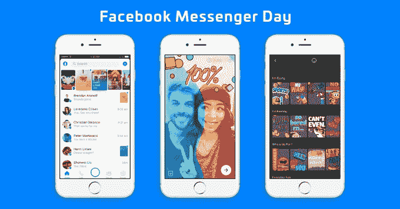
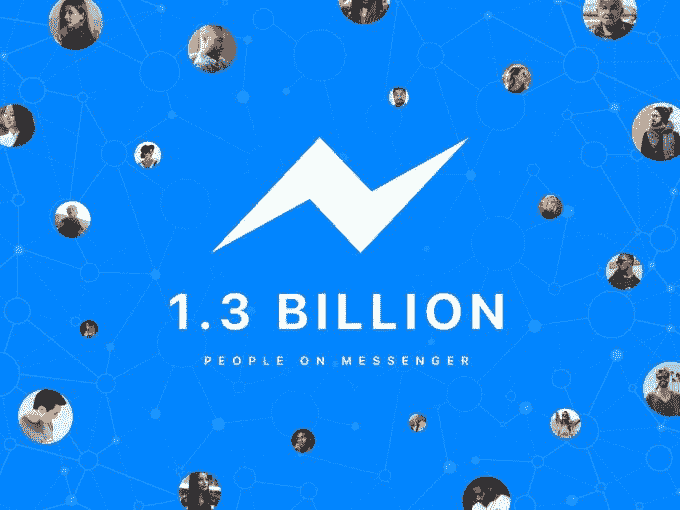
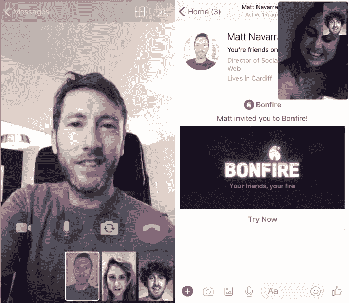
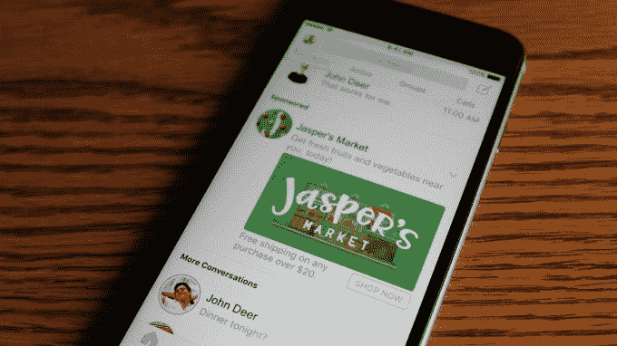

# Facebook Messenger Day 日活 7000 万，月活 13 亿

> 原文：<https://web.archive.org/web/https://techcrunch.com/2017/09/14/facebook-messenger-1-3-billion/>

脸书终于透露了其 Snapchat Stories 克隆版的表现，尽管它没有看到 Instagram 或 WhatApp 版本那样的爆炸式增长。Messenger Day 推出六个月后，现在每天有 7000 万用户发布和观看照片和视频幻灯片。

相比之下，Instagram Stories 仅用了两个月就达到了 1 亿用户，而 WhatsApp Status 仅用了 10 周就达到了 1.75 亿用户。这两家公司现在都有 2.5 亿每日用户，而竞争对手 Snapchat 的整个应用程序有 1.73 亿每日用户。

与此同时，Facebook Messenger 作为一个整体继续上升，巩固了自己作为西方顶级跨操作系统消息应用的地位。 [Messenger now](https://web.archive.org/web/20230307031951/https://www.facebook.com/messenger/photos/a.882538591865822.1073741828.602814669838217/1530168793769462/?type=3&theater) 拥有 13 亿月活用户，高于 2016 年 4 月的 12 亿和 7 月的 10 亿。这与脸书的另一款聊天产品 WhatsApp 的数量相同。

这些年来，Messenger 的增长率略有下降。从 8 亿增加到 10 亿只用了 6 个月，增加到 12 亿用了 9 个多月，增加最后 1 亿用了 5 个月。这可能意味着 Messenger 在一些核心市场开始达到饱和。

不属于脸书的 Messenger 的最接近的竞争对手包括截至 5 月份拥有 9.38 亿月用户的中国微信，截至 2017 年 Q1 拥有 8.61 亿月用户的中国 QQ，以及截至 2017 年 Q2 拥有 1.73 亿日用户的 Snapchat(尽管并非所有人都使用它进行消息传递)。苹果的 iMessage 也重新展现了自己，从平淡无奇的短信替代品转变为动态体验，包括动画，一个应用平台，以及在即将到来的 iOS 11 中， [Animoji，你可以使用增强现实](https://web.archive.org/web/20230307031951/https://techcrunch.com/2017/09/12/iphone-x-animoji/)用你的脸控制。

Messenger 在设计方面经历了艰难的一年。它推出了一个积极的重新设计，使整个收件箱只是信使相机上的一层，矩形屏幕上有尴尬的圆形边缘。后来，它恢复了一些样式，[在五月份转移到了标签收件箱](https://web.archive.org/web/20230307031951/https://techcrunch.com/2017/05/18/facebook-messenger-debuts-a-new-look-focused-on-improving-navigation/)。

该应用的 Snapchat Stories 克隆版 [Messenger Day](https://web.archive.org/web/20230307031951/https://techcrunch.com/2017/03/09/facebook-messenger-day/) 于 3 月推出，受到了严厉批评，一些人说社交媒体的广播功能不适合聊天工具，[从消息线程](https://web.archive.org/web/20230307031951/https://techcrunch.com/2017/03/13/to-day-or-not-today/)那里窃取了屏幕空间。增长比 Snapchat 的其他版本要慢得多。一些脸书爱好者可能已经将使用转移到 Instagram 的即时通讯功能 Direct 。它已经膨胀到每月 3.75 亿用户，现在提供永久和短暂的信息服务。

与此同时，脸书一直在努力使信使机器人成为它所希望的无处不在的公用事业。在 2016 年草率推出后，Messenger 为机器人增加了群聊功能，开始通过其人工智能助手 M 推荐它们，并在 Messenger 中内置了一个机器人发现部分。尽管如此，他们并没有引起太多的关注。尽管对亚马逊 Alexa 和谷歌 Home 等产品有着狂热的崇拜，但脸书并没有给 Messenger 添加任何新的语音功能。

从好的方面来看，Messenger 的视频聊天已经证明很受欢迎。截至去年 12 月，当 [Messenger 添加六路分屏群组视频聊天](https://web.archive.org/web/20230307031951/https://techcrunch.com/2016/12/19/messenger-group-video-chat/)时，该功能的月用户数达到 2.45 亿，让人想起青少年应用 Houseparty。现在，信使号加倍努力，集成到昨天刚刚在野外发现的脸书羽翼丰满的家庭派对克隆体“篝火”( T4)中。Messenger 的 13 亿用户无需下载单独的应用程序，就可以立即加入群组视频聊天，而不是强迫 Bonfire 从零开始发展。

Messenger 终于开始增加盈利。品牌可以付费发送[赞助信息](https://web.archive.org/web/20230307031951/https://techcrunch.com/2016/04/12/facebook-sponsored-messages/)给已经和他们聊天的人，或者[购买收件箱](https://web.archive.org/web/20230307031951/https://techcrunch.com/2017/07/11/facebook-messenger-display-ads/)中的展示广告，这在 7 月份推出。

如果 Messenger 想要保持增长，它必须继续复制竞争对手的最佳功能，同时通过与脸书的联系，在自己拥有天然优势的领域进行创新。一个机会可能是据报道脸书正在制造的视频聊天硬件设备，代号为 Aloha。有了 13 到 15 英寸的屏幕，它可以帮助人们与祖父母或其他不熟悉智能手机应用程序的家人进行视频聊天。脸书可以利用这一设备对家用电话发起攻击，这可能会带来巨大的增长机会。

然而，尽管聊天可能是移动体验的中心，并且所有的移动设备都在适应视觉通信时代，Messenger 不能让花哨的功能妨碍其核心的快速实用功能。