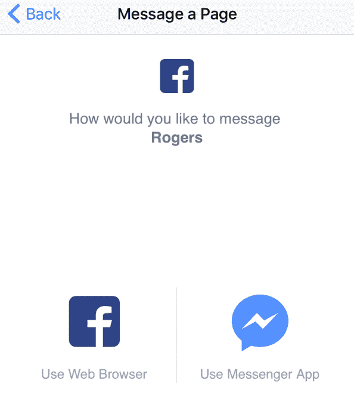

# 脸书计划在 Messenger  上投放广告

> 原文：<https://web.archive.org/web/https://techcrunch.com/2016/02/18/facebook-messenger-ads/>

一份泄露的文件显示，脸书发送给一些最大的广告商，脸书将于 2016 年在 Q2 推出 Messenger 广告。

TechCrunch 获得的这份文件称，企业将能够向之前与该公司发起聊天的人发送广告消息，但为了保护其已核实的来源，这份文件是保密的。为了做好准备，该文件建议企业让消费者现在就开始与他们进行信息交流，以便他们能够在该功能推出时向他们发送广告。

该文件还指出，fb.com/msg/脸书已经悄悄地推出了一个 URL 短链接，可以立即打开一个与企业的聊天线程。脸书证实了这个网址短链接的存在。这似乎证实了泄露文件的真实性。

企业和用户之间的消息示例

关于信使广告，脸书告诉我“我们不评论谣言或猜测。也就是说，我们使用 Messenger 的目的是为全球 8 亿人创造高质量、引人入胜的体验，这包括确保人们不会收到任何类型的不想要的消息。”最后一部分听起来像是脸书试图让用户放心，即使有广告，他们也不会完全不请自来，而且会非常小心。

Messenger 是脸书最受欢迎、增长最快的产品之一，每月活跃用户达 8 亿。然而，社交网络之前从未直接将其货币化。

对用户来说，值得庆幸的是，脸书不会让品牌向任何人甚至是喜欢他们页面的人发送广告信息。只有那些自愿与商家聊天的人才能被发送广告。这应该在某种程度上限制了垃圾邮件的可能性和烦恼。现在，几乎所有的信息都来自一个人的朋友，所以脸书可能会试图通过限制广告来保持这种高信噪比。

这个消息与马克·扎克伯格在 2014 年初脸书收购 WhatsApp 时为了安抚用户所说的话有些矛盾[。扎克伯格在一次分析师电话会议上表示:“我个人认为广告不是将信息货币化的正确方式。”。](https://web.archive.org/web/20230306013351/https://techcrunch.com/2014/02/19/whatsapp-will-monetize-later/) [WhatsApp 的首席执行官简·库姆](https://web.archive.org/web/20230306013351/http://blog.whatsapp.com/245/Why-we-dont-sell-ads)在 2012 年的一篇博客文章中走得更远，称“广告不仅仅是对美学的破坏、对你智力的侮辱和对你思路的打断”，也是对工程资源的浪费。

然而，随着越来越多来自朋友、新闻出版商、视频制作商和品牌的内容争夺人民网有限的空间，脸书显然越来越愿意让广告商直接向人民网付费。这不是唯一一个在两者之间开辟新的直接渠道的公司。 [Twitter 今天宣布了](https://web.archive.org/web/20230306013351/https://techcrunch.com/2016/02/18/twitter-customer-service/)公司通过 DMs 提供客户服务的新方式。

## 替换 1-800 号码

脸书的信使大卫·马库斯的头

自 2011 年底以来，脸书一直在慢慢加强企业与人私下沟通的方式。那是它第一次允许用户向页面发送信息，然后页面才被允许回复信息。最初，这是为了让企业将混乱或愤怒的客户服务对话从他们的墙上移走，让其他粉丝可以看到。

2014 年，脸书聘请 PayPal 总裁 [David Marcus](https://web.archive.org/web/20230306013351/https://techcrunch.com/2014/06/09/facebook-poaches-paypal-president-david-marcus-to-run-messenger-maybe-monetize-it-with-payments/) 来运营 Messenger，从而加倍了商务聊天的努力。他带来了一个愿景:脸书可以让公司更好地与客户交流，而不是电话和 1-800 号码，还有笨拙的按键菜单和等待时间。

在 2015 年 3 月的 F8 会议上，脸书宣布了其在 Messenger 上的[业务](https://web.archive.org/web/20230306013351/https://techcrunch.com/2015/03/25/facebook-launches-messenger-platform-with-content-tools-and-chat-with-businesses/)计划，该计划让电子商务客户获得收据，并与客服代表聊天以更改订单。它还允许企业集成第三方工具，如 Zendesk 和 Conversocial，以管理他们的新信息。

在接下来的几个月里，脸书增强了企业的聊天功能，让他们在页面上显示一个大的[“发送消息”或“联系我们”](https://web.archive.org/web/20230306013351/https://techcrunch.com/2015/09/08/facebook-storefronts/)按钮，[创建已保存的回复](https://web.archive.org/web/20230306013351/https://techcrunch.com/2015/06/02/facebook-tests-saved-replies-a-tool-that-lets-pages-respond-to-customers-with-canned-messages/#.c09dfs:OJwl)，显示一个徽章，根据[他们的回复速度](https://web.archive.org/web/20230306013351/https://techcrunch.com/2015/12/08/facebook-page-response-time/)，以及[用私人消息回复墙上的帖子](https://web.archive.org/web/20230306013351/https://techcrunch.com/2015/08/05/facestomer-support/)。

脸书最近还推出了“点击发送信息”的新闻提要广告，让商家付费让人们与他们聊天。此外，它一直在秘密测试一个聊天机器人平台，该平台允许开发者在 Messenger 中创建电子商务体验和个人助理。

## 脸书迄今为止最强有力的广告

现在，脸书正在推动品牌使用这些工具来鼓励人们向他们发送信息，这样他们最终将能够发送广告作为回报。根据泄露的文件，它最近还发布了一个新工具:Messenger URL 短链接。它现在对所有页面都有效，通过格式 fb.com/msg/，然后是页面的脸书用户名，像[fb.com/msg/techcrunch](https://web.archive.org/web/20230306013351/http://fb.com/msg/techcrunch)。

品牌可以分享和推广他们的链接。当用户点击它时，它会在信使应用程序或脸书的移动网站或桌面网站上开始与该品牌的对话。脸书向我证实，包括加拿大电信公司 Rogers 在内的一些合作伙伴已经在试用 fb.com/msg/Rogers 短码，但脸书没有谈及此事。

这个短链接本质上是 1-800 号码的下一代版本。不用打电话给 1-800-FLOWERS，你只需点击像 fb.com/msg/flowers 这样的东西，就可以按照自己的节奏与客服人员聊天。否“按 1 听取选项列表。”没有“请稍等”

该文件详细说明，如果企业在过去一周的 24 小时内对消息的回复率达到 90%，他们的 Messenger 句柄将可以在脸书上搜索到。这可能会进一步激发内送信息线索，最终成为展示广告的机会。

目前还不清楚商家将能够在 Messenger 广告中投放什么，但有很多可能性。该文件称，广告应该继续用户发起的现有讨论。广告也许可以:

*   通知客户有关闪购、免费礼品或其他促销活动的信息
*   宣布产品发布，鼓励客流量或提供在线购买商品的链接
*   发布新的视频、GIF 或品牌创建的其他内容
*   接着用重新定位风格的提醒来提醒用户之前考虑购买的商品不再缺货或者已经降价

考虑到这是企业向潜在客户做广告或与之互动的最直接、最有力的方式，脸书可能会收取很高的费用。

Messenger 广告的早期测试总有可能收到负面反馈，从而导致计划流产。脸书最不想做的事情就是把垃圾邮件塞进 Messenger，给人们一个返回短信或其他聊天平台的理由。预计这些广告在可能推出之前会经过缓慢而彻底的测试。

现在，几乎每次 Messenger 发出嗡嗡声，你都知道这是你的一个朋友，可能值得一看。脸书将不得不积极阻止垃圾邮件或滥用信使广告来赚钱，同时保持其聊天应用程序在我们移动生活中的中心地位。