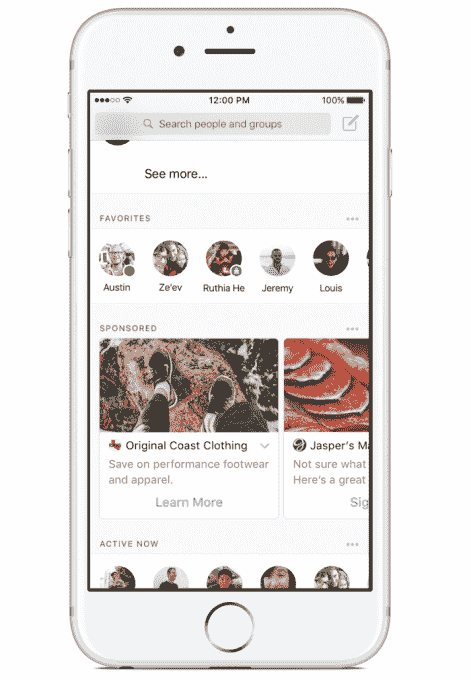

# Facebook Messenger 开始测试广告...他们是大

> 原文：<https://web.archive.org/web/https://techcrunch.com/2017/01/25/facebook-messenger-begins-testing-ads-and-theyre-big/>

脸书今天开始测试将广告整合到其移动通讯应用的用户界面中。该公司表示，将在澳大利亚和泰国推出其所谓的“非常小的测试”，允许企业在 Messenger 主屏幕上放置广告。这些相当突出的卡片式广告包括图像缩略图，并附有文本和链接。脸书说，它们会出现在你最近的对话下方。

有问题的链接可以引导用户采取不同的行动，比如点击了解更多的业务信息或注册服务等。这类似于今天的脸书商业页面如何引导用户采取特定的行动，例如，在他们的网站上购物，或者开始聊天。

广告目前占据了主屏幕的大量空间，它们位于你的收藏夹下方和“现在活跃”部分的上方，后者向你显示哪些朋友在线。这似乎让 Messenger 变得不那么用户友好，因为你必须滚动浏览这些巨大的、难以忽视的广告，才能使用 Messenger 的其他关键功能。

脸书至少承诺广告不会出现在对话中，除非用户选择点击广告或开始与该品牌聊天。

“企业一直告诉我们，他们对 Messenger 平台接触客户、帮助他们推动销售、建立品牌知名度和提高客户满意度的潜力感到非常兴奋，”脸书产品经理 Eddie Zhang 在一份详细介绍新广告的公告中写道。

当然，企业很兴奋。然而，用户却不这么认为。

目前，脸书已经为企业提供了通过 Messenger 联系客户的其他方式，包括将用户带入聊天会话的新闻提要广告和赞助消息。

今天的 Messenger 每月有超过 10 亿的用户，可以通过这样的广告达到。该公司还指出，人们每月向品牌发送超过 10 亿条信息——这一统计数据表明，人们希望在 Messenger 中看到这样的广告。

但事实是，人们喜欢通过 Messenger 联系企业，因为与给企业打电话或发电子邮件相比，这是一种更有效的提问或获得客户服务的方式。这并不意味着他们希望他们的一个主要消息应用程序的用户界面充斥着广告。

当然，这只是暂时的测试。如果这些广告和 Messenger 用户之间的互动很少，脸书可能会重新考虑如何实施。

此外，该公司指出，用户可以使用 Messenger 中的下拉菜单隐藏和报告特定的广告。

长期以来一直有传言称，脸书将通过广告进一步赚钱，尽管之前的泄露已经[指出计划](https://web.archive.org/web/20230326023647/https://techcrunch.com/2016/02/18/facebook-messenger-ads/)允许企业与之前发起聊天线程的用户开始包含广告的聊天。这后来变成了[赞助的消息。](https://web.archive.org/web/20230326023647/https://techcrunch.com/2016/04/12/facebook-sponsored-messages/)但这类广告更具干扰性，可能会让人们不太可能打开有机邮件，因为他们会认为应用程序中的邮件是垃圾邮件。

另一方面，新广告看起来更像你滚动浏览的新闻提要中的横幅。

脸书表示，这些广告将在未来几周内在泰国和澳大利亚的测试人群中推出。