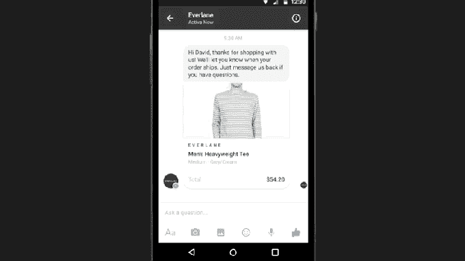
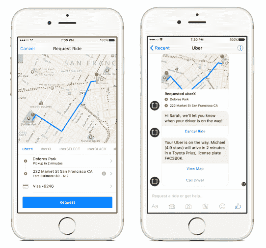

# 脸书的秘密聊天软件开发工具包让开发者建立信使机器人

> 原文：<https://web.archive.org/web/https://techcrunch.com/2016/01/05/facebook-messenger-bots/>

M 不会是 Facebook Messenger 上唯一的人工智能。据直接了解 SDK 的消息人士证实，脸书已经向一些开发者提供了一个未经宣布的聊天 SDK，允许他们在 Messenger 中建立互动体验和“机器人”来购物、预订旅行等。

Chat SDK 允许开发人员创建机器人，用户可以直接向其发送文本消息，并自动回复信息、图像、位置服务、产品价格、购买按钮等。Chat SDK 还可以接入 Messenger 内置的支付系统，让用户通过机器人进行购物。

脸书还没有公布任何聊天软件开发工具包的文档，该工具包目前正通过 PDF 文档与开发者共享。该项目部分由 Facebook Messenger 的战略合作伙伴负责人[布莱恩·胡伦](https://web.archive.org/web/20230313035250/https://www.linkedin.com/in/bryanhurren)领导。脸书拒绝置评。

[ **太平洋标准时间 1 月 6 日上午 10:25 更新** : [Assist](https://web.archive.org/web/20230313035250/http://www.assi.st/) 似乎是基于 Messenger Chat SDK 构建的机器人之一。它声称它在 Messenger 上提供交互式机器人功能。当我问该公司是否使用聊天软件开发工具包时，它拒绝回答，回写道“我们很高兴能在脸书信使上使用。我们不能讨论整合的细节。”]

虽然目前只是有限发布，但聊天 SDK 可能会发展成为一个更加开放的平台，超越其早期的大牌合作伙伴实验，如优步。

> 我们只是让人们习惯于这样一种想法，即您可以在 Messenger 上发送消息，而不仅仅是向其他人发送消息。塞思·罗森伯格，脸书产品经理

起初，脸书帮助开发人员构建可能与它自己的混合人类/人工智能助手竞争的信使机器人似乎有些奇怪。但 M 的一大目标是将 Messenger 作为一款拥有超能力的聊天应用进行差异化，并使其成为人们希望用来进行日常交流的工具，而不是短信或其他竞争对手。

通过培育一个聊天机器人生态系统，脸书可以让外部开发者提高 Messenger 的价值，让它更容易让人上瘾。这样，用户就可以留在脸书的应用程序家族中，他们更有可能接触到脸书赚钱和提供联系的方式。

[Facebook URL = " https://www . Facebook . com/Dave Marcus/videos/10156429336080195/"/]

Messenger Chat SDK 可以让更多的开发者有能力开发像优步一样的机器人。

## 西方的微信

中国的微信(WeChat)和日本的 Line 等应用程序率先在亚洲推广了基于聊天的轻量级商务、新闻等界面的概念。他们可以简单地在他们已经使用了一整天的即时通讯应用程序中发送消息“官方账户”或聊天机器人，而不是强迫人们为每个业务或用例下载整个应用程序。这些可以让你通过微信支付选项进行购物，订购出租车，购买电影票，支付账单等。

这些机器人和官方账户不仅方便了用户使用附加工具。聊天应用平台让企业不必为多种手机操作系统构建、推广和维护完整的移动应用。随着如此多的应用程序充斥应用程序商店，让人们发现它们并经历安装应用程序的麻烦对企业来说可能是艰难的。对于企业来说，让用户简单地给他们发消息要轻松得多。

开发人员和企业在 Messenger 中内置的有用功能越多，它就变得越粘。这是与 Slack 类似的[策略，Slack 于上月正式推出其工作场所聊天应用平台。](https://web.archive.org/web/20230313035250/https://techcrunch.com/2015/12/15/trophy-emoji/)

去年 4 月，脸书在 F8 展示了 Messenger 上的客户服务

此前，脸书曾与特定合作伙伴合作，为 Messenger 构建类似机器人的集成，但这些都是由知名企业进行的受控实验。我们去年曾爆料称，[脸书将把 Messenger 变成一个平台](https://web.archive.org/web/20230313035250/https://techcrunch.com/2015/03/19/facebook-messenger-platform/)，用于 Giphy 和 PingTank For Messenger 等全面应用，帮助用户制作丰富的媒体内容来发送朋友。

但是在脸书的 F8 发布会上，它还推出了 Messenger 平台上的[业务，允许公司通过聊天、收据和更改订单的方式提供实时客户服务。它与 Everlane 的最初合作表明，客户能够与某人聊天以更改他们的送货地址，并在聊天线程中处理所有确认，而不是通过电子邮件。](https://web.archive.org/web/20230313035250/https://techcrunch.com/2015/03/25/soon-facebook-messenger-will-let-you-reach-out-to-businesses/)

从那以后，脸书没有在 Messenger 上过多谈论商业，因为焦点转移到了当时脸书 M assistant 的有限推出上。与此同时，它还为用户提供了一种途径，让他们可以从 MLB 获得世界棒球大赛的实时更新，从 T4 获得手工活的报价，并与 Pro.com 的承包商联系。

TechCrunch 得到消息称，脸书在 Messenger 中做了一件更奇怪的事情。对于一些用户来说，在消息开头输入@符号会弹出一个“命令”菜单，其中只有一个名为“假日挑战”的选项。除了通过 SDK 构建的成熟的机器人账户，脸书似乎正在测试类似于 [Telegram](https://web.archive.org/web/20230313035250/https://telegram.org/blog/inline-bots) 和 [Kik](https://web.archive.org/web/20230313035250/https://techcrunch.com/2015/12/21/kik-invests-in-its-platform-buys-fashion-startup-behind-popular-kik-bot/) 的内嵌机器人。

## 有用=上瘾

上个月，脸书终于通过其[优步集成](https://web.archive.org/web/20230313035250/https://techcrunch.com/2015/01/02/chat-apps-increasingly-important-for-brands/)展示了机器人在 Messenger 上的真正潜力。轻按交通按钮或地址，然后选择优步，您将开始与汽车服务聊天。聊天中的一个交互式面板让您可以设置取货点、目的地和付款选项。然后，当驱动程序接近时，您将在线程中获得更新，并提供查看地图或调用驱动程序的选项。

用 Messenger 聊天 SDK 构建的机器人看起来和工作起来与这些截图相似。他们无需成为朋友或喜欢他们就可以立即发送信息。这些机器人可以对交互式按钮上的点击或在线程中键入的关键字做出反应。Sockets 技术将允许他们实时响应，而不是将 M 视为开发者应用的竞争对手，脸书可以用它来测试和实验人们想要什么，以及 Messenger 上的机器人有什么可能。

## 作为门户的聊天

在网络上，关键词搜索是体验的核心。但是在手机上，很明显聊天是人们花费大部分时间的地方。这使得赢得信息战对脸书来说既是一个要求，也是一个机会。

为了在手机领域保持主导地位，它必须让 Messenger 变得不可抗拒地有用，而做到这一点的最佳方式是用开发者开发的机器人来增强自己的产品，为每一个利基用例提供便利和实用。如果脸书控制了信息传递，它就控制了商业、内容和通信的门户。

突然间，马克·扎克伯格 2016 年对自己的挑战变得更有意义了，那就是打造一个人工智能助理，像钢铁侠的贾维斯一样管理他的房子。“我将开始教它理解我的声音来控制我们家里的一切——音乐、灯光、温度等等，”他写道。他也在建造一个对自然语言有反应的机器人。

在优步集成发布之前，脸书产品经理 Seth Rosenberg 告诉 TechCrunch，“我们只是让人们习惯于这样一个想法，即你可以在 Messenger 上发送消息，而不仅仅是人。”聊天软件开发工具包可以给这些人带来更多的信息。