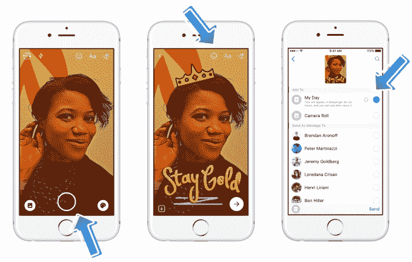
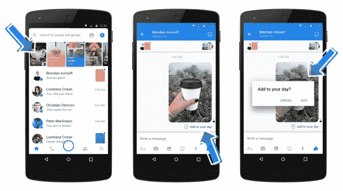
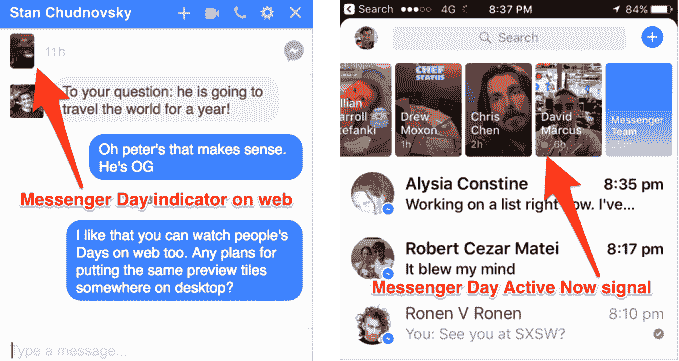
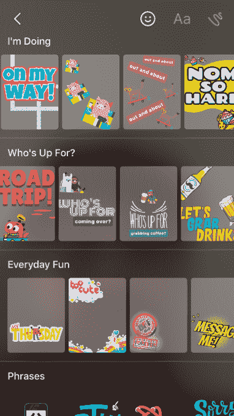

# Facebook Messenger Day 是 Snapchat Stories 的克隆版，用于制定计划

> 原文：<https://web.archive.org/web/https://techcrunch.com/2017/03/09/facebook-messenger-day/>

今天，脸书在全球范围内发起了信使日，为幻灯片的形式注入了实用的元素。Snapchat Stories 是用来复述你做过的事情的，而 Messenger Day 的主题是“谁准备好了？”过滤器和活跃的现在指示器帮助你找到朋友聊天和见面。

现在，在通过在波兰和澳大利亚等十几个国家的[测试获得了数百万用户之后，信使日随着今天的](https://web.archive.org/web/20230326023406/https://techcrunch.com/2016/09/30/messenger-day/) [iOS](https://web.archive.org/web/20230326023406/https://itunes.apple.com/us/app/messenger/id454638411?mt=8) 和 [Android](https://web.archive.org/web/20230326023406/https://play.google.com/store/apps/details?id=com.facebook.orca&hl=en) 更新，加上桌面消息线程，正在为脸书聊天应用顶部的每个人推出。该功能可让您与公众或自定义朋友分享装饰过的照片和视频，这些照片和视频会在 24 小时后消失。

如果 Messenger Day 流行起来，它可以通过 Messenger 新增强的摄像头鼓励视觉交流，启动聊天线程，让朋友在离线时聚在一起。脸书的消息副总裁 David Marcus 告诉我，Day 将“很可能”在帖子之间插入广告，成为 Messenger 的第一个收入来源。

除了 WhatsApp 的地位、 [Instagram Stories](https://web.archive.org/web/20230326023406/https://techcrunch.com/2016/08/02/instagram-stories/) 和[脸书 Stories](https://web.archive.org/web/20230326023406/https://techcrunch.com/2017/01/25/facebook-stories/) 之外，Messenger Day 可以利用便利性与 Snapchat 争夺[用户增长，这已经成为 Snap 上市后的一个关键弱点。毕竟，已经有十亿人在使用 Messenger 了。随着信使日的宣布，Snap 的股价今天早上略有下降。](https://web.archive.org/web/20230326023406/https://techcrunch.com/2017/02/02/slowchat/)

此次发布展示了脸书的理念，即尽管 Snapchat 可能发明了故事，但它实际上是一个比任何一家公司都大的基础内容媒体。不管批评者怎么说，脸书不怕抄袭。重要的是它对用户是否有价值。

人们自然会问为什么他们需要另一个地方来分享，也许他们不需要。但是，如果 Messenger 能够围绕实用性而非趣味性重新构想故事格式，而不会给聊天应用的其他部分带来不便，它可能会刺激我们创造更多的记忆，而不是仅仅消耗旧的记忆。

## 信使日实践

“这大约是今天。这不是昨天的事。这与明天无关，”马库斯告诉我。“两个关键的功能是:1)我将设置背景，因为如果人们知道我在哪里，我在做什么，这将有助于更好的对话。2)它是关于我想在哪里度过我的一天，比如“我很无聊，我想出去喝咖啡”或“我想去看电影”，所以我会用一个相框，拍一张照片，看看我的哪些朋友会和我一起制定计划，因为计划是消息应用程序的核心功能之一。”

我昨天花了一天时间自己尝试了一下 Messenger Day，它在不增加应用程序摩擦的情况下实现了这两个目标，给我留下了深刻的印象。

### 注意

Messenger Day 出现在 Messenger 主屏幕的聊天线程上方，采用了帮助 [Instagram Stories 在 5 个月内飙升至 1.5 亿日用户](https://web.archive.org/web/20230326023406/https://techcrunch.com/2017/01/11/instagram-stories-hits-150m-daily-users-launches-skippable-ads/)的大胆设计。在那里，你会看到预览朋友们日子的缩略图，而不仅仅是姓名和个人资料图片。它们是按时间顺序倒序排列的，可以帮助你制定与人分享的计划。您可以轻按来快进或倒回，并按住来暂停，下一个朋友的一天会紧接在上一天之后出现。这种自动推进的风格使得在不同的日子之间插入广告变得容易。

虽然没有类似的计数器，但 Messenger 可以让您立即私下回复一天，并在您与该人的聊天线程中显示自定义或预填充的消息，如“哈哈”、“哇”、“一颗心”或“100”表情符号。这消除了在 Snapchat 中将广播变成对话的障碍，这可能会让人感到有些畏惧。如果你已经在和发帖的人聊天，你会在手机和脸书的桌面网站上看到一个关注他们一天的电话。

Snapchat 没有的一个特殊功能:立即激活。您会在当前可以在应用程序上聊天的朋友的 Messenger Days 上看到一个绿点。这打破了僵局，促使用户从看到朋友做有趣的事情，转向询问他们是否可以加入。从这个角度来看，Messenger 可能是一种治愈孤独的方式，它可能会在午餐、免费和 Foursquare 失败的地方取得成功。

### 共享

从 12 月开始，Messenger 的大摄像头重新设计似乎是为了提高日常使用量而量身定制的。你可以点击底部的大快门按钮，顶部的“添加到你的一天”按钮，或者当你在一个帖子中分享图像时通过提示来发布。分享选项包括原生拍摄的照片和 15 秒钟的视频，以及上传的媒体，包括带有黑色边框的 gif，以表明它们是旧的。您可以手动逐帧存储您共享的内容。

默认情况下，帖子对“所有人”可见，除了你屏蔽的特定人。然而，脸书表示，只有有权向你发送脸书好友消息的人才能在他们的应用程序顶部看到你的生活。你也可以选择一个特定的可以查看你的日志的人的列表，这适用于你发布的所有内容，而不是每次都要设置。你还可以选择直接向朋友发送帖子，以及分享你的一天。你会在帖子的底部看到那些见证过你的一天的人的脸。

在你分享之前或之后，你可以用图画、文字说明、动画自拍镜头、叠加气泡或熔岩灯颜色等环境效果、让你的图像看起来像油画或素描的风格转换、虚拟“装扮”道具、语音气泡、贴纸和 5000 多个插图滤镜来修饰你的内容。

这就是信使日在传递信息的故事上的独特倾向的来源。可搜索的分类过滤器包括行动号召，如“谁想去喝杯咖啡？”、“公路旅行”、“电影之夜？”、“我们去喝一杯吧”、“我们去跑步吧”等等。这些使得邀请朋友和你一起出去玩变得简单而有趣。不像张贴“谁想吃晚饭？”在脸书，没有回复会让你看起来不受欢迎，在 Messenger Day 上的帖子会消失，所有回复都是私人的，所以你不必担心看起来很孤独。

如果没有适合您的过滤器，Messenger Day 可以将您写的任何文本转换为过滤器，如您朋友的姓名或您所在的位置。这些计算机生成的过滤器使得 Messenger Day 中的创意选项表面上是无限的。

### 少了什么

总的来说，信使日感觉比我想象的更少打扰，更顺畅。像 Instagram 的故事，如果你不关心，很容易被忽略。即使朋友很少发布消息，Messenger 也能很好地工作，因为这可以减少噪音，让它专注于计划外出。

尽管如此，我还是希望它有很多缺失的功能，包括:

*   可以将你的一整天保存为视频并导出到脸书 feed (Snapchat)
*   可旋转的颜色和光线滤镜(Snapchat、Instagram)
*   选择照片显示时间的选项
*   可以钉在物体上的 3D 贴纸(Snapchat)
*   FaceSwap (Snapchat)
*   像 Bitmoji (Snapchat)这样的个性化头像贴纸
*   易于访问的贴纸表情符号(Snapchat)
*   标题背景颜色(Instagram)
*   回旋镖或 GIF 捕捉(Instagram)
*   绘画的笔刷样式(Instagram)
*   提到如果你回复就会开始群聊的朋友(Instagram)

最重要的应该是一些基本的颜色和光线调整滤镜，以及标题背景色，因为 Messenger 的字体已经有点难以阅读，可能会融入图像中变得不可读。

随着时间的推移，Messenger 肯定会采用其中的一些，并构建更多使其脱颖而出的功能。但是对于全球首次推出的 v1 来说，它在触及大多数关键功能方面做得非常出色，所以它立即就可以使用了。

现在白天不允许做生意。也没有广告，但当被问到他是否看到了广告的机会时，马库斯告诉我“可能。。。我们希望尝试更多的方式来与企业建立联系。。。你绝不会希望我们妨碍某人快速发送信息。。。只要我们保持这种活力，我们就有权利去试验，看看真正好的广告是否能打开人们想要的话题。。。实际上是有价值的。”

## 从各个角度攻击 Snapchat

信使日的“谁准备好了？”过滤器帮助你计划与朋友见面

视觉交流是未来，正如我昨天在关于 Messenger 发展的[深度探讨](https://web.archive.org/web/20230326023406/https://techcrunch.com/2017/03/08/the-camera-is-the-keyboard/)中所写的，任何不加入的聊天应用都注定要失败。不过，Messenger 在这里将 Day 放在线程之上是冒险的，因为它减少了您最初在屏幕上看到的数量。如此积极地向社交媒体扩张不值得阻碍 Messenger 在传统聊天领域的增长，所以脸书必须仔细观察，以确保世界各地不同的人口统计数据在推出后不会减少消息。

脸书是故事格式的后来者，但现在它正在接近它，并通过其每一个核心应用程序与 Snapchat 竞争。如果成功，它可能会进一步抑制 Snapchat 的增长，特别是在国外的一些市场，那里的青少年甚至没有尝试过 Snapchat，但已经在 Messenger、WhatsApp 或 Instagram 上使用了多年。脸书的版本可能不会根除现有忠实用户的 Snapchatting，但可能会削弱其用例，同时足以说服一些人，他们不需要注册另一个社交网络。

这里没有拳头。脸书毫不掩饰地窃取了 Snapchat 的精华，并把它们放在最前面和最中心的位置。这似乎是创新的反面，或者至少是坏的体育精神。但是脸书的意识形态总是以规模为中心，而不是原创性。这不是第一个社交网络，但它是一个让所有人。它没有发明故事，但时间不一定会奖励发明故事的人。只是那些把他们放进每个人口袋里的。