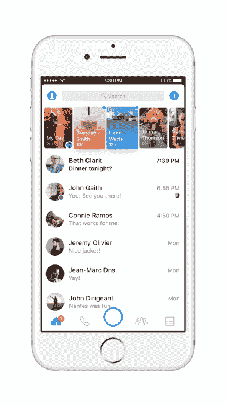
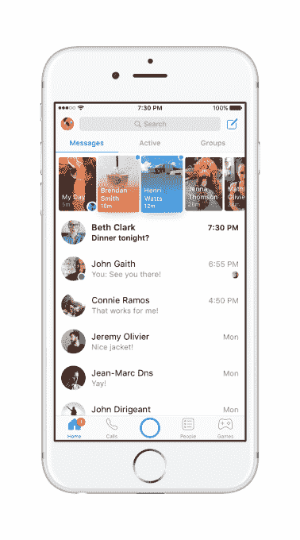

# Facebook Messenger 推出新外观，专注于改进导航

> 原文：<https://web.archive.org/web/https://techcrunch.com/2017/05/18/facebook-messenger-debuts-a-new-look-focused-on-improving-navigation/>

Facebook Messenger 的外观焕然一新。不，它没有放弃它的故事功能，Messenger Day，而是对其主屏幕上的内容进行了一系列较小的改变，以加快导航速度，并帮助你回到上次访问时离开的地方。

此更新在 Messenger 主屏幕的顶部引入了新的选项卡，用于在您的消息、活动联系人和群组之间移动。此外，该应用程序现在将通过在各个部分和标签上使用红点来提醒您访问其他区域，让您知道何时有活动。

脸书解释说，新的设计是为了更好地突出人们联系和沟通的许多其他方式，而不仅仅是短信。

此次更新将群组从底部导航栏重新定位到屏幕顶部的 a 选项卡，使其在重新设计的应用程序中不那么突出。

现在，在 Messenger 主屏幕的顶部，有你的消息的选项卡和现在在应用程序上活跃的人的列表(如他们名字旁边的绿点所示)，旁边是新的组选项卡。

*上图:*之前的 iOS 收件箱

通过为活跃用户提供他们自己的专用部分，Messenger 似乎在鼓励你通过应用程序开始更多的对话，因为在一个长的垂直滚动列表中更容易看到谁在线，而不是以前的水平滚动条。

此外，通过将所有这些以消息为中心的区域集中在主屏幕上，而不是分散在应用程序中，Messenger 可以将其他更新的部分集中在底部的主导航栏中。例如，本月早些时候[刚刚在全球推出的游戏](https://web.archive.org/web/20230326022156/https://techcrunch.com/2017/05/02/messenger-games/)在这个工具栏上有了自己的按钮，因为群组已经转移到了其他地方。

*上图:*之后的 iOS 收件箱

奇怪的是，考虑到它希望在不同平台上与 Snapchat 竞争，脸书现在已经缩小了 Messenger 中相机按钮的尺寸。以前，超大按钮比周围的按钮更大，甚至经常导致意外按压——这也是脸书展示其类似 Snapchat 的滤镜、效果和遮罩集合的机会。然而，随着更新，按钮恢复到正常大小，并与其邻居很好地对齐。

可以肯定的是，这是一个更好的设计美学，但它也让相机功能感觉不太像 Messenger 的主要功能，就像以前的大按钮一样。

更新后的底部栏现在有主页、通话、相机按钮、人物和游戏标签。在 iOS 上，也有标签，而以前它们只是图标。(在安卓系统上，这款应用只保留了图标。)

[gallery ids="1492940，1492939"]

*上图:安卓前&后*

改造后的 Messenger 应用程序的另一个新功能是当应用程序中的一个部分有新活动时会出现红点。例如，如果您尚未阅读任何邮件，您会在底部的主页图标旁边看到一个圆点。如果您错过了一个电话，红点将出现在主屏幕顶部的通话选项卡旁边。

这将是一个有用的指南，帮助你找到那些你上次登录后错过的东西，但它也可能会对我们这些有应用程序强迫症的人造成潜在的困扰。也就是说，如果你是那些今天在脸书点击市场按钮只是为了清除屏幕上的红点的人之一，请准备好在更新后开始点击 Messenger。

脸书表示，这些变化将从本周开始在 iOS 和 Android 平台上推广到 Messenger worldwide。