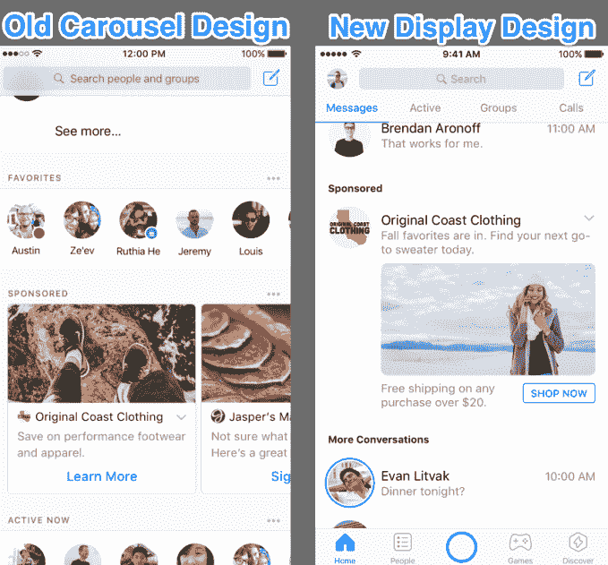
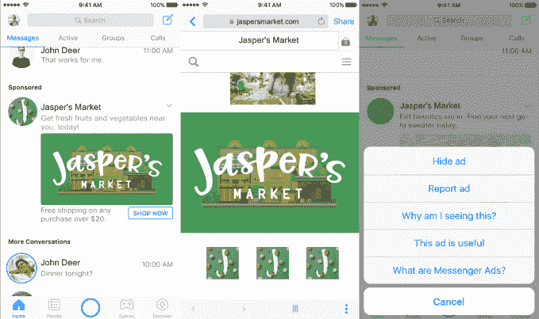

# Facebook Messenger 全球测试将展示广告注入收件箱

> 原文：<https://web.archive.org/web/https://techcrunch.com/2017/07/11/facebook-messenger-display-ads/>

短信是移动的中心，脸书希望广告出现在所有人的眼前。在看到“来自澳大利亚和泰国的有希望的结果”后，Facebook Messenger 正在[扩展](https://web.archive.org/web/20230326023702/https://messenger.fb.com/blog/messenger-ads-becoming-available-to-advertisers-globally)它的展示广告 [beta 测试](https://web.archive.org/web/20230326023702/https://techcrunch.com/2017/01/25/facebook-messenger-begins-testing-ads-and-theyre-big/)，让企业购买你的聊天线程之间的空间。本月晚些时候，一小部分用户将开始在 Messenger 应用的主页标签中看到广告。

脸书告诉 TechCrunch，这些广告出现在收件箱中的位置“取决于用户有多少线程，他们手机物理屏幕的大小和显示屏的像素密度。”

下个月，脸书将逐步向全球所有广告商推出 Messenger 广告。他们将能够通过广告管理器或超级编辑器进行购买，Messenger 将成为脸书广告的自动放置位置之一，与主要的脸书应用程序 Instagram 和其他应用程序和网站的受众网络并列。广告的目标不是人们在信息中写的内容，而是使用相同的脸书目标，测量工具和最低 50%的像素在视图标准中的可视性。

脸书在一月份开始测试 Messenger 展示广告，尽管设计已经从水平滚动的转盘设计发展到单一展示广告设计。这是有道理的，因为[信使最近的重新设计](https://web.archive.org/web/20230326023702/https://techcrunch.com/2017/05/18/facebook-messenger-debuts-a-new-look-focused-on-improving-navigation/)给了人们可以滑动的标签，这可能是人们滑动广告时意外触发的。

展示广告是脸书试图利用其 12 亿用户 Messenger 应用赚钱的最传统方式。随着脸书耗尽其新闻源中的广告库存，[警告称](https://web.archive.org/web/20230326023702/https://techcrunch.com/2016/11/02/facebook-earnings-q3-2016/)可能会减缓公司的收入增长，它正在寻求在其更多的物业上投放广告。

回到 2016 年 4 月，脸书开始测试来自你已经谈过的品牌的[赞助信息](https://web.archive.org/web/20230326023702/https://techcrunch.com/2016/04/12/facebook-sponsored-messages/)，然后将它们推广给[所有开发者](https://web.archive.org/web/20230326023702/https://techcrunch.com/2016/11/08/facebook-opens-sponsored-messages-to-all-advertisers-in-newest-version-of-messenger/)。从 2015 年开始，点击发送信息的广告让脸书新闻频道的人们与一个品牌进行对话。

新的 Messenger 显示广告可以引导到应用程序内部浏览器中呈现的网站。或者，他们可以像点击信息广告一样工作，与一家公司发起信息线程，这样他们可以说服你购买一些东西。然后，因为你已经开始与他们聊天，他们有资格在未来向你发送赞助消息。

脸书广告专家和余允抗 BlitzMetrics 的首席技术官说:“预计脸书会像往常一样慢慢推出这些产品，但会集成支付和 M，这是 Messenger 平台的特殊之处。”。“这是脸书和亚马逊竞争实现无摩擦商业的地方，所以抓住你的马，来一次狂野之旅！”

俞指的是的一个机会，它可以让你直接通过 Messenger 买东西，因为它有一个用于点对点转账的应用内支付系统，还可以使用它的人工智能助手 M，在它识别出你的短信暗示你可能想买东西时提供建议。

对一些人来说，信使广告会让人觉得很突兀，被塞在你的个人信息旁边。[没有办法](https://web.archive.org/web/20230326023702/https://www.facebook.com/business/help/1568130549881135/)永久关闭 Messenger 广告，但你可以点击广告右下角的向下箭头，查看报告或隐藏它的选项。

但至少它们不会像赞助信息一样伪装成真实的内容。如果脸书能够避免在收件箱中放置太多这样的邮件，并且只在足够多的线程之后显示它们，他们可以帮助它赚钱，而不会显著改变 Messenger 的感觉。